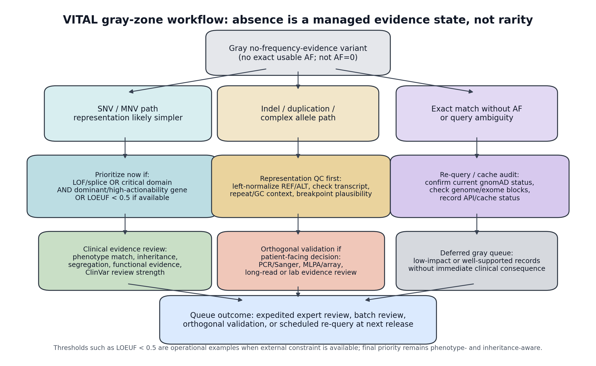

# ClinVar vs gnomAD Allele Frequency Analysis

This project compares allele frequencies from ClinVar arrhythmia-associated variants with population frequencies from gnomAD. The analysis focuses on inherited arrhythmia genes and asks whether clinically reported pathogenic variants occupy a frequency-constrained subset of population variation.

## Key Result

Up to 35% of AF-observed ClinVar P/LP LOF/splice arrhythmia assertions show population-frequency contradiction under ancestry-aware analysis. This is the punchline: severe annotation does not protect against frequency tension, and global-AF-only ACMG-style workflows miss most ancestry-aware alerts. In the arrhythmia audit, 92/262 LOF/splice assertions (35.1%) have popmax/global AF >1e-5, similar to missense assertions (19/66, 28.8%); global AF alone detects only 13 signals, while popmax/global screening detects 115, meaning 102/115 alerts are hidden by global-AF-only review. VITAL compresses those 115 naive AF alerts into 3 urgent, explainable red-priority re-review cases, while expert-panel reviewed P/LP assertions in the 3,000-variant external comparator produce 0 red-priority calls despite visible frequency tension in some curated records.

## Repository Structure

- `src/`: analysis and data-preparation scripts
- `notebooks/`: quick Colab demo notebook
- `data/processed/`: small processed CSV/TSV outputs used by the analysis
- `data/examples/`: tiny demo CSVs for the VITAL quick runner
- `figures/`: PNG figures generated from processed outputs
- `requirements.txt`: Python dependencies
- `Dockerfile`: minimal reproducible Python environment for cached/demo analyses

Large raw inputs such as full ClinVar downloads, gnomAD VCFs, VCF indexes, local environments, and generated cache files are intentionally excluded.
Raw external annotation downloads used for the biological contrast layer are also excluded; derived context tables are committed under `data/processed/`.

## Try VITAL in 2 Minutes

Open the quick demo notebook:

[VITAL demo: score ClinVar variants in 2 minutes](https://colab.research.google.com/github/anerecye/New-project/blob/main/notebooks/vital_demo_colab.ipynb)

The notebook has three paths:

- single VCV: edit one line and run `python run_vital.py --vcv VCV000440850`;
- CSV batch: run `python run_vital.py --input data/examples/sample_variants.csv`;
- demo table: browse `data/processed/vital_top_suspicious.csv`.

The quick demo uses cached score tables and makes no ClinVar or gnomAD API calls.

## Weight-Consistency Audit

The primary VITAL score remains expert-specified by design. The repository includes a restricted weight-consistency audit so reviewers can see whether the component structure behaves sensibly in data, without turning VITAL into a fitted prediction model. The audit is intentionally restricted to frequency-positive historical records, because unrestricted calibration conflates general ClinVar churn with frequency-assertion discordance.

```bash
python src/run_vital_score_calibration.py
```

Key outputs:

- `data/processed/vital_cross_disease_3000_restricted_calibration_model_metrics.csv`
- `data/processed/vital_cross_disease_3000_restricted_calibration_feature_dominance.csv`
- `data/processed/vital_cross_disease_3000_restricted_calibration_coefficients.csv`
- `figures/vital_cross_disease_3000_restricted_calibration_models.png`
- `supplementary_tables/Supplementary_Table_S21_VITAL_empirical_weight_calibration.tsv`

The three diagnostic probes separate review-only features, frequency-tension features, and the combined feature set. This is a calibration and feature-dominance audit, not an architecture search and not a replacement for the prespecified VITAL score.

## Biological Contrast Layer

VITAL-red variants are summarized as contrast cases rather than as another wide annotation table. The biological layer joins VITAL scores to real gnomAD v4.1 LOEUF constraint values and Human Protein Atlas v23 heart-muscle expression, then adds a compact mechanism interpretation:

```bash
python src/run_vital_biological_contrast.py
```

Inputs expected in `data/external/`:

- `gnomad.v4.1.constraint_metrics.tsv` from the gnomAD v4.1 constraint release.
- `hpa_rna_tissue_consensus.tsv.zip` from Human Protein Atlas v23.

Outputs:

- `data/processed/arrhythmia_gene_biological_context.csv`
- `data/processed/arrhythmia_vital_biological_contrast_cases.csv`
- `data/processed/arrhythmia_vital_biological_contrast_summary.csv`
- `figures/vital_biological_contrast_cases.png`

## Severe-Annotation Discordance and Expert Comparator

The repository includes one focused biological-claim audit: severe HGVS consequences are not sufficient to override population-frequency contradictions. This is not a claim that LOF variants are usually benign. It is a claim that frameshift, stop-gained, splice, and other severe-looking ClinVar P/LP assertions can create a misinterpretation hazard when reviewers treat annotation severity as stronger than ancestry-aware population evidence. These records still need AC, popmax, inheritance, penetrance, transcript/NMD, phenotype, and review-context checks when population frequency is discordant.

```bash
python src/run_vital_external_truth_claim.py
```

Headline outputs:

- 92/262 AF-observed LOF/splice arrhythmia assertions (35.1%) have popmax/global AF >1e-5.
- The pattern persists after excluding CASQ2/TRDN: 57/197 severe annotations (28.9%) remain discordant across 8 genes.
- Global-AF-only review misses 102/115 (88.7%) ancestry-aware frequency alerts detected by popmax/global screening.
- Mechanism triage prevents overclaiming: 35/92 severe-discordant assertions are in CASQ2/TRDN carrier-compatible contexts, while only 1/57 non-recessive severe-discordant assertions is AC-supported.
- Frameshift, stop-gained, and canonical-splice subclasses all show naive frequency discordance.
- In the external 3,000-variant comparator, 204 expert-panel P/LP assertions produce 39 naive AF flags, 13 AC-supported flags, and 0 VITAL red-priority calls.

Generated files:

- `data/processed/vital_severe_annotation_frequency_discordance_summary.csv`
- `data/processed/vital_severe_annotation_gene_spread.csv`
- `data/processed/vital_severe_annotation_mechanism_triage.csv`
- `data/processed/vital_expert_panel_truth_validation.csv`
- `data/processed/vital_expert_panel_high_tension_examples.csv`
- `data/processed/vital_external_truth_claim_tests.csv`
- `figures/vital_external_truth_biological_claim.png`
- `supplementary_tables/Supplementary_Table_S22_external_truth_biological_claim.tsv`

## Real Reclassification and Curated Truth Audit

VITAL is not sold as a broad reclassification predictor, so the repository now separates real clinical classification impact from workflow-burden metrics. In the independent 3,000-variant historical set, 23 baseline P/LP records moved to VUS/B/LB by April 2026. VITAL-red captured one real strict reclassification: `CFAP91` `VCV000812096`, which moved to VUS and had popmax AF `3.50e-4`, qualifying AC `152`, weak/no assertion support, and VITAL `76.5`.

The external curated truth stress-test is intentionally uncomfortable but useful. One strict future downgrade had current expert-panel review status: `RYR1` `VCV001214001`, which moved to VUS. VITAL did not flag it because max AF was only `8.99e-7` and there was no AC-supported frequency tension. That is the boundary condition: VITAL catches frequency-assertion hazards, not all curated downgrades.

```bash
python src/run_vital_real_reclassification_audit.py
```

Generated files:

- `data/processed/vital_real_reclassification_clinical_impact_audit.csv`
- `data/processed/vital_real_reclassification_case_examples.csv`
- `supplementary_tables/Supplementary_Table_S23_real_reclassification_truth_audit.tsv`

## Temporal Robustness and AC-Gate Audit

The temporal robustness analysis rescoring arrhythmia P/LP assertions across January 2023, January 2024, and the canonical April 2026 current score table. It uses one cached gnomAD matcher keyed by `variant_key`, so missing frequency evidence is retained as gray/no-frequency evidence rather than silently converted to `AF=0`.

```bash
python src/run_vital_temporal_robustness.py
```

If `data/raw/variant_summary_2023-01.txt.gz` or `data/raw/variant_summary_2024-01.txt.gz` is missing, the script downloads the public NCBI ClinVar archives automatically. Use `--no-download` to require local raw files only.

Headline outputs:

- Red-priority queue size stays sparse across releases: 2 in 2023, 2 in 2024, and 3 in the canonical April 2026 current table.
- Composition is not static: `TRDN` persists across all three snapshots, `KCNE1` is red in 2023/2024 but not current, and `SCN5A` plus `KCNH2` enter the current red queue.
- AC sensitivity supports `AC>=20` as an operational gate: lower gates add extra calls (`ANK2`, `KCNQ1`, `CACNB2`), while `AC>=50` becomes too restrictive.
- The inheritance flag explicitly separates `CASQ2/TRDN` as `recessive_context_required`, so carrier-compatible architecture is counted separately from standard dominant-context red calls.

Generated files:

- `data/processed/arrhythmia_temporal_robustness_vital_scored_variants.tsv`
- `data/processed/arrhythmia_temporal_robustness_snapshot_summary.tsv`
- `data/processed/arrhythmia_temporal_robustness_ac_threshold_sensitivity.tsv`
- `data/processed/arrhythmia_temporal_robustness_red_threshold_membership.tsv`
- `data/processed/arrhythmia_temporal_robustness_red_queue.tsv`
- `data/processed/arrhythmia_temporal_robustness_red_overlap.tsv`
- `data/processed/arrhythmia_temporal_robustness_inheritance_summary.tsv`
- `data/processed/arrhythmia_temporal_robustness_af_flags.tsv`
- `figures/arrhythmia_temporal_robustness_vital_score_distribution.png`
- `supplementary_tables/Supplementary_Table_S25_temporal_robustness_scored_variants.tsv`
- `supplementary_tables/Supplementary_Table_S26_temporal_robustness_summary.tsv`
- `supplementary_tables/Supplementary_Table_S27_temporal_ac_threshold_sensitivity.tsv`

## Validation Readiness and AC Reliability

The independent-validation package turns the main weakness of the current analysis into a pre-specified external review task. It does not claim that expert validation has already been completed. Instead, it fixes the endpoint, builds a blinded review form, keeps a separate VITAL key for analysis, and reports AC reliability as strata rather than a single magic cutoff.

```bash
python src/run_vital_validation_readiness.py
```

Key outputs:

- `data/processed/vital_independent_validation_protocol.csv`
- `data/processed/vital_blinded_expert_review_form.csv`
- `data/processed/vital_blinded_expert_pilot_key.csv`
- `data/processed/vital_ac_reliability_strata.csv`
- `data/processed/vital_ac_threshold_sensitivity_extended.csv`
- `data/processed/vital_detectability_required_fields.csv`
- `data/processed/vital_temporal_red_tracking_summary.csv`
- `supplementary_tables/Supplementary_Table_S34_blinded_expert_pilot_key.tsv`
- `supplementary_tables/Supplementary_Table_S35_blinded_expert_review_form.tsv`
- `supplementary_tables/Supplementary_Table_S36_ac_reliability_strata.tsv`
- `supplementary_tables/Supplementary_Table_S37_detectability_required_fields.tsv`

The blinded pilot contains 23 variants: 3 red-priority cases, 10 gray no-frequency-evidence cases, and 10 non-red controls. The endpoint is expert consensus on `requires re-review` versus `does not require re-review`; planned metrics are sensitivity, specificity, PPV for red/gray routing, Cohen/Fleiss kappa, and discordance adjudication.

## Provenance Credibility Filter

The repository also includes a narrow provenance-aware sensitivity analysis for the sharpened "public label is not a disease state" framing. The filter is intentionally conservative: it excludes weak/no-assertion or single-submitter P/LP records with extreme population-frequency inconsistency (`max_frequency_signal > 1e-4` and `qualifying_frequency_ac >= 20`). In the current arrhythmia run, that removes exactly 3 records: `SCN5A VCV000440850`, `TRDN VCV001325231`, and `KCNH2 VCV004535537`.

```bash
python src/run_vital_provenance_credibility_sensitivity.py
```

Outputs:

- `data/processed/vital_provenance_credibility_filter_summary.csv`
- `data/processed/vital_provenance_credibility_filter_excluded_cases.csv`
- `supplementary_tables/Supplementary_Table_S50_provenance_credibility_filter_summary.tsv`
- `supplementary_tables/Supplementary_Table_S51_provenance_credibility_filter_excluded_cases.tsv`

The point of this filter is not to redefine pathogenicity. It is to show what remains true after the most obviously fragile extreme-frequency public records are removed.

## Tiered Match Reconciliation

The representation audit now includes a separate reconciliation layer that asks a deliberately annoying question: how much of the apparent ClinVar-to-gnomAD gap is just formatting, and how much is real infrastructure friction? The current answer is: not much is rescued by lightweight reconciliation.

```bash
python src/run_vital_bcftools_reference_normalization.py
python src/run_vital_match_reconciliation.py
```

Current cached outputs:

- strict exact exome AF-observed space: `334 / 1,731` (`19.3%`)
- strict exact any-dataset space: `350 / 1,731` (`20.2%`)
- exact/equivalent reconciliation space: `357 / 1,731` (`20.6%`)
- locus/regional context without exact/equivalent AF: `1,326 / 1,731` (`76.6%`)
- still unevaluable after both passes: `48 / 1,731` (`2.8%`)

What is and is not being claimed:

- Tier 1 exact/equivalent evidence is allele-resolved and suitable for direct population-frequency interpretation.
- Tier 2 locus/regional context is useful context, but it is **not** allele-resolved AF evidence.
- Tier 3 still-unevaluable variants remain outside clean population-frequency review even after reconciliation.

Equivalent recovery is intentionally modest: 5 local-window indel equivalents and 2 decomposed substitution equivalents. That is the point. The representation gap is not mainly a cosmetic exact-key problem.

Reference-normalization audit:

- all `1,731` arrhythmia variants were additionally normalized against a local GRCh38 primary-assembly FASTA using `bcftools norm`
- coordinate/allele changes introduced by reference-based normalization: `0 / 1,731`
- multiallelic-decomposition audit with `bcftools norm -f GRCh38.fa -m -both`: no additional exact/equivalent recoveries

That negative result matters: the residual gap is not explained by missed left-alignment or trivial trimming.

Outputs:

- `data/processed/vital_bcftools_reference_normalization.csv`
- `data/processed/vital_bcftools_decomposed_components.csv`
- `data/processed/vital_bcftools_reference_normalization_summary.json`
- `data/processed/vital_tiered_match_reconciliation_detail.csv`
- `data/processed/vital_tiered_match_reconciliation_summary.csv`
- `data/processed/vital_tiered_match_reconciliation_layers.csv`
- `supplementary_tables/Supplementary_Table_S47_tiered_match_reconciliation_detail.tsv`
- `supplementary_tables/Supplementary_Table_S48_tiered_match_reconciliation_summary.tsv`
- `supplementary_tables/Supplementary_Table_S49_tiered_match_reconciliation_layers.tsv`

Implementation note: this audit now includes a real local-reference normalization pass via `bcftools norm` against `data/external/reference/Homo_sapiens.GRCh38.dna.primary_assembly.fa`. The downstream reconciliation counts remain modest because the reference-based pass changed no arrhythmia variant representations.

## Clinical Decision-Risk Proxy

ClinVar does not expose patient counts, diagnoses changed, or cascade-testing uptake. The repository therefore includes a conservative public-exposure proxy: each P/LP record is a potential decision-risk record, and each submitter contributes one minimum submitter-exposure unit; missing submitter counts are counted as one.

```bash
python src/run_vital_clinical_decision_risk_proxy.py
```

Headline outputs:

- Current arrhythmia upper-bound exposure: 115 frequency-discordant P/LP records, representing at least 168 submitter-exposure units.
- AC-supported active-review exposure: 9 arrhythmia records, representing 15 submitter-exposure units.
- Urgent VITAL-red exposure: 3 arrhythmia records, all weak-review and AC-supported.
- Clinical routing split among current arrhythmia red calls: 2 standard-context records with potential monogenic-label risk and 1 `recessive_context_required` TRDN record with carrier-architecture routing risk.
- Cross-disease 3,000-variant current sample: 332 frequency-discordant P/LP records, representing at least 1,962 submitter-exposure units, compressed to 3 VITAL-red urgent records.

Generated files:

- `data/processed/vital_clinical_decision_risk_proxy_summary.tsv`
- `data/processed/vital_clinical_decision_risk_proxy_temporal.tsv`
- `data/processed/vital_clinical_decision_risk_proxy_top_cases.tsv`
- `supplementary_tables/Supplementary_Table_S28_clinical_decision_risk_proxy.tsv`

## Clinical Decision Projection

The decision-projection layer asks what happens if each VITAL-red public P/LP label is read as an unqualified high-penetrance Mendelian assertion, then contrasts that with the state-aware reading implied by the frequency and mechanism evidence. This is not patient-outcome evidence and does not claim actual misdiagnosis, cascade testing, ICD placement, or management change.

```bash
python src/run_vital_clinical_decision_projection.py
```

Key outputs:

- `data/processed/vital_red_clinical_decision_projection.csv`
- `data/processed/vital_guideline_tension_audit.csv`
- `supplementary_tables/Supplementary_Table_S40_clinical_decision_projection.tsv`
- `supplementary_tables/Supplementary_Table_S41_guideline_tension_audit.tsv`

The guideline-tension audit is deliberately conservative: it does not claim disagreement with ClinGen expert panels. Instead, it records that the red-priority cases lack expert-panel/practice-guideline review in the public record, while ClinVar/ClinGen terminology already supports state-aware labels such as low-penetrance and risk-allele categories.

## Clinical Action Contexts and Regime Distribution

This layer turns the 115-variant frequency-tension set into two manuscript-ready summaries: where those variants sit in real clinical-action contexts, and how they partition into operational label-state regimes.

```bash
python src/run_vital_clinical_action_contexts.py
```

Headline outputs:

- `103 / 115` tension variants (`89.6%`, 95% CI `82.6-93.9`) fall in an action-linked arrhythmia core where a public P/LP label can plausibly influence cascade testing or management.
- `60 / 115` lie in drug-restriction contexts and `59 / 115` in device or intensive-surveillance contexts.
- The action-linked core is not purely low-confidence noise: within those `103` variants, `51` have weak review structure, `9` are AC-supported, and all `3` VITAL-red cases are contained inside this clinical-action subset.
- Operational regime split: `1` hard dominant incompatibility candidate (`SCN5A`), `76` boundary/monitoring tensions, and `38` recessive/carrier-compatible tensions in `CASQ2` or `TRDN`.
- AC-supported signals are unevenly distributed across regimes: `1` in the hard dominant class, `1` in the standard-context boundary class, and `7` in the recessive/carrier-compatible class.

Generated files:

- `data/processed/vital_clinical_action_context_summary.csv`
- `data/processed/vital_frequency_tension_regime_distribution.csv`
- `supplementary_tables/Supplementary_Table_S52_clinical_action_context_summary.tsv`
- `supplementary_tables/Supplementary_Table_S53_frequency_tension_regime_distribution.tsv`

## Frequency Constraint and Maximum Credible AF

The frequency-constraint layer formalizes the "too common for high-penetrance Mendelian disease" argument using maximum credible allele frequency, disease-prevalence logic, Bayesian ACMG-style odds, recessive carrier logic, and allele-count reliability. In these outputs, `allelic_contribution_fraction` means the fraction of disease attributable to a variant, while gnomAD `AC` remains allele count.

```bash
python src/run_vital_frequency_constraint_analysis.py
```

Key outputs:

- `data/processed/vital_max_credible_af_analysis.csv`
- `data/processed/vital_prevalence_constraint_analysis.csv`
- `data/processed/vital_bayesian_acmg_frequency_tension.csv`
- `data/processed/vital_recessive_carrier_logic.csv`
- `data/processed/vital_allele_count_reliability.csv`
- `supplementary_tables/Supplementary_Table_S42_max_credible_af.tsv`
- `supplementary_tables/Supplementary_Table_S43_prevalence_constraint.tsv`
- `supplementary_tables/Supplementary_Table_S44_bayesian_acmg_frequency_tension.tsv`
- `supplementary_tables/Supplementary_Table_S45_recessive_carrier_logic.tsv`
- `supplementary_tables/Supplementary_Table_S46_allele_count_reliability.tsv`

Headline outputs:

- Under a strict dominant high-penetrance scenario, SCN5A `VCV000440850` exceeds maximum credible AF by 113.5-fold.
- Under an SCN5A Brugada-like Mendelian read with penetrance relaxed to 20%, SCN5A still exceeds the model ceiling by 45.4-fold.
- KCNH2 `VCV004535537` exceeds a high-penetrance LQTS-like ceiling by 2.6-fold but falls below a generous low-penetrance ceiling, reinforcing its borderline status.
- TRDN `VCV001325231` is incompatible with a dominant misread but compatible with carrier-state logic: popmax carrier frequency is approximately `4.36e-4`, while homozygote frequency is approximately `4.76e-8`.
- Allele-count reliability is graded: SCN5A AC=214 has approximate 95% relative margin 13.4%, TRDN AC=40 has 31.0%, and KCNH2 AC=24 has 40.0%.

## How to Run

Create an environment and install dependencies:

```bash
python -m venv .venv
python -m pip install -r requirements.txt
```

Regenerate the summary tables and gnomAD AF distribution figure from the included processed merge:

```bash
python src/create_metric_tables.py
python src/summarize_gnomad_merge.py
python src/make_publication_figure.py
```

To rerun the full pipeline from raw ClinVar data, place `variant_summary.txt.gz` in `data/raw/` and run:

```bash
python src/clean_clinvar.py
python src/qc_variant_keys.py
python src/collapse_variant_records.py
python src/export_gnomad_lookup_input.py
python src/make_bed_for_gnomad.py
bash src/split_bed_by_chromosome.sh
bash src/extract_gnomad_exomes.sh
python src/merge_gnomad.py --gnomad data/processed/gnomad_subset_with_header.tsv
python src/create_metric_tables.py
python src/summarize_gnomad_merge.py
python src/make_publication_figure.py
```

The gnomAD extraction scripts require `bcftools` and internet access to query public gnomAD VCFs.

## API-Based ClinVar and gnomAD Pipeline

An alternative end-to-end API runner is available for reproducing the ClinVar
P/LP to gnomAD r4 matching workflow without downloading full gnomAD VCFs:

```bash
python src/arrhythmia_variant_pipeline.py --email anerecye@gmail.com
```

This script:

- fetches ClinVar records for the 20 inherited-arrhythmia genes through NCBI
  Entrez and filters to germline pathogenic or likely pathogenic variants;
- logs ClinVar P/LP records discarded because no GRCh38 VCF coordinate is
  available in the VCV XML;
- matches variants to the gnomAD GraphQL API using exact `chrom-pos-ref-alt`
  variant IDs, with exponential backoff for transient GraphQL failures, and
  stores both exome and genome AF/AC/AN fields when available;
- labels unmatched variants as `allele_discordance` when another gnomAD allele
  exists at the same position, otherwise `no_gnomad_record`;
- classifies matched AF values by `1e-5` and `1e-4` thresholds;
- writes per-gene Fisher exact tests with BH correction and warns when
  per-gene AF-covered counts are small;
- writes `run_qc_summary.csv`, including the
  `allele_discordance:no_gnomad_record` split and coverage-query status counts;
- samples unmatched positions for a coverage check and writes four figures.

NCBI requires an email address for Entrez calls. You can pass it with `--email`
or set `ENTREZ_EMAIL`. Full gnomAD matching is intentionally rate-limited and
can take 30-60 minutes. CSV caches are accompanied by `.meta.json` files that
record gene list, gnomAD dataset, thresholds, and related settings. Reuse cached
outputs on repeated runs:

```bash
python src/arrhythmia_variant_pipeline.py --skip-clinvar --skip-gnomad --skip-coverage
```

Use `--strict-cache-metadata` to fail instead of warning if a cache was produced
with a different gene list, dataset, or cache mode.

### Reproducibility and API Independence

The current manuscript is tied to an explicit data freeze: April 21, 2026 for
the current ClinVar/gnomAD analysis, gnomAD `v4.1.1` for exome and genome
frequency queries, and the archived January 2023 ClinVar `variant_summary`
snapshot for historical validation. External APIs are used for data acquisition,
but the repository is not dependent on those APIs remaining unchanged for
downstream reproducibility.

Core intermediate files are cached under `data/processed/` and accompanied by
`.meta.json` metadata where applicable. The cache metadata records the gene
list, gnomAD dataset, cache type, thresholds, and related settings used to
produce the ClinVar, gnomAD, and coverage caches. Repeated runs can therefore
reuse committed tables instead of re-querying NCBI Entrez, gnomAD GraphQL, or
UCSC:

```bash
python src/arrhythmia_variant_pipeline.py --skip-clinvar --skip-gnomad --skip-coverage
python src/advanced_variant_analyses.py --no-fetch-population-af --no-fetch-exome-genome-af
python src/score_vital_from_variant_summary.py
python src/validate_vital_reclassification.py
```

The practical split is: API mode creates the frozen cache; cached/offline mode
rebuilds VITAL scores, historical analyses, figures, supplementary tables, and
the manuscript from machine-readable intermediate files. This protects the
analysis from future API schema changes or temporary service outages. A minimal
Docker environment is provided to pin the Python runtime and package installation
for cached/demo analyses:

```bash
docker build -t vital .
docker run --rm vital
docker run --rm vital python run_vital.py --vcv VCV000440850
docker run --rm vital python src/run_vital_score_calibration.py
```

Large raw ClinVar/gnomAD downloads remain outside the image by default; mount
them explicitly if rerunning acquisition-heavy workflows.

Large ClinVar genes can produce interrupted XML downloads. The API runner uses
`--clinvar-batch-size 50` by default and will retry and split failed ClinVar
batches before skipping any individual VariationID.

The API runner also supports space-separated gene lists and output prefixes,
which is useful for running an arrhythmia set and a non-arrhythmia control set
side by side:

```bash
python src/arrhythmia_variant_pipeline.py --email anerecye@gmail.com --output-prefix arrhythmia --clinvar-batch-size 50 --genes KCNQ1 KCNH2 SCN5A KCNE1 KCNE2 RYR2 CASQ2 TRDN CALM1 CALM2 CALM3 ANK2 SCN4B KCNJ2 HCN4 CACNA1C CACNB2 CACNA2D1 AKAP9 SNTA1
python src/arrhythmia_variant_pipeline.py --email anerecye@gmail.com --output-prefix control --clinvar-batch-size 50 --genes BRCA1 BRCA2 MLH1 APC
```

With prefixes, outputs are written as files such as
`data/processed/control_gnomad_matched.csv`,
`data/processed/control_run_qc_summary.csv`, and
`figures/control_af_distribution.png`.

## Advanced Stratified and QC Analyses

Run the advanced analysis layer after the API pipeline has produced a
`*_gnomad_matched.csv` file:

```bash
python src/advanced_variant_analyses.py --output-prefix arrhythmia
```

This adds five manuscript-oriented analysis blocks:

- ancestry-stratified gnomAD exome AFs for AFR, AMR, ASJ, EAS, FIN, MID, NFE,
  SAS, and remaining groups, including computed `popmax_af` and
  globally-rare/population-enriched candidates;
- gnomAD v4.1 exome-vs-genome sensitivity for exact matches, including
  duplication-specific genome presence checks;
- reclassification-risk screening for ClinVar P/LP variants with AF above
  `1e-5` or `1e-4`, review strength, submitter-count signal, and a
  `potential_misclassification_signal` flag that requires at least one
  threshold-exceeding frequency source with `AC >= 20`;
- gene-level functional features, including LOF, missense,
  splice-or-intronic, in-frame, synonymous, and unresolved classes;
- non-overlap structure for `allele_discordance` and `no_gnomad_record`
  variants, including gene enrichment, indel/SNV balance, hotspot-position
  markers, coverage-query summaries, and a CpG-transition proxy.

Main CSV outputs include:

- `data/processed/arrhythmia_population_af.csv`
- `data/processed/arrhythmia_population_af_long.csv`
- `data/processed/arrhythmia_population_af_summary.csv`
- `data/processed/arrhythmia_population_af_outliers.csv`
- `data/processed/arrhythmia_exome_genome_af_comparison.csv`
- `data/processed/arrhythmia_exome_genome_af_summary.csv`
- `data/processed/arrhythmia_reclassification_risk.csv`
- `data/processed/arrhythmia_reclassification_risk_summary.csv`
- `data/processed/arrhythmia_vital_scores.csv`
- `data/processed/arrhythmia_vital_summary.csv`
- `data/processed/arrhythmia_vital_predictions.csv`
- `data/processed/arrhythmia_gene_frequency_constraint.csv`
- `data/processed/arrhythmia_variant_type_detectability.csv`
- `data/processed/arrhythmia_vital_component_breakdown.csv`
- `data/processed/arrhythmia_vital_component_summary.csv`
- `data/processed/arrhythmia_vital_method_comparison.csv`
- `data/processed/arrhythmia_vital_validation_curves.csv`
- `data/processed/arrhythmia_vital_retention_summary.csv`
- `data/processed/arrhythmia_vital_threshold_sweep.csv`
- `data/processed/arrhythmia_vital_acmg_disagreement.csv`
- `data/processed/arrhythmia_vital_top_suspicious.csv`
- `data/processed/arrhythmia_vital_absence_detectability_bias.csv`
- `data/processed/arrhythmia_review_fragility_summary.csv`
- `data/processed/arrhythmia_gene_variant_type_summary.csv`
- `data/processed/arrhythmia_gene_lof_missense_af_summary.csv`
- `data/processed/arrhythmia_gene_non_overlap_summary.csv`
- `data/processed/arrhythmia_non_overlap_feature_summary.csv`
- `data/processed/arrhythmia_non_overlap_gene_enrichment.csv`
- `data/processed/arrhythmia_non_overlap_variant_level.csv`

Machine-readable supplementary tables are generated as TSV files:

```bash
python src/generate_supplementary_tables.py --output-prefix arrhythmia
```

This writes `supplementary_tables/Supplementary_Table_S2_reclassification_candidates.tsv`,
`supplementary_tables/Supplementary_Table_S5_gene_non_overlap_summary.tsv`,
`supplementary_tables/Supplementary_Table_S6_VITAL_scores.tsv`,
`supplementary_tables/Supplementary_Table_S7_VITAL_method_comparison.tsv`, and
`supplementary_tables/Supplementary_Table_S8_review_fragility_summary.tsv`,
plus S9-S12 for the VITAL threshold sweep, ACMG/VITAL disagreement table, top
suspicious variants, and absence/detectability bias analysis.

Main figures include:

- `figures/arrhythmia_population_af_distribution.png`
- `figures/arrhythmia_population_af_outliers.png`
- `figures/arrhythmia_reclassification_risk.png`
- `figures/arrhythmia_vital_score_model.png`
- `figures/arrhythmia_vital_validation_curves.png`
- `figures/vital_clinical_workflow.png`
- `figures/arrhythmia_review_fragility.png`
- `figures/arrhythmia_vital_absence_not_rarity.png`
- `figures/vital_external_panel_score_distribution.png`
- `figures/arrhythmia_variant_type_by_gene.png`
- `figures/arrhythmia_non_overlap_features.png`
- `figures/arrhythmia_non_overlap_genes.png`

Population AF queries are cached in `arrhythmia_population_af.csv`. Reuse the
cache without new gnomAD requests:

```bash
python src/advanced_variant_analyses.py --output-prefix arrhythmia --no-fetch-population-af
```

Exome/genome AF queries are cached in
`arrhythmia_exome_genome_af_comparison.csv`. Reuse this cache with
`--no-fetch-exome-genome-af`; use `--force-exome-genome-fetch` to refresh it.

## VITAL Clinical Reclassification Risk Prioritization Framework

The analysis now formalizes the population-frequency critique as **VITAL**
(`Variant Interpretation Tension and Allele Load`), a 0-100 clinical
reclassification risk prioritization score. VITAL is designed to reduce
false-positive variant re-evaluation burden in clinical genomics workflows. It
is not a replacement for clinical interpretation and does not declare every
frequency outlier benign. It asks a narrower workflow question: which ClinVar
P/LP assertions are under enough frequency, review, gene, and technical
pressure that they should be prioritized for human expert re-review?

VITAL combines seven components:

- global AF and ancestry `popmax_af`, scaled from `1e-5` to `1e-3`;
- AC reliability, saturated at `AC >= 20`;
- popmax enrichment over global AF;
- variant-type tension (`SNV`, indel, duplication, or unresolved);
- a gene-specific frequency-constraint proxy estimated from the gene's
  observed popmax outlier burden;
- a technical detectability index that explicitly downweights variant classes
  with poorer exact-match behavior, especially duplications and indels;
- review fragility from ClinVar review status and submitter count.

The component weights are expert-specified rather than empirically fitted.
They are intentionally reported as part of the framework: AF pressure has the
largest maximum weight, AC reliability acts as required support, and review
fragility plus technical detectability remain visible but insufficient on their
own. Weight sensitivity is therefore a required output rather than a hidden
implementation detail. These weights should not be assumed to transfer
unchanged to other disease areas without local calibration or explicit
sensitivity reporting.

Minimal local calibration protocol:

1. Freeze the target gene list, disease mechanism, and intended clinical use.
2. Run the primary VITAL profile plus prespecified alternative weight profiles.
3. Report red-queue size, retained/gained/lost red variants, and proxy
   false-positive burden under each profile.
4. Choose the operational threshold based on review capacity and acceptable
   workload before outcome testing.
5. Lock and version the weights, AC gate, and threshold before prospective or
   release-to-release monitoring.

Conceptually, VITAL is a **variant pathogenicity tension continuum**, not only
a red flag. It positions each ClinVar P/LP assertion in a space of discordance
between population frequency, AC support, ancestry enrichment, review quality,
technical detectability, gene context, and functional annotation. In the
current lightweight implementation, functional context comes from
HGVS-derived `functional_class` plus the internal gene-frequency constraint
proxy. A fuller implementation could add MAVE scores, LOEUF, missense Z, and
protein-domain or transcript-specific annotations where coverage is available.
Those external resources are not forced into the current analysis because they
are incomplete across this variant set.

The continuum also splits LOF calls into HGVS-derived subtypes so frameshift,
stop_gained, and canonical_splice assertions are not silently merged into one
bucket. This subtype annotation is descriptive and is not part of the VITAL
score. In the current arrhythmia cache, AF-observed LOF variants include 82
frameshift, 108 stop_gained, and 60 canonical_splice records. Naive AF flags are
common in all three groups (35.4%, 30.6%, and 38.3%, respectively), but
AC-supported contradictions are much rarer (1.2%, 2.8%, and 3.3%). High-tension
VITAL scores still appear in severe-looking subtypes: 2 frameshift variants, 1
stop_gained variant, and 1 canonical_splice variant fall in VITAL 60-100. TRDN
`VCV001325231` is the key example: a frameshift red-priority record with AMR
popmax AF `2.18e-4` and global AC `40`. This is the concrete "not all LOF
behaves like textbook high-penetrance" result.

In the current cached arrhythmia run, the VITAL audit table carries all 1,731
ClinVar P/LP variants forward rather than silently dropping unmatched records.
Only 334 variants have observed exact-match gnomAD AF evidence and are eligible
for continuous frequency scoring. Another 736 are explicitly labeled
`not_observed_in_gnomAD`, 645 are `allele_discordance_no_exact_AF`, and 16 are
`exact_match_without_AF`; these rows retain `NaN` frequency fields and the
separate `gray_no_frequency_evidence` band rather than being converted to
`AF = 0`.

Within the 334 AF-covered exact matches, the naive ACMG-style frequency screen
flags 115 ClinVar P/LP variants (34.4%) when popmax is used, compared with only
13/334 (3.9%) from global AF alone. The high-frequency subset (`AF > 1e-4`) is
9/334 (2.7%) with popmax versus 1/334 (0.3%) with global AF alone. Requiring
AC support narrows the frequency contradiction to 9/334 variants, and VITAL's
red reclassification-priority band narrows the actionable review-priority set to
3/334 (0.9%). That is a 97.4% reduction in action-priority calls versus a naive
`AF > 1e-5` screen while preserving the strongest frequency-supported
weak-review signals.

The model writes:

- `data/processed/arrhythmia_vital_scores.csv`: per-variant component scores,
  final VITAL score, band, and signal reasons.
- `data/processed/arrhythmia_vital_summary.csv`: headline counts showing how
  many P/LP variants violate popmax/global frequency screens, how many have
  `AC >= 20`, and how many survive as VITAL red review-priority calls.
- `data/processed/arrhythmia_vital_predictions.csv`: red and orange
  reclassification-priority candidates.
- `data/processed/arrhythmia_gene_frequency_constraint.csv`: gene-level
  frequency-constraint proxy used by the model.
- `data/processed/arrhythmia_variant_type_detectability.csv`: empirical
  exact-match/non-overlap structure by variant type plus detectability index.
- `data/processed/arrhythmia_vital_component_breakdown.csv`: long-format
  explainability table with one row per variant-component pair, so a score can
  be read as, for example, AF pressure + AC reliability + review fragility
  rather than as an opaque model output.
- `data/processed/arrhythmia_vital_method_comparison.csv`: explicit
  baseline comparison against global AF, popmax/global AF, high-frequency
  screens, and AF+AC filtering with TP/FP/FN/TN, precision, recall, and
  specificity.
- `data/processed/arrhythmia_vital_validation_curves.csv` and
  `figures/arrhythmia_vital_validation_curves.png`: ROC and precision-recall
  points for the operational benchmark.
- `data/processed/arrhythmia_vital_threshold_sweep.csv`: sensitivity sweep
  showing how precision, recall, and false positives change as the VITAL score
  cutoff is moved.
- `data/processed/arrhythmia_vital_ac_threshold_sensitivity.csv`: AC gate
  sensitivity at `AC >= 5`, `10`, `20`, and `50`, with red-set composition,
  gained variants, and lost variants tracked relative to the prespecified
  `AC >= 20` actionability gate.
- `data/processed/arrhythmia_vital_weight_sensitivity_summary.csv`: expert
  weight-profile sensitivity summary. Across five alternative profiles, no new
  red variants appear, red count ranges from 1 to 3, proxy false-positive count
  remains 0, and compression versus naive AF screening remains 97.4%-99.1%.
- `data/processed/arrhythmia_vital_weight_sensitivity_variant_matrix.csv` and
  `data/processed/arrhythmia_vital_weight_sensitivity_variant_profile_table.csv`:
  red-variant stability tables. SCN5A `VCV000440850` is `anchor`, TRDN
  `VCV001325231` is `near-stable`, and KCNH2 `VCV004535537` is `borderline`.
- `supplementary_tables/Supplementary_Table_S13_VITAL_weight_sensitivity.tsv`:
  long-format 5 alternative weight profiles x 3 current red variants table.
- `data/processed/arrhythmia_vital_pathogenicity_tension_continuum.csv`:
  per-variant 20-point tension band and frequency-function discordance class.
- `data/processed/arrhythmia_vital_frequency_function_discordance_summary.csv`:
  VITAL 0-20/20-40/40-60/60-80/80-100 band summary showing how frequency,
  AC, review, variant-type, and functional signals reorganize along the
  continuum.
- `data/processed/arrhythmia_vital_signal_reorganization_summary.csv`:
  comparison of all AF-observed variants, naive AF flags, AC-supported flags,
  upper VITAL bands, and VITAL-red calls.
- `data/processed/arrhythmia_vital_lof_subtype_discordance_summary.csv`:
  frameshift, stop_gained, and canonical_splice discordance summary across the
  VITAL continuum.
- `data/processed/vital_severe_annotation_frequency_discordance_summary.csv`,
  `data/processed/vital_severe_annotation_gene_spread.csv`,
  `data/processed/vital_severe_annotation_mechanism_triage.csv`,
  `data/processed/vital_expert_panel_truth_validation.csv`, and
  `supplementary_tables/Supplementary_Table_S22_external_truth_biological_claim.tsv`:
  severe-annotation frequency-discordance audit and expert-panel comparator.
- `data/processed/vital_red_manual_review_live_check.csv`:
  live ClinVar manual-review snapshot for the three VITAL-red variants,
  including conflicts, submitter status, literature mentions, and unresolved
  interpretation.
- `data/processed/arrhythmia_vital_acmg_disagreement.csv`: case-level table
  for variants that a naive ACMG-style frequency screen flags, split by
  whether VITAL agrees or withholds red priority.
- `data/processed/arrhythmia_vital_top_suspicious.csv`: top 10 review-priority
  ClinVar assertions ranked by VITAL score and annotated with the component
  reasons.
- `data/processed/arrhythmia_vital_absence_detectability_bias.csv` and
  `figures/arrhythmia_vital_absence_not_rarity.png`: variant-type evidence that
  absence from gnomAD is partly a detectability/representation signal rather
  than proof of rarity.
- `data/processed/arrhythmia_review_fragility_summary.csv`: review-strength
  stratification showing how many frequency-supported outliers come from
  single-submitters, weak/no-assertion records, or multiple-submitter records.
- `data/processed/vital_external_panel_summary.csv`,
  `data/processed/vital_external_panel_band_distribution.csv`,
  `data/processed/vital_external_panel_score_distribution.csv`, and
  `figures/vital_external_panel_score_distribution.png`: small external-domain
  stress tests for cardiomyopathy, epilepsy, hearing-loss genes, random ClinVar
  P/LP variants, and the BRCA/MMR/APC descriptive comparator cache.
- `data/processed/vital_cross_disease_3000_cross_disease_validation_summary.csv`,
  `data/processed/vital_cross_disease_3000_cross_disease_band_distribution.csv`,
  `data/processed/vital_cross_disease_3000_cross_disease_outliers.csv`, and
  `figures/vital_cross_disease_3000_score_distribution.png`: independent
  3,000-variant current cross-disease portability validation outside arrhythmia
  and previous external-panel genes.
- `data/processed/vital_cross_disease_3000_2023_01_to_current_vital_historical_validation.csv`,
  `data/processed/vital_cross_disease_3000_2023_01_to_current_vital_historical_enrichment.csv`,
  and `figures/vital_cross_disease_3000_2023_01_to_current_vital_historical_curves.png`:
  independent 3,000-variant 2023-to-current historical cross-disease validation.
- `data/processed/vital_real_reclassification_clinical_impact_audit.csv`,
  `data/processed/vital_real_reclassification_case_examples.csv`, and
  `supplementary_tables/Supplementary_Table_S23_real_reclassification_truth_audit.tsv`:
  real strict P/LP-to-VUS/B/LB reclassification audit and expert-panel curated
  truth stress-test.
- `figures/vital_clinical_workflow.png`: clinician-facing workflow schematic
  showing how ClinVar P/LP assertions move through VITAL risk prioritization,
  into a short review queue, and then back to human expert ACMG/AMP
  decision-making.
- `figures/vital_gray_zone_workflow.png`: clinician-facing workflow schematic
  for no-frequency-evidence gray variants, including expedited-review,
  representation-QC, orthogonal-validation, and deferred-queue branches.
- `figures/arrhythmia_vital_score_model.png`: score-versus-frequency view of
  the model bands.

The current operational benchmark treats weak-review, AC-supported frequency
signals as positives and current `review_score >= 2` P/LP variants as a
high-confidence retained-P/LP proxy. This is not a substitute for prospective
clinical truth and it is partly circular: weak review support and AC-supported
frequency tension help define the proxy-positive class and also contribute to
the VITAL red actionability gate. The benchmark is therefore a workflow
diagnostic for false-positive re-evaluation burden, not an independent estimate
of clinical accuracy. Precision 1.00 and recall 1.00 in this proxy task are
artifacts of design concordance, not evidence of perfect clinical performance.
Under this benchmark
VITAL red has 3 true positives, 0 false positives, 0 false negatives, and 109
true negatives, with precision 1.00 (`95% CI 0.44-1.00`), recall 1.00
(`95% CI 0.44-1.00`), specificity 1.00 (`95% CI 0.966-1.00`), and false
positive rate 0.00 (`95% CI 0.00-0.034`). The competing popmax/global
`AF > 1e-5` screen has the same recall but 53 false positives, precision 0.054
(`95% CI 0.018-0.146`), and false-positive rate 0.486
(`95% CI 0.394-0.579`). The `AF > 1e-5` plus `AC >= 20` screen still has 6
false positives. All 56 high-confidence, frequency-consistent P/LP variants
remain green, and all 109 high-confidence P/LP proxy variants remain non-red.

The clinical workflow implication is burden reduction. A naive popmax/global AF
screen would send 115 current arrhythmia P/LP assertions into urgent manual
re-evaluation; VITAL red sends 3, suppressing 112 potential false-positive
review triggers. At an illustrative 30-60 minutes per first-pass variant
review, that corresponds to roughly 56-112 reviewer-hours avoided in this
1,731-variant audit, while leaving final classification with human ACMG/AMP
reviewers.

The AC gate is treated as an actionability filter, not as part of the scoring
function. This separates signal detection (`vital_score`) from operational
decision thresholds (`qualifying_frequency_ac`). AC sensitivity shows the red
core is stable across `AC >= 5`, `AC >= 10`, and `AC >= 20`: SCN5A
`VCV000440850`, TRDN `VCV001325231`, and KCNH2 `VCV004535537` remain red.
CACNB2 `VCV003774534` appears only at `AC >= 5` and `AC >= 10`; at `AC >= 50`,
only SCN5A remains red. This makes threshold dependence visible rather than
hidden.

Weight-profile sensitivity shows which red calls are robust to expert-weight
choices. Five alternative weighting profiles produce no gained red variants.
SCN5A `VCV000440850` is retained under all five alternatives (`anchor`), TRDN
`VCV001325231` is retained under 4/5 (`near-stable`), and KCNH2
`VCV004535537` is retained under 2/5 (`borderline`). KCNH2 is therefore a
threshold-adjacent re-review signal rather than an anchor call. The long-format
S13 table makes this explicit as 5 profiles x 3 variants.

The threshold sweep shows that this is not a brittle single-cutoff result. In
the current operational benchmark, a VITAL cutoff of 60 keeps recall at 1.00
but leaves 2 false positives; cutoffs of 65 and 70 keep recall at 1.00 with 0
false positives; cutoffs of 75 and above trade recall down to 0.33. This gives
reviewers an explicit sensitivity/specificity dial rather than a hidden
threshold.

Why use `70` rather than `80`? The default red gate is a clinical review-capacity
threshold, not the enrichment-maximizing historical cutoff. In the current
operational sweep, `65` and `70` remove proxy false-positive re-evaluation calls
while preserving the full red-core recall; `75` and `80` create a smaller but
less sensitive queue. In the historical broad-endpoint calibration, `80` showed
higher enrichment, but that was based on a sparse `1/1` red event and was not
used to refit the model. Treat `70` as the immediate-review queue and `80` as an
optional ultra-high-priority subqueue for labs with tighter review bandwidth.

Inheritance is intentionally not treated as an automatic score modifier in the
current implementation. VITAL flags frequency tension in ClinVar assertions;
the next review step must interpret that tension under dominant, recessive,
semidominant, low-penetrance, founder, or carrier-state mechanisms. A frequency
that is implausible for a fully penetrant dominant heterozygous disorder may be
compatible with a recessive carrier allele. Deployment should therefore
stratify red/orange calls by disease mechanism before any classification
change: dominant/high-penetrance records can move directly to expert review,
while recessive heterozygous LOF or founder alleles require zygosity,
phenotype, segregation, and mechanism review first.

The continuum output removes binary thinking from the descriptive analysis.
Across 20-point VITAL bands, higher bands concentrate frequency-function
discordance. The 0-20 band has no popmax `AF > 1e-4` signals and no
AC-supported contradictions. The 40-60 band has median max AF `3.01e-5`,
9.8% AC-supported signals, and 39.3% indel/duplication representation. The
60-80 band has 100% popmax `AF > 1e-4`, 40% AC-supported signals, 40%
indel/duplication representation, and 100% LOF/splice/unresolved annotations.
The 80-100 band is the SCN5A composite assertion with popmax `AF=5.68e-3` and
qualifying `AC=214`. This is not perfectly monotonic for every component
because the upper bands are intentionally tiny, but it shows VITAL reorganizing
AF signals into progressively more discordant strata.

Layer comparison makes the same point. Naive `AF > 1e-5` captures 115 variants
with median VITAL 41.1 and only 7.8% AC-supported signals. The AC-supported
layer contains 9 variants with median VITAL 52.6. VITAL 60-80 contains 5
variants with 100% popmax `AF > 1e-4` and 100% LOF/splice/unresolved
annotations. VITAL red contains 3 variants, all AC-supported, all weak/single
review, and all LOF/splice/unresolved/composite. This is the
frequency-function discordant class: variants that may be overcalled,
low-penetrance, hypomorphic, ancestry-enriched, transcript/domain-specific, or
otherwise inconsistent with canonical high-penetrance assumptions.

The ACMG/VITAL disagreement table is the case-level answer to the obvious
pushback. A naive popmax/global `AF > 1e-5` screen flags 115 AF-covered P/LP
variants; VITAL agrees with only 3 as red. The other 112 are not discarded:
they are annotated with reasons such as `AC_below_20`, `stronger_review`, or
`score_below_70`. This makes the model a re-review prioritizer rather than a
frequency-only benign classifier.

The absence/detectability analysis makes the core assumption explicit:
frequency-based criteria implicitly assume that variants are technically and
representationally detectable. In the current arrhythmia table, exact AF
evidence is available for 238/970 SNVs (24.5%) but only 71/529 deletions
(13.4%) and 21/194 duplications (10.8%). Deletions have 458/529 (86.6%) rows
without exact frequency evidence, and duplications have 173/194 (89.2%); both
are significantly more absence-prone than SNVs (`p=2.36e-7` for deletions,
`p=1.16e-5` for duplications). The practical implication is direct: absence
from gnomAD is not equivalent to rarity for structurally complex variants.

### Independent Cross-Disease Portability Validation

The main external validation layer now uses 3,000 random ClinVar P/LP variants
outside the arrhythmia development genes and outside the previously used
cardiomyopathy, epilepsy, and hearing-loss panel genes. The design is fixed:
2,000 variants are sampled from the top 100 genes by number of ClinVar P/LP
submissions after exclusions, and 1,000 variants are sampled from the remaining
eligible ClinVar P/LP pool.

```bash
python src/run_vital_cross_disease_validation.py \
  --output-prefix vital_cross_disease_3000 \
  --top-gene-sample-size 2000 \
  --random-sample-size 1000 \
  --random-seed 20260421
```

Sanity checks are explicit: the current 3,000-variant sample has 0 arrhythmia
gene leaks, 0 overlaps with previous external-panel genes, and 0 duplicate
variant IDs or variant keys. In this independent current sample, VITAL behaves
as a conservative review-priority framework rather than a broad AF filter:

| sample | N | exact AF rows | naive AF flags | AC-supported flags | VITAL red | red-rate 95% CI | compression vs naive |
|---|---:|---:|---:|---:|---:|---:|---:|
| current cross-disease | 3,000 | 668 | 332 | 71 | 3 | 0.034%-0.294% | 110.7x |
| 2023 baseline cross-disease | 3,000 | 732 | 379 | 87 | 13 | 0.253%-0.740% | 29.2x |

The historical version uses the same sampling design on the January 2023 ClinVar
snapshot and evaluates outcomes against the April 21, 2026 snapshot:

```bash
python src/run_vital_cross_disease_validation.py \
  --historical-only \
  --historical-variant-summary data/raw/variant_summary_2023-01.txt.gz \
  --followup-variant-summary data/variant_summary.txt.gz \
  --historical-output-prefix vital_cross_disease_3000_2023_01 \
  --top-gene-sample-size 2000 \
  --random-sample-size 1000 \
  --random-seed 20260421
```

Against strict P/LP-to-B/LB-or-VUS reclassification, the historical red set has
low recall (`1/23`, 4.3%) but high specificity (`99.6%`). By conventional
prediction standards, this is poor sensitivity for strict future downgrades.
Against the expanded instability endpoint (non-P/LP, clinical-significance
change, or review-status change), 11/13 red calls are events (`84.6%`, Wilson
95% CI `57.8%-95.7%`) with `99.9%` specificity. This is the correct framing:
VITAL red is high-specificity and low-recall. It reduces false-positive
re-evaluation burden and enriches an extreme-priority monitoring subset, but it
is not a stand-alone prediction model and should not be sold as one.

The expanded endpoint is intentionally soft. It can count review-status or
aggregate clinical-significance text changes even when the variant remains
P/LP. Use it as a ClinVar curation-activity endpoint, not as evidence that VITAL
predicts clinically meaningful downgrades.

Key outputs:

- `data/processed/vital_cross_disease_3000_cross_disease_validation_summary.csv`
- `data/processed/vital_cross_disease_3000_cross_disease_outliers.csv`
- `data/processed/vital_cross_disease_3000_sample_sanity_checks.csv`
- `data/processed/vital_cross_disease_3000_2023_01_to_current_vital_historical_validation.csv`
- `data/processed/vital_cross_disease_3000_2023_01_to_current_vital_historical_enrichment.csv`
- `supplementary_tables/Supplementary_Table_S14_cross_disease_3000_validation_summary.tsv`
- `supplementary_tables/Supplementary_Table_S15_cross_disease_3000_outliers.tsv`
- `figures/vital_cross_disease_3000_score_distribution.png`
- `figures/vital_cross_disease_3000_2023_01_to_current_vital_historical_curves.png`

As an orthogonal smaller stress-test, the same VITAL machinery was also run on
three targeted non-arrhythmia disease panels and one smaller random ClinVar P/LP
sample:

```bash
python src/run_vital_external_panels.py \
  --panel-sample-size 300 \
  --random-sample-size 500 \
  --random-seed 37
```

This is intentionally small: it is a stress test for overfitting and
false-positive burden, not a full disease-specific validation or sensitivity
analysis. Approximately 300 variants per domain is not enough to conclude that
VITAL would recover true reclassification candidates outside arrhythmia. The
result is conservative outside the arrhythmia training context, but absence of
red calls cannot prove that true reclassification candidates were not missed.
Cardiomyopathy, the nearest disease-domain comparator, has
23 naive `AF > 1e-5` flags among 300 sampled P/LP variants, but only 1 VITAL red
call. Epilepsy has 5 naive AF flags and 0 VITAL red calls. Hearing-loss genes
have many more population-frequency hits (76/300 naive AF flags and 16
AC-supported flags), but still 0 red calls; the signal remains in yellow/orange
watchlist territory rather than becoming an automatic reclassification queue.
The random ClinVar P/LP sample behaves similarly: 94/500 naive AF flags and 20
AC-supported flags, but 0 VITAL red calls.

| domain | N | exact AF rows | naive AF flags | AC-supported flags | VITAL red | score >=70 | max score |
|---|---:|---:|---:|---:|---:|---:|---:|
| cardiomyopathy | 300 | 64 | 23 | 2 | 1 | 1 | 80.8 |
| epilepsy | 300 | 20 | 5 | 0 | 0 | 0 | 59.9 |
| hearing loss | 300 | 120 | 76 | 16 | 0 | 3 | 77.4 |
| random ClinVar P/LP | 500 | 167 | 94 | 20 | 0 | 7 | 85.1 |
| BRCA/MMR/APC descriptive comparator | 2,000 | 173 | 5 | 2 | 0 | 0 | 57.8 |

This is a workload-compression result, not just a scoring result. In the random
ClinVar P/LP sample, a naive AF screen produces 94/500 actionable flags
(18.8%), whereas VITAL red produces 0/500. In hearing-loss genes, naive AF
produces 76/300 flags (25.3%) and VITAL red again produces 0/300. This
represents a greater-than-10-fold reduction in actionable review flags without
manual curation, converting population-frequency noise into a short, auditable
clinical reclassification risk queue.

The BRCA1/BRCA2/MLH1/APC cache has 0 red calls, 0 variants with score `>=60`, 0
variants with score `>=70`, and maximum VITAL score 57.8. This is reassuring as
a descriptive comparator, but it should not be treated as a clean negative
control because cancer-predisposition genes differ from arrhythmia genes in
penetrance, founder architecture, and disease mechanism. The external
hearing-loss and random-P/LP samples do show some high-tension variants, which
is useful: VITAL does not flatten all non-arrhythmia data into green, but it
also does not turn ordinary AF noise into red-priority calls.

Three examples show how the table becomes a clinical review story:

- `SCN5A` `VCV000440850` is the highest-priority VITAL case
  (`VITAL=96.1`). The variant is globally present at `AF=1.46e-4` with
  `AC=214`, but the ancestry-specific maximum is far higher
  (`popmax_af=5.68e-3`, AFR `AC=190`). ClinVar review support is weak
  (`no assertion criteria provided`). VITAL marks it red because every major
  re-review axis aligns: frequency pressure is saturated, AC reliability is
  saturated, popmax enrichment is strong, and the review assertion is fragile.
  This is the highest-priority example of why VITAL is not just an AF screen:
  although naive `AF > 1e-5` criteria flag 115 arrhythmia P/LP variants, VITAL
  prioritizes only 3, including this one, where high AC and fragile review
  support make the frequency contradiction actionable.
  The likely classification outcome may indeed be downgrade, VUS, or a
  context-specific/non-Mendelian assertion, but VITAL itself does not assign
  benign status. The haplotype, historical literature, drug-response/functional
  context, penetrance, and phenotype specificity still require expert review.
- `TRDN` `VCV001325231` (`c.1050del`, `p.Glu351fs`) is a loss-of-function
  deletion with `VITAL=74.3`. It has `global_AF=2.77e-5` and `global_AC=40`,
  enough to pass the AC-supported frequency screen, while the AMR popmax is
  `2.18e-4`. The ClinVar record is single-submitter. VITAL still treats the
  deletion's lower technical detectability cautiously, but the combination of
  AF pressure, `AC >= 20`, LOF/variant-type tension, and single-submitter
  review support keeps it in the red re-review band. A naive AF threshold would
  also flag many stronger-review variants; VITAL elevates this deletion because
  the frequency signal is AC-supported and the clinical assertion is
  review-fragile, while 112 other AF-flagged variants are withheld from red
  priority.
- `KCNH2` `VCV004535537` (`c.2398+2T>G`) is a splice-region/LOF SNV with
  `VITAL=70.3`, just over the red threshold. It has `global_AF=4.37e-5` and
  `global_AC=24`; the ASJ popmax reaches `1.32e-4`, although popmax AC is only
  2. The AC support therefore comes from the global count, not from the
  ancestry popmax alone. ClinVar support is single-submitter. VITAL marks it
  red because a constrained arrhythmia gene, global `AC >= 20`, high popmax,
  good SNV detectability, and fragile review status all point toward
  re-review. Naive AF logic would place this in the same bucket as dozens of
  lower-support frequency outliers; VITAL separates it because the global AC
  clears the reliability floor and the review record lacks multi-submitter
  support. Weight sensitivity makes the caveat explicit: this is a
  `borderline` red call, retained under 2/5 alternative profiles, not an
  anchor case.

Single-variant clinical output should be concise enough for a reviewer to use
without reading the whole model paper. For example, SCN5A `VCV000440850` can be
rendered as:

| field | value |
|---|---|
| human summary | VITAL red: high AFR popmax frequency, high allele-count support, weak ClinVar review; urgent expert review recommended, not automatic benign classification. |
| ClinVar assertion | Pathogenic; no assertion criteria provided; single submission. |
| frequency evidence | global `AF=1.46e-4`, global `AC=214`; AFR popmax `AF=5.68e-3`, popmax `AC=190`. |
| component breakdown | AF pressure `45.0/45`; AC reliability `20.0/20`; popmax enrichment `7.9/10`; variant-type tension `0.0/6`; technical detectability `6.5/8`; gene constraint `6.6/10`; review fragility `10.0/10`. |
| workflow interpretation | Enters immediate re-review because the frequency contradiction is AC-supported and the public assertion is review-fragile. Final classification still requires phenotype, inheritance, segregation, functional literature, haplotype/drug-response context, and laboratory policy. |

### Live Manual Review Snapshot

The three red-priority variants were rechecked against live ClinVar pages on
April 21, 2026. This is not adjudication; it is the bridge between score output
and human review.

- `SCN5A` `VCV000440850` remains `Pathogenic` for Brugada syndrome 1 with
  `no assertion criteria provided` and a single submission. No conflicting or
  multiple-submitter evidence was present. ClinVar lists submitter-cited PubMed
  records `10532948`, `15851227`, and `18599870`, plus text-mined citations.
  Suspicious but unresolved: AFR popmax is too high for a simple fully
  penetrant Mendelian assertion, but the haplotype has historical literature
  and drug-response/functional context.
- `TRDN` `VCV001325231` remains `Likely pathogenic` for catecholaminergic
  polymorphic ventricular tachycardia 5, with criteria from a single submitter
  and no conflicts. ClinVar reports no germline citations for this variant.
  Suspicious but unresolved: it is a frameshift with AMR popmax `2.18e-4` and
  global `AC=40`, but TRDN interpretation must account for recessive disease
  architecture, carrier state, phenotype, and missing public segregation data.
- `KCNH2` `VCV004535537` remains `Likely pathogenic` for Long QT syndrome,
  with criteria from a single LabCorp submitter and no conflicts. ClinVar cites
  PMID `36861347`; the submitter text notes affected observations but not
  unequivocal association, and no experimental functional confirmation. Suspicious
  but unresolved: this is a plausible canonical splice-donor allele in a
  constrained gene, yet it has ASJ popmax `1.32e-4`, global `AC=24`, and
  borderline weight sensitivity.

The live check table is written to
`data/processed/vital_red_manual_review_live_check.csv`.

### Handling Gray No-Frequency-Evidence Variants

Gray is not green. In the current arrhythmia run, 1,397 variants sit in the
`gray_no_frequency_evidence` band: 736 `not_observed_in_gnomAD`, 645
`allele_discordance_no_exact_AF`, and 16 `exact_match_without_AF`. These
variants are carried forward because absence can mean true rarity, incomplete
coverage, allele-representation mismatch, or poor detectability.

A practical gray queue should triage by variant type and clinical context, with
explicit operational triggers:

- split SNVs/MNVs from indels, duplications, and complex alleles before
  interpreting absence;
- move to expedited review if the variant is predicted LOF/canonical splice in
  a dominant or high-actionability gene, if established haploinsufficiency or
  `LOEUF < 0.5` is available, if the allele sits in a curated critical
  domain/hotspot with phenotype match, or if a weak/single-submitter assertion
  is likely to affect patient-facing decisions;
- route indels, duplications, and complex alleles through representation QC:
  left-normalization, transcript/HGVS consistency, repeat context, local
  mappability/GC review, and breakpoint plausibility;
- require orthogonal validation when the result could change patient-facing
  care, using Sanger/PCR, long-read sequencing, MLPA, array-based methods, or
  laboratory-specific evidence review where relevant;
- keep variants without immediate clinical actionability in a deferred gray
  queue for periodic re-query as ClinVar, gnomAD, and local coverage releases
  change.



Review fragility is reported as an explicit result rather than hidden inside
the score. In the current cache, AC-supported frequency signals are mostly
not weak submissions: 6/9 are multiple-submitter/no-conflict records. VITAL
does not automatically overturn those; all 3 red-priority calls come from
review-fragile records, with 2/3 single-submitter and 1/3 weak/no-assertion.
This makes the review-quality prior auditable and clinically interpretable.

### Practical Implementation

The intended deployment is batch scoring, not one-off spreadsheet triage:

```bash
python src/arrhythmia_variant_pipeline.py --email EMAIL --output-prefix arrhythmia
python src/advanced_variant_analyses.py --output-prefix arrhythmia --no-fetch-population-af --no-fetch-exome-genome-af
python src/generate_supplementary_tables.py --output-prefix arrhythmia
python src/build_vital_manuscript_docx.py
```

The key files for a lab workflow are `*_vital_scores.csv`,
`*_vital_component_breakdown.csv`, and `*_vital_predictions.csv`. Red variants
go to immediate expert review, orange/yellow variants can be reviewed in batch,
and gray variants enter the no-frequency-evidence workflow above. The current
implementation is most comfortable for laboratories with bioinformatics support.
For routine use by individual clinical geneticists, the same tables should be
wrapped in a single-variant web interface or plugin-style integration for
existing interpretation environments such as Franklin or Alamut, showing the
one-line summary, component breakdown, ClinVar/gnomAD/PubMed links, and local
laboratory evidence fields.

For historical enrichment analysis across ClinVar releases, generate a VITAL score table
from an older ClinVar snapshot, then compare that baseline snapshot with a
later one:

```bash
python src/score_vital_from_variant_summary.py \
  --variant-summary data/raw/variant_summary_2023-01.txt.gz \
  --output-prefix arrhythmia_2023_01

python src/validate_vital_reclassification.py \
  --score-table data/processed/arrhythmia_2023_01_vital_scores.csv \
  --baseline-variant-summary data/raw/variant_summary_2023-01.txt.gz \
  --followup-variant-summary data/variant_summary.txt.gz \
  --output-prefix arrhythmia_2023_01_to_current
```

The validator labels baseline P/LP variants that later become B/LB or VUS
(`strict_PLP_to_BLB_or_VUS`) and also reports a broader destabilization target
that includes conflicting, other, or missing follow-up classifications. Outputs
include ROC AUC, average precision, precision at top decile, and VITAL red-band
precision/recall, plus baseline method-comparison tables and ROC/PR curve
figures. ClinVar monthly archived releases are available from the NCBI
tab-delimited archive:
`https://ftp.ncbi.nlm.nih.gov/pub/clinvar/tab_delimited/archive/`.

The 2023-01 to current analysis is intentionally reported as a sparse secondary
audit layer, not as a finished prospective classifier. It is kept in the main
manuscript for transparency around alignment, endpoint definitions, and
negative evidence against overclaiming; its evidentiary weight is lower than
the current workflow-compression and explainability results. Given the
intentionally small red set, historical validation is underpowered and serves
only as a directional consistency check rather than a definitive predictive
evaluation. The 2023-01 baseline
contains 1,669 arrhythmia P/LP variants: 455 with observed exact AF evidence
and 1,214 `not_observed_in_gnomAD` gray rows. By the current ClinVar snapshot,
17 baseline P/LP variants meet the strict P/LP-to-B/LB-or-VUS endpoint and 113
meet the broader P/LP-to-non-P/LP-or-missing endpoint. VITAL red identifies
2 baseline variants. For the strict endpoint it has 0/2 precision and 0 recall
(`ROC AUC=0.482`, `AP=0.0098`). For the broader endpoint it has 1/2 precision
(`0.50`) and 1/113 recall (`0.0089`; `ROC AUC=0.512`, `AP=0.090`). Among the
455 frequency-observed baseline variants, the broader-endpoint recall is 1/38
(`0.027`) at the same 1/2 red precision. This is consistent with VITAL red as a
review-priority enrichment signal, while showing that the current score does
not capture most future ClinVar downgrades. Because only two baseline variants
were red, the result should be treated as preliminary and uncertainty should be
shown prominently.

The enrichment framing is the key interpretation: VITAL red is not broad and is
not a sensitive predictor of strict future downgrades, but it is enriched in
this sparse snapshot. For the broader historical endpoint, the overall downgrade or
destabilization rate is 113/1,669 (6.8%), while the VITAL-red rate is 1/2
(50.0%), a 7.38-fold enrichment over baseline. Restricting to the 455
frequency-observed baseline variants gives 38/455 (8.4%) overall versus 1/2
(50.0%) among VITAL red, a 5.99-fold enrichment. The threshold sweep makes the
same tradeoff explicit: at score cutoffs of 50, 60, 70, and 80, broad-endpoint
precision is 0.175, 0.235, 0.250, and 0.400 while recall falls from 0.062 to
0.035 to 0.018 to 0.018.

A one-event perturbation makes the instability explicit: the observed broad
endpoint is 1/2 red events (50.0%; 7.38x enrichment), but if the single red
event were absent the enrichment would be 0x, and if one additional red event
occurred it would become 14.77x. Adding one red non-event would reduce the
estimate to 4.92x. The historical result should therefore be interpreted
qualitatively: it is a directional consistency check for an extreme-priority
subset, not a stable prediction effect size.

The expanded historical validation now runs the same logic across arrhythmia,
cardiomyopathy, epilepsy, hearing-loss genes, and a random ClinVar P/LP sample:

```bash
python src/run_combined_historical_validation.py \
  --baseline-variant-summary data/raw/variant_summary_2023-01.txt.gz \
  --followup-variant-summary data/variant_summary.txt.gz \
  --output-prefix combined_2023_01_to_current_vital
```

This writes within-domain metrics and pooled-deduplicated metrics separately.
That separation is intentional: disease architecture, baseline reclassification
rate, and error mechanisms differ by domain. The raw combined table has 3,069
baseline rows. Within-domain duplicate checks found 0 duplicate variation IDs
and 0 duplicate variant keys. Cross-domain leakage was limited to 6 variants
appearing both in a fixed disease panel and the random ClinVar sample; pooled
dedupe removed those 6 rows and removed 0 VITAL-red rows, leaving 3,063 pooled
variants. Pooled dedupe uses a fixed priority order
`arrhythmia > cardiomyopathy > epilepsy > hearing_loss > random_clinvar_plp`,
with max VITAL score only as a tie-breaker within the same priority level.

The combined historical result is larger but still sparse. VITAL red appears in
arrhythmia (2 variants) and random ClinVar P/LP (2 variants), but not in the
cardiomyopathy, epilepsy, or hearing-loss historical samples at the prespecified
`AC >= 20` red gate. In pooled-deduplicated analysis, strict reclassification is
not enriched (`0/4` red events vs `24/3063` overall). The broad endpoint has
`2/4` red events vs `174/3063` overall (`8.80x` enrichment), and the expanded
endpoint has `3/4` red events vs `818/3063` overall (`2.81x` enrichment). This
supports qualitative enrichment under broader instability definitions, not a
stand-alone prediction model.

Sanity outputs are first-class results, not decoration:

- `data/processed/combined_2023_01_to_current_vital_historical_sanity_domain_summary.csv`
- `data/processed/combined_2023_01_to_current_vital_historical_alignment_breakdown.csv`
- `data/processed/combined_2023_01_to_current_vital_historical_missing_cases_for_manual_review.csv`
- `data/processed/combined_2023_01_to_current_vital_historical_cross_domain_dedupe_decisions.csv`
- `data/processed/combined_2023_01_to_current_vital_historical_within_domain_dedupe_summary.csv`
- `data/processed/combined_2023_01_to_current_vital_historical_pooled_dedupe_summary.csv`
- `data/processed/combined_2023_01_to_current_vital_historical_endpoint_summary.csv`
- `data/processed/combined_2023_01_to_current_vital_historical_stratified_bootstrap_summary.csv`

Alignment checks found 18 baseline variants missing by VariationID in the 2026
snapshot: 13 disappeared completely or lacked a current GRCh38 key match, while
5 had the same variant key present under a current record and were labeled as
mapping failures or VariationID changes. The highest-scoring missing case was a
yellow-watchlist random ClinVar MUC4 variant, not a red call.

The stratified bootstrap resamples after dedupe, within domain. It should be
read as binary-noise sensitivity for sparse red sets. For the broad endpoint,
10.9% of usable bootstrap samples have 0 red events and 30.7% have exactly 1;
for the expanded endpoint, 2.5% have 0 and 15.9% have exactly 1. That behavior
is precisely why the manuscript frames the historical result as directional
consistency rather than stable effect-size estimation.

Historical confidence intervals are intentionally reported even when wide. For
the broad endpoint, VITAL-red event rate is 1/2 (`50.0%`, `95% CI 9.5-90.5%`)
versus 113/1,669 overall (`6.8%`, `95% CI 5.7-8.1%`), with 7.44-fold
enrichment versus non-red variants (`95% CI 2.36-23.31`). The historical AC
sensitivity table shows red-set composition: `AC >= 10` and `AC >= 20` select
the same two baseline red variants, KCNE1 `VCV001202620` and TRDN
`VCV001325231`; `AC >= 5` adds ANK2 `VCV000207942`, and `AC >= 50` retains only
KCNE1. The corresponding AC-supported baseline screens still carry false
positive burden for the broad endpoint: 36, 34, 25, and 7 false positives at
`AC >= 5`, `10`, `20`, and `50`, respectively.

Historical threshold calibration is saved with both pre-fix and corrected
field-mapping outputs. The retained field-mapping-inconsistent calibration run
has 0 red-gate-compatible flags because `weak_review_signal` was absent from
the historical prediction table and defaulted to false. The corrected
calibration derives weak review from `review_score <= 1` or
`submitter_count <= 1`, and it can derive AC support from
`qualifying_frequency_ac >= 20` plus the frequency signal if
`frequency_signal_ac_ge_20` is absent. After correction, the threshold-70
arrhythmia historical red set matches the validator: KCNE1 `VCV001202620` and
TRDN `VCV001325231`. KCNH2 `VCV004535537` is not red in the 2023 snapshot
because it is not present there as the same allele-specific record. The 2023
table contains the same splice position as VCV000560686, `c.2398+2T>A`
(`A>T`), with `AC=0` and non-red status. The current red record,
VCV004535537, `c.2398+2T>G` (`A>C`), was created/submitted on 2025-12-14 and
has current global `AC=24` with single-submitter review. KCNH2 therefore did
not cross the gate through review-score drift within the same VCV record; it
entered the current red set as a later allele-specific assertion with sufficient
AC support, consistent with its current `borderline` weight-stability label.

Release-to-release red-queue composition is visible but not yet estimable as a
stable rate. The January 2023 arrhythmia red set was KCNE1 `VCV001202620` plus
TRDN `VCV001325231`; the April 2026 arrhythmia red set is SCN5A `VCV000440850`,
TRDN `VCV001325231`, and KCNH2 `VCV004535537`. Exact-VCV overlap is therefore
1 retained record (`TRDN`) with Jaccard overlap `1/4`. This does not undermine
the framework if each release still creates a short review queue, but it means
VITAL should be monitored as a release-specific queue rather than a static list.
Future runs should report retained, gained, and lost red calls at every
ClinVar/gnomAD update.

Calibration also shows why threshold optimization is not overclaimed. For the
arrhythmia broad endpoint, the best enrichment occurs at threshold 80
(`1/1` broad event, `14.77x`), while the prespecified threshold 70 has `1/2`
events (`7.38x`). In the pooled combined historical table, threshold 70 has
4 red flags and 2 broad events (`8.80x`), while the broad-endpoint enrichment
maximum occurs at threshold 80 with 3 flags and 2 events (`11.74x`). This is a
sparse calibration stress test, not a refit.

The clinical logic for retaining `70` is workload-oriented. VITAL is designed to
compress a naive alert set into a reviewable queue, not necessarily into the
single most enriched record. A threshold of `80` can be reported as an
ultra-high-priority subqueue, but using it as the default would discard
plausible review signals such as TRDN and threshold-adjacent KCNH2 depending on
the weight profile.

Related outputs:

- `data/processed/arrhythmia_2023_01_to_current_vital_historical_threshold_calibration_field_mapping_inconsistent.csv`
- `data/processed/arrhythmia_2023_01_to_current_vital_historical_threshold_calibration_field_mapping_audit.csv`
- `data/processed/arrhythmia_2023_01_to_current_vital_historical_threshold_calibration_mapping_fix_summary.csv`
- `data/processed/combined_2023_01_to_current_vital_historical_threshold_calibration.csv`
- `data/processed/combined_2023_01_to_current_vital_historical_threshold_calibration_mapping_fix_summary.csv`

For existing ClinVar caches that were generated before the XML parser included
`NumberOfSubmitters`, submitter counts in the risk table are lower-bound
inferences from `review_status` and are marked with
`submitter_count_source=review_status_lower_bound`. Fresh ClinVar fetches from
the updated API pipeline write exact `submitter_count` and `submission_count`
fields from the VCV XML. The CpG field is a C>T/G>A transition proxy because
the current processed inputs do not include flanking reference sequence.

## Reviewer-Facing Interpretation Notes

The BRCA1, BRCA2, MLH1, and APC comparator is retained only as a
non-arrhythmia cancer-predisposition comparator. It should not be interpreted
as a clean technical control for arrhythmia genes because founder effects and
reduced penetrance can allow some cancer predisposition P/LP variants to appear
in population data at non-zero frequency. The observed exact-match difference
between the arrhythmia set and this comparator (20.2% versus 9.3% in the
current cached run) is therefore descriptive; a cardiomyopathy-gene comparator
would be a stronger like-for-like control.

`allele_discordance` means that gnomAD has at least one record at the same
GRCh38 position as the ClinVar P/LP variant, but not the same REF/ALT allele.
This category is a representation and locus-context flag, not a pathogenicity
classification. It may reflect a different alternate allele at the same base,
left/right alignment around indels, repeat-context representation differences,
or local mapping artifacts. Variants without any same-position gnomAD record
remain labeled `no_gnomad_record`.

Reclassification candidates are screened by AF and explicitly annotated by
allele-count support. `Supplementary_Table_S2_reclassification_candidates.tsv`
keeps the full 115 AF-threshold candidates for auditability, but the
`potential_misclassification_signal` flag now requires weak review evidence and
at least one threshold-exceeding global or popmax frequency with `AC >= 20`.
In the current cache, 9/115 candidates pass this AC support filter and 3/115
also have weak review evidence.

The KCNH2 submission-date trend should be treated as descriptive only. The
median-split Fisher test is not conventionally significant in the current
cache (`p=0.081918`), so the manuscript should avoid claiming a definite
temporal improvement. The year-by-year distribution is provided in
`data/processed/arrhythmia_kcnh2_submission_date_summary.csv`.

The KCNH2 duplication result should also be framed statistically rather than
mechanistically. Duplications account for much of the observed KCNH2
non-overlap excess, but the current analyses do not establish whether the cause
is technical representation, local sequence context not captured by GC/repeat
annotations, biological depletion, ClinVar ascertainment, or a mixture of
these. The defensible clinical claim is narrower: absence of a KCNH2
duplication from gnomAD should not be treated as strong rarity evidence without
orthogonal validation. The mechanism remains an open question.

Future functional-context extensions are natural and likely useful, but should
remain explainable. The current score uses HGVS-derived consequence classes and
a gene-level frequency-constraint proxy; it does not yet use MAVE scores,
transcript-aware LOF/NMD prediction, curated domain/hotspot annotations,
missense constraint, exon criticality, transcript-specific expression, or
disease-specific mechanism labels. Adding those axes could improve specificity,
especially for distinguishing high-frequency variants in noncritical regions,
nonessential exons, or weakly expressed transcripts from high-frequency variants
in active sites, critical domains, or well-established disease transcripts.

TRDN counts depend on which pipeline/table is used. The legacy reviewer-QC
table reports 6/23 AF-covered TRDN variants above `1e-5` (26.1%,
BH `q=0.030765`), whereas the current API pipeline reports 7/31 (22.6%,
BH `q=0.00049`). Manuscript text and tables should not mix these denominators.

For the strongest observed non-overlap gene signal, run a focused KCNH2
diagnostic pass:

```bash
python src/investigate_kcnh2_non_overlap.py --output-prefix arrhythmia
```

This writes `arrhythmia_kcnh2_non_overlap_summary.csv`,
`arrhythmia_kcnh2_non_overlap_stratified_tests.csv`,
`arrhythmia_kcnh2_non_overlap_type_contribution.csv`,
`arrhythmia_kcnh2_duplication_size_summary.csv`,
`arrhythmia_kcnh2_duplication_sensitivity.csv`,
`arrhythmia_kcnh2_repeat_overlap_summary.csv`,
`arrhythmia_kcnh2_gc_control_summary.csv`,
`arrhythmia_kcnh2_submission_date_summary.csv`,
`arrhythmia_kcnh2_non_overlap_kb_bins.csv`,
`arrhythmia_kcnh2_non_overlap_variant_context.csv`, and
`figures/arrhythmia_kcnh2_non_overlap_diagnostics.png`. By default it fetches
the hg38 chr7 KCNH2 interval from the UCSC sequence API for local GC windows,
UCSC `rmsk` and `simpleRepeat` tracks for repeat overlap, and ClinVar VCV
metadata for submission dates. Pass `--skip-reference-sequence`,
`--skip-repeatmasker`, or `--skip-clinvar-dates` to disable those remote
queries.

## Figure

`figures/figure_final_publication.png` compares log10 allele-frequency distributions for gnomAD population variants and ClinVar clinical variants. Dashed vertical lines mark approximate rare-disease frequency thresholds at `1e-5` and `1e-4`. The clinical distribution is concentrated below these thresholds, illustrating the frequency-constrained nature of clinically cataloged pathogenic variation.

## Main Metric Outputs

- `data/processed/main_metrics.csv`: headline counts, outlier fractions, maximum AF, and median AF.
- `data/processed/af_category_counts.csv`: counts by ultra-rare, rare, and common AF categories.
- `data/processed/clinvar_vs_gnomad_af_summary.csv`: descriptive AF comparison for ClinVar-matched variants versus the queried gnomAD population subset.
- `data/processed/outlier_variants.csv`: all ClinVar variants with `AF > 1e-5`.
- `data/processed/gene_af_stats.csv`: per-gene AF summary statistics.
- `data/processed/outlier_counts_by_gene.csv`: per-gene `AF > 1e-5` outlier counts, denominators, within-gene fractions, and each gene's share of all outliers.
- `data/processed/top_variants.csv`: top 10 variants ranked by AF, not the full outlier list.
- `data/processed/exomes_genomes_af_comparison.csv`: exome/genome AF comparison when overlapping genome inputs are available. In the current small processed example, no overlapping exome/genome variant keys are available.
- `data/processed/match_qc_summary.csv`: exact-match and unmatched-category counts for ClinVar-to-gnomAD matching.
- `data/processed/match_qc_by_gene.csv`: per-gene exact-match and unmatched-category counts.
- `data/processed/gene_outlier_enrichment_tests.csv`: Fisher exact tests for per-gene enrichment of `AF > 1e-5` variants.
- `figures/af_distribution_updated.png`: threshold-marked AF histogram.
- `figures/af_categories.png`: AF category barplot.
