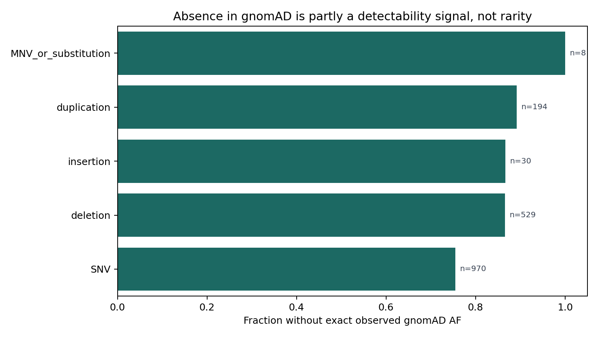
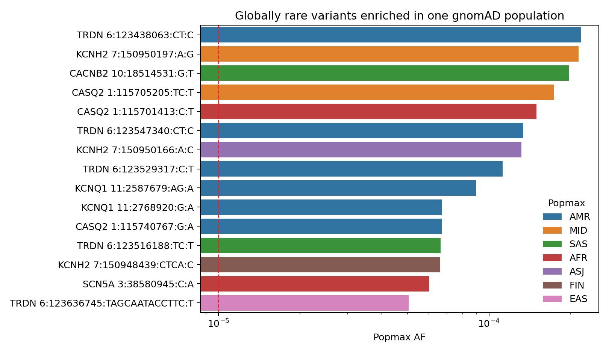
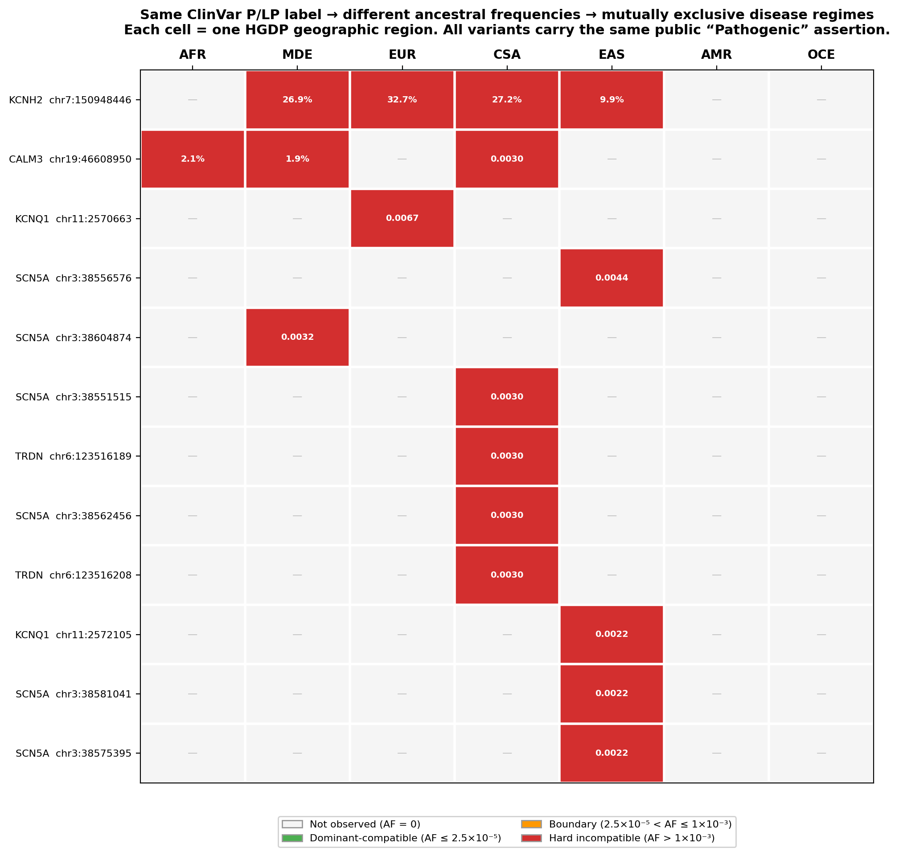
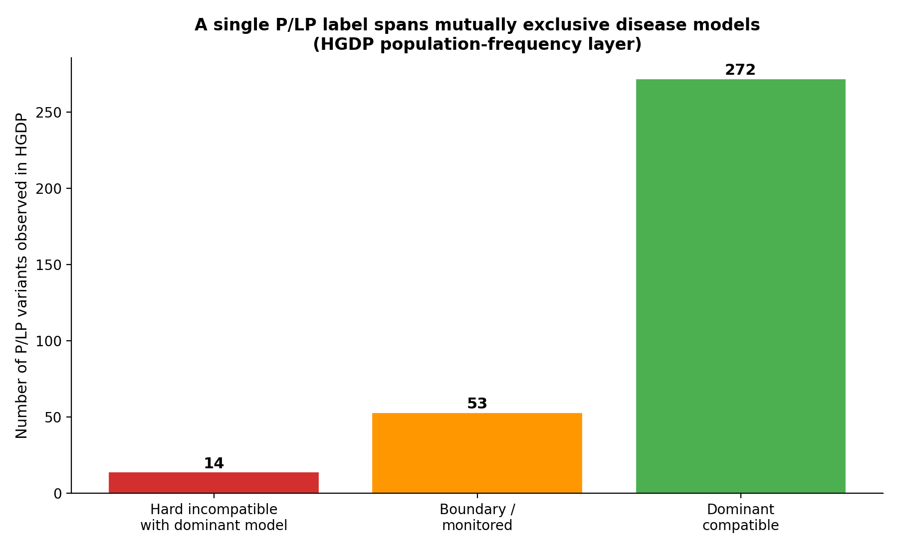
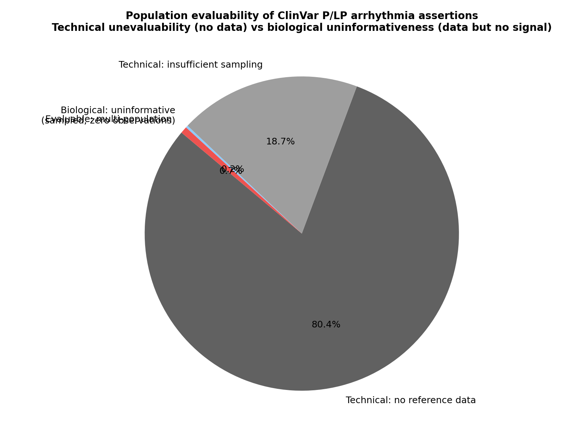
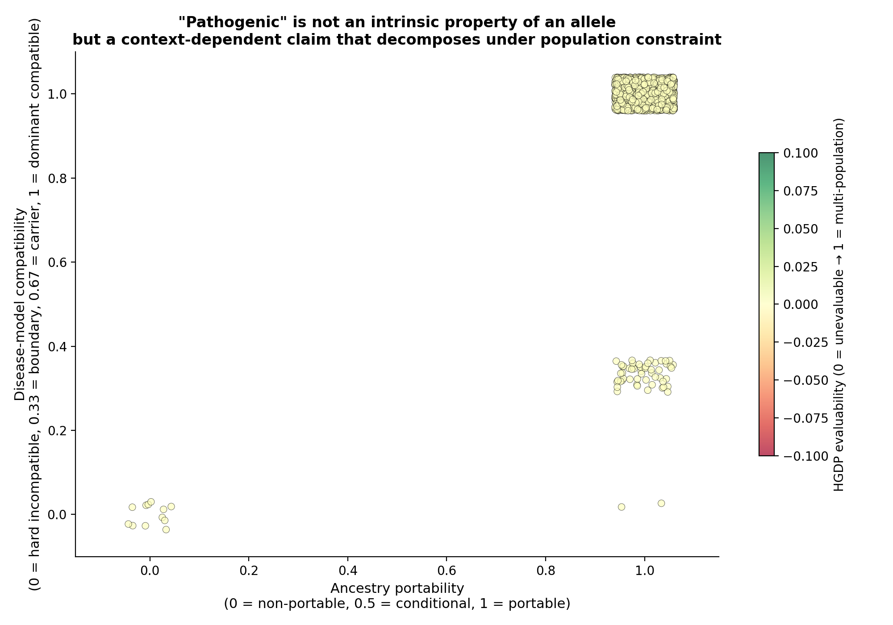

# A Public Pathogenic Label Is Not a Disease State: Population Evaluability Reveals Hidden Interpretation Regimes in ClinVar Arrhythmia Assertions

## Abstract

Public pathogenic and likely pathogenic (P/LP) assertions are widely reused across clinical and research workflows as though they carry a stable and portable disease claim. That reuse assumes that a categorical pathogenicity label preserves the disease model under which it was originally assigned. Here we show that this assumption is systematically unstable once population evaluability and ancestry-aware frequency are restored at the point of downstream use.

We analyzed 1,731 unique ClinVar P/LP variants across 20 inherited arrhythmia genes. Against gnomAD v4.1.1 exomes, we applied strict exact matching, trim-aware and decomposition-aware reconciliation, and full reference-based normalization with `bcftools norm` against a local GRCh38 reference. Only 357 of 1,731 variants (20.6%) achieved allele-resolved population context, while 1,326 (76.6%) retained only locus- or region-level context without allele-resolved allele frequency and 48 (2.8%) remained unevaluable. Reference-based normalization changed 0 of 1,731 variant representations, showing that the dominant limitation was not residual normalization failure but the structural unavailability of allele-resolved population constraint under current representation and aggregation regimes.

Disease-model analysis was therefore restricted to the Tier 1 subset with usable allele-frequency data (`n = 334`, 19.3% of the full cohort). Within this subset, a global-AF-only screen flagged 13 variants above the `1x10^-5` review threshold, whereas a global-or-popmax screen flagged 115. Global-only review therefore missed 102 of 115 ancestry-aware alerts (88.7%). These 115 variants spanned three interpretation regimes beneath the same public P/LP label: hard incompatibility with an unqualified dominant high-penetrance reading (`n = 1`), boundary or monitoring status (`n = 76`), and recessive or carrier-compatible architecture (`n = 38`). Of the 115 alerts, 103 occurred in genes linked to clinically consequential interpretation contexts, including cascade testing, drug restriction, intensive surveillance, and device-related management.

We then applied an independent HGDP regional stress-test using gnomAD r3.1.2 genomes. Under four-level reconciliation, 340 of 1,731 variants entered the HGDP matched universe: 64 as strict allele matches, 4 as representation-rescued matches, and 272 as position-overlap matches. Within that full matched set, 67 of 340 variants (19.7%) fell outside a dominant-compatible regime under the tested maximum-credible-allele-frequency framework, compared with 4 of 64 (6.2%) in the strict-allele-only subset. The difference is not a nuisance detail; it marks the boundary between allele-level evidence and locus-context inference.

These findings support a governance conclusion. A public P/LP label does not reliably preserve the disease-state definition required for safe downstream reuse. For most variants in this study, one of the main constraining signals, allele-resolved population frequency, was not operationally available. Where such constraint was available, the same exported label supported mutually inconsistent biological readings. Responsible reuse therefore requires explicit specification of both the disease model being invoked and the level of population evaluability available for the asserted allele.

## Introduction

Public clinical variant assertions now function as shared infrastructure. A pathogenic or likely pathogenic label exported from ClinVar is routinely reimported into laboratory interpretation pipelines, cascade-testing workflows, decision-support systems, and research analyses as though it were a portable unit of clinical meaning. This pattern of reuse rests on an implicit assumption: that the public label preserves the disease model it was originally intended to describe. To test whether the routing framework simply interrupts trusted assertions, we also assembled the current-snapshot pooled expert-curated comparator available in this repository: 942 allele-level deduplicated expert-panel or practice-guideline P/LP assertions from current scored cross-disease, external-panel, and BRCA/MMR/APC control tables.

That assumption is structurally unsafe. A public P/LP assertion is not a self-sufficient disease claim. It is a compressed object that records a classification outcome while omitting key parts of the interpretive model that produced it, including inheritance logic, penetrance assumptions, ancestry context, representation stability, and the evaluability conditions under which population evidence could be applied. Once the label circulates independently of those parameters, downstream users are forced to reconstruct a disease model that the public object does not itself encode.

This problem is not merely theoretical. In settings where a variant label can influence syndrome diagnosis, family cascade testing, medication guidance, surveillance intensity, or device-related decisions, importing the wrong disease model changes the practical meaning of the assertion. The central question is therefore not whether an individual ClinVar submission may once have been coherent in its original context. The question is whether the exported label remains interpretable as a coherent disease-state claim once ancestry-aware population structure, allele-resolved representation, and mechanism are reintroduced downstream.

Inherited arrhythmia genes provide a stringent test domain for this problem. They span dominant, recessive, and mixed architectures; variable penetrance; ancestry-specific enrichment; founder effects; and clinically consequential interpretation contexts. They therefore expose both the biological and operational consequences of label reuse. This is not because arrhythmia genes are unique, but because they make the infrastructure problem easier to detect.

We examine two linked questions. First, for how many public arrhythmia assertions can allele-resolved population constraint actually be recovered under current public representation and aggregation systems? Second, when such constraint is available, how stable is the disease model implied by the label as observational resolution increases from global AF to ancestry-aware population maxima and then to regional stress-testing in HGDP?

We show that most public arrhythmia assertions cannot be connected to allele-resolved population frequency even after exhaustive reconciliation and reference-based normalization. Among the minority for which allele-resolved context is available, ancestry-aware frequency exposes distinct interpretation regimes concealed beneath the same public P/LP label. A second HGDP-based analysis sharpens the same point: once reconciliation expands beyond strict allele identity, the apparent burden of non-dominant-compatible variants rises markedly, but much of that burden lives in a locus-context universe rather than an allele-proven one. Safe downstream reuse therefore requires more explicit metadata than current public labels provide.

## Methods

### Cohort definition and evidence layering

We analyzed ClinVar P/LP assertions across 20 inherited arrhythmia genes: `KCNQ1`, `KCNH2`, `SCN5A`, `KCNE1`, `KCNE2`, `RYR2`, `CASQ2`, `TRDN`, `CALM1`, `CALM2`, `CALM3`, `ANK2`, `SCN4B`, `KCNJ2`, `HCN4`, `CACNA1C`, `CACNB2`, `CACNA2D1`, `AKAP9`, and `SNTA1`. Variants were collapsed to unique GRCh38 alleles by chromosome, position, reference allele, and alternate allele, yielding 1,731 unique variants in the April 24, 2026 ClinVar data freeze used for this manuscript.

The analyses are intentionally layered. The primary analysis cohort is the allele-resolved arrhythmia set with usable AF (`n = 334`). Expanded external-domain and historical analyses are validation layers for stability and transportability, not substitutes for the primary cohort. Variants without allele-resolved AF remain a non-evaluable universe used to measure infrastructure limits rather than to infer population compatibility. This separation prevents the study from treating a larger pooled count as stronger evidence when the evidentiary status of variants differs.

### Exome reconciliation and evaluability tiering

Variants were cross-referenced against gnomAD v4.1.1 exomes using a multi-step reconciliation pipeline. Matching began with strict allele identity and then added trim-aware and decomposition-aware rescue. All variants were additionally normalized against a local GRCh38 reference using `bcftools norm`. Each variant was then assigned to one of three exome evaluability tiers:

| Tier | Definition | N | % |
|---|---|---:|---:|
| 1 | Exact or equivalent allele-resolved match with usable allele-level AF | 357 | 20.6 |
| 2 | Locus or regional context only; no allele-resolved AF | 1,326 | 76.6 |
| 3 | Genuinely unevaluable after all reconciliation steps | 48 | 2.8 |

Tier 1 contains the only variants used for allele-level frequency conclusions in the exome analysis. Tier 2 was never interpreted as population-consistent by implication.

### Exome frequency screening and regime assignment

For Tier 1 variants with usable AF (`n = 334`), we extracted global AF, popmax AF, allele count, review-strength metadata, and variant-class annotations from existing processed outputs. We used `1x10^-5` as a review trigger rather than as a pathogenicity boundary and compared global-AF-only review with global-or-popmax review. Regime assignment within the 115 ancestry-aware alerts followed the precomputed arrhythmia interpretation framework already present in the repository: hard incompatibility with an unqualified dominant high-penetrance reading, boundary or monitoring status, and recessive or carrier-compatible architecture.

### HGDP regional stress-test

We next queried gnomAD r3.1.2 genomes and the HGDP+1KG population layer using cached GraphQL outputs. Variant reconciliation used four levels: exact allele identity, normalization rescue, event-equivalent rescue, and position-overlap rescue. For reporting, these were collapsed into four match classes:

1. `strict_allele`
2. `normalized_allele` (including event-equivalent rescue)
3. `position_overlap`
4. `no_match`

We also tracked a higher-level allele-resolution label: `allele_resolved`, `representation_rescued`, `locus_context_only`, or `unevaluable`.

### HGDP disease-model compatibility

For HGDP-matched variants, we defined effective AF as the larger of `max_hgdp_af` and `gnomad_r3_genome_af`. We then compared that effective AF to two maximum-credible-allele-frequency thresholds used here as a resolution stress-test:

1. strict dominant high-penetrance ceiling: `2.5x10^-5`
2. generous low-penetrance dominant ceiling: `1x10^-3`

Variants were classified as `dominant_compatible`, `boundary`, or `hard_incompatible`. We report results both for the full HGDP matched universe and for the strict-allele subset alone.

### Clinical-action context and comparator framing

To connect population tension with real downstream use environments, we retained the existing action-context summaries already computed in the repository. These classify alerted variants into clinically consequential gene contexts relevant to cascade testing, drug restriction, and intensive surveillance or device-related management. These context labels are exposure indicators, not patient-outcome measurements.

The comparator is not a claim that every public P/LP record should be acted on identically. It is the class of label-only downstream pipelines that import public P/LP assertions without explicit evaluability, mechanism, inheritance, or population-constraint layers. Examples include VCF annotation filters that promote ClinVar P/LP status, screening or cascade-testing triage lists that do not require state-aware disease models, and clinical decision-support knowledge bases that carry a label forward without allele-count and ancestry-context metadata. The relevant question is therefore whether these label-only pipelines can safely infer direct-actionability compatibility from pathogenicity category alone.

We further separate three validation layers. The gold expert layer remains same-snapshot and strict: current ClinVar expert-panel or practice-guideline P/LP assertions, allele-level deduplicated by `variant_key` (`n = 204` in the cross-disease scored table). The pooled cross-domain expert-curated layer then adds current scored expert-panel/practice-guideline positives from external panels and BRCA/MMR/APC controls (`n = 942`) to test preservation behavior and false interruption, not domain-specific burden or calibration. Multiple-submitters/no-conflicts records are reported separately as a high-review non-expert consistency layer, not as expert truth.

## Results

### 1. A structural evaluability boundary limits allele-resolved population review

Across 1,731 unique arrhythmia P/LP variants, only 357 (20.6%) reached exact or equivalent allele-resolved population context in gnomAD v4.1.1 exomes. Of these, 334 retained usable allele-frequency data for downstream screening. The remaining 1,326 variants occupied Tier 2 locus- or region-context space, and 48 remained genuinely unevaluable after all reconciliation steps.

Strict initial matching recovered 350 variants. Trim-aware and decomposition-aware reconciliation increased recovery by only 7 variants. Full reference-based normalization using `bcftools norm` changed 0 of 1,731 representations. Together, these negative findings matter more than a cosmetic recovery gain: the dominant barrier is not an avoidable formatting miss, but the structural inability to connect most public arrhythmia assertions to allele-resolved population frequency.

### 2. Tier 2 reflects structured representation limits, not random absence

Tier 2 is not a homogeneous gray zone. Within its 1,326 variants, 638 (48.1%) showed allele discordance at the queried locus, whereas 688 (51.9%) lacked even a same-locus gnomAD record. Tier 2 was also enriched for representation-sensitive classes: indels, duplications, and insertions accounted for 640 of 1,326 Tier 2 variants (48.3%), compared with 106 of 357 Tier 1 variants (29.7%), corresponding to an odds ratio of 2.21.

This means that non-observation at the allele level is not a uniform proxy for rarity. For precisely the classes most vulnerable to representation instability, absence of an allele-resolved match often reflects discordance between public assertion and aggregation systems rather than genuine population absence.

### 3. Global AF alone suppresses ancestry-localized tension in the evaluable exome subset

Within the 334 Tier 1 variants with usable AF, 321 (96.1%) had global AF `<= 1x10^-5`, so a global-AF-only review would have flagged just 13 variants. Replacing global AF with the maximum of global AF and popmax AF increased the alert set to 115. Global-only review therefore missed 102 of 115 ancestry-aware alerts (88.7%).

This was not a trivial methodological refinement. Of the 115 alerted variants, 103 fell in genes linked to clinically consequential interpretation contexts. Sixty occurred in drug-restriction contexts, 59 in intensive-surveillance or device-related contexts, and 103 in cascade-testing contexts. Global AF alone therefore suppresses precisely the ancestry-localized signal most relevant to downstream disease-model constraint in this domain.

### 4. Exome-resolved frequency tension spans three interpretation regimes beneath a shared public label

The 115 ancestry-aware exome alerts did not represent one kind of problem. They resolved into three distinct interpretation regimes:

| Regime | N variants | Representative locus | Defining feature |
|---|---:|---|---|
| Hard dominant incompatibility | 1 | `SCN5A VCV000440850` | AF incompatible with an unqualified dominant high-penetrance reading |
| Boundary / monitoring | 76 | `KCNH2 VCV004535537` | Exceeds a strict ceiling but remains compatible with a lower-penetrance dominant interpretation |
| Recessive / carrier-compatible | 38 | `TRDN VCV001325231` | Dominant reading implausible; recessive or carrier logic remains coherent |

`SCN5A VCV000440850` remains the clearest incompatibility case in the exome-resolved subset. `KCNH2 VCV004535537` illustrates a parameter-sensitive monitoring regime rather than a categorical collapse, and `TRDN VCV001325231` shows how a generic P/LP label can flatten a carrier-compatible recessive allele into an apparently dominant claim unless the disease model is made explicit.

These regimes convert the result from a single non-pass percentage into a risk model. Direct-actionability compatibility becomes most plausible when a variant is allele-resolved, population-consistent under global and popmax AF, and mechanistically aligned with the asserted inheritance model. Review/deferral becomes more likely when evaluability is incomplete, popmax and global AF disagree, or the variant sits near a maximum-credible-AF boundary. Model conflict becomes most plausible when an AC-supported population signal is incompatible with an unqualified dominant high-penetrance interpretation, or when a carrier-compatible recessive mechanism has been exported as a generic P/LP disease claim.

### 5. HGDP adds regional resolution but sharpens the match-class problem

We next applied a second, stricter resolution stress-test using gnomAD r3.1.2 genomes and HGDP regional frequencies. Under four-level reconciliation, 340 of 1,731 variants entered the HGDP matched universe:

| HGDP match class | N | % of total cohort |
|---|---:|---:|
| `strict_allele` | 64 | 3.7 |
| `normalized_allele` | 4 | 0.2 |
| `position_overlap` | 272 | 15.7 |
| `no_match` | 1,391 | 80.4 |

This is the core caution of the HGDP layer. The matched universe is substantially larger than the strict-allele subset, but most of that expansion comes from `position_overlap`, not allele identity. Under the accompanying evaluability classification, only 12 variants were HGDP-evaluable, 328 were present but data-insufficient or absent in HGDP populations, and 1,391 remained technically unevaluable in the regional layer.

### 6. Quantitative regime burden depends strongly on whether locus-context matches are allowed

Within the full HGDP matched universe (`n = 340`), 67 variants (19.7%) fell outside a dominant-compatible regime under the tested MCAF framework: 14 `hard_incompatible` and 53 `boundary`. In the strict-allele-only subset (`n = 64`), only 4 variants (6.2%) were non-dominant-compatible: 1 `hard_incompatible` and 3 `boundary`.

| Analysis universe | Hard incompatible | Boundary | Dominant-compatible | Total non-dominant-compatible |
|---|---:|---:|---:|---:|
| Full HGDP matched set (`n = 340`) | 14 (4.1%) | 53 (15.6%) | 273 (80.3%) | 67 (19.7%) |
| Strict-allele HGDP subset (`n = 64`) | 1 (1.6%) | 3 (4.7%) | 60 (93.8%) | 4 (6.2%) |

This distinction is not cosmetic. Position-overlap matching expands the scope of evaluability and highlights where regime shifts may be hiding, but it does not constitute allele-level proof of frequency incompatibility. The public-label problem is therefore two-layered: a structural inability to recover allele-resolved context for most variants, and a second inferential gap between locus-context stress signals and allele-level evidence.

## Discussion

### A public P/LP label is a compressed object, not a self-contained disease claim

The most important result of this study is not simply that some P/LP variants are too frequent. It is that the exported label does not reliably preserve the disease-state model required for downstream reuse. In the exome-resolved subset, the same public label spans hard incompatibility, monitoring, and carrier-compatible regimes. In the HGDP layer, the same label can move between dominant-compatible and non-dominant-compatible interpretations depending on whether one works with strict allele identity or with position-overlap rescue.

### The evaluability boundary is structural, not a pipeline artifact

The exome reconciliation result is especially informative because of what it did not show. Reference-based normalization changed 0 of 1,731 variants. Exhaustive reconciliation rescued only 7 additional exact or equivalent exome matches. This localizes the failure clearly: the main barrier is not missed left-alignment or sloppy trimming, but a structural disconnect between public clinical assertions and population aggregation systems.

### Population structure is not a refinement layer; it is part of the claim

Global-only screening missed 88.7% of ancestry-aware exome alerts. In a domain shaped by ancestry-localized enrichment, founder effects, and mixed inheritance architectures, global AF is not a sufficient stand-in for the population signal needed to constrain a disease model. Popmax does not add decorative granularity; it restores biologically relevant structure that global AF suppresses.

### The HGDP layer exposes a second boundary: allele proof versus locus-context stress

The HGDP analysis sharpens the story rather than replacing it. It shows that once one pushes beyond exome popmax into regional stress-testing, most additional coverage is gained through `position_overlap`, not through allele-resolved rescue. That is valuable because it identifies where regime shifts may be hiding, but it also creates a new evidentiary boundary. A full matched-universe estimate (19.7% non-dominant-compatible) and a strict-allele estimate (6.2%) answer different questions. Both are informative; neither should be reported as though it were the other.

### Arrhythmia genes act here as a stress-test domain

This manuscript does not claim that arrhythmia genes are uniquely affected. Rather, they provide a stringent domain in which ancestry structure, variable penetrance, founder effects, and high-consequence downstream interpretation coexist. That combination makes failures of disease-model portability easier to see. Whether the same quantitative regime burdens recur in other disease areas requires separate empirical work.

### Expanded validation should test structure, not just scale

Because a 10,000-variant strict expert-positive layer is not available in the current cached snapshot, the current revision preserves a 204-allele gold expert layer and adds a 942-allele pooled cross-domain expert-curated robustness layer. This pooled cross-domain preservation layer includes 191 frequency-observed variants, 811 severe-annotation variants, and no red-priority calls; it is not used for domain-specific burden or calibration claims. Fifty-five of 942 (5.8%) had a naive AF alert, 21 (2.2%) had AC-supported frequency tension, and only 4 (0.4%) reached score >=70, all as orange review/monitoring rather than hard red interruption. This supports the intended safety property: trusted expert positives are not automatically overturned, but high-frequency exceptions are surfaced as state-aware review cases.

A future 10,000- to 20,000-variant expansion would only strengthen the manuscript if it preserves evidence layering and tests stability across strata. The core arrhythmia cohort should remain separate from an expanded high-review or expert-panel ClinVar layer, independent ClinGen/VCEP or locus-specific truth sets where available, benign/likely benign controls, external disease-domain replication panels, and the non-evaluable representation-sensitive universe. Pooling these sources into one denominator would obscure the central result.

The expanded analysis should therefore report stratified validation by evaluability tier, disease mechanism, inheritance model, consequence class, ancestry-localized enrichment, review status, and disease domain. Its main endpoint should be the probability of direct-actionability compatibility or review/deferral as a function of evaluability, mechanism, inheritance, popmax/global discordance, and variant class, not merely the fraction of variants exceeding a fixed alert threshold. A key safety metric should be false interruption: among high-review or expert-curated P/LP positives, how often does the framework create a hard model conflict rather than a review, monitoring, or metadata-completion route?

## Limitations

First, all exome disease-model conclusions are restricted to the 334 Tier 1 variants with usable allele-resolved AF. The unevaluable majority cannot be assumed to follow the same regime structure. The 942-allele pooled expert-curated comparator is therefore a specificity and false-interruption layer, not an expanded replacement for the primary arrhythmia cohort. Larger future validation sets would not remove this limitation unless they preserve the same evaluability separation and report false-interruption rates in expert-positive strata.

Second, the HGDP regional analysis is limited by both sparse evaluability and the distinction between strict-allele and position-overlap matching. The expanded matched universe is directionally informative, but the strongest quantitative claims remain concentrated in the strict or representation-rescued allele-level subset.

Third, this is a study of disease-model compatibility, not of patient-level outcomes. The clinical-action categories used here identify exposure to consequential decision environments but do not quantify realized downstream harm.

Fourth, frequency-based analysis can exclude a particular disease-model reading, but it cannot on its own establish the correct alternative interpretation. Low penetrance, haplotypic context, allelic phase, transcript-specific rescue, segregation evidence, and functional validation remain outside the scope of this analysis unless orthogonal data are introduced.

Fifth, the `1x10^-5` trigger used in the exome screening layer is operational rather than ontological. The qualitative result, especially the large popmax gain over global AF, was stable, but absolute alert counts depend on the screening threshold selected.

## Governance Implications

Three governance-relevant conclusions follow.

First, popmax should be required alongside global AF in inherited arrhythmia variant review. In this study, global-only screening missed 88.7% of ancestry-aware frequency alerts, and 103 of those alerts occurred in clinically consequential gene contexts.

Second, public assertions intended for downstream reuse should carry at least three additional fields alongside pathogenicity category:

1. the disease-state model being asserted, including inheritance class and penetrance logic;
2. the population evaluability tier of the asserted allele;
3. the allele count supporting any cited population signal, together with explicit acknowledgment of low-count uncertainty; and
4. the recommended downstream route: direct-actionability compatible, state-aware review/metadata completion, or explicit disease-model conflict.

Third, downstream users should not equate locus-context stress with allele-level proof. For indels, duplications, splice-disrupting variants, and other representation-sensitive classes, non-observation and same-position overlap are properties of representation before they are properties of biology.

## Conclusion

Across 1,731 ClinVar P/LP variants in 20 inherited arrhythmia genes, two problems converge. The first is operational: even after exhaustive reconciliation and reference-based normalization, most public assertions lacked allele-resolved population context in the exome layer, and the HGDP regional layer was even more sharply constrained. The second is biological: among the minority of variants for which population constraint was recoverable, the same exported P/LP label supported mutually inconsistent disease-model readings.

These findings establish a structural problem rather than a complete prevalence estimate. The unevaluable majority cannot yet be analyzed at the same depth, and that inability to assess scope is itself part of the governance failure documented here.

A public pathogenic label does not reliably preserve the disease-state definition required for safe downstream reuse. Responsible reuse requires, at minimum, explicit specification of the disease model being invoked and explicit declaration of the degree of population evaluability available for the asserted allele.

## Tool Availability

The computational pipeline used for these analyses is available in the project repository. Historical script names retain the `vital` prefix, but the current manuscript framing is evaluability- and disease-model-centric rather than tool-centric.

## Data Availability

Code, cached intermediate files, processed tables, and figure assets required to reproduce the analyses summarized here are available in the repository. The April 24, 2026 data freeze used ClinVar public assertion snapshots together with gnomAD v4.1.1 exome outputs and gnomAD r3.1.2 genome/HGDP regional outputs already cached in the project workspace.
