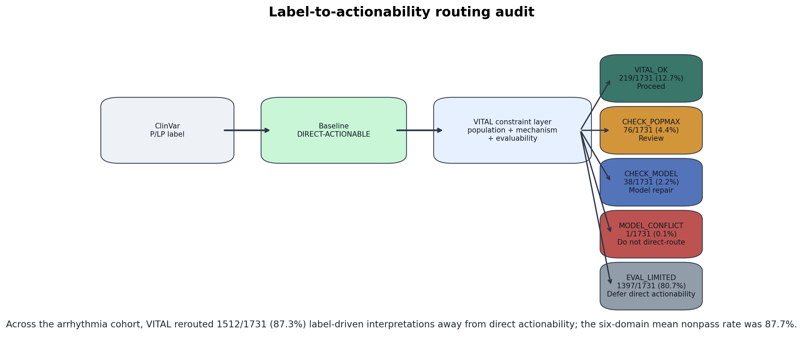
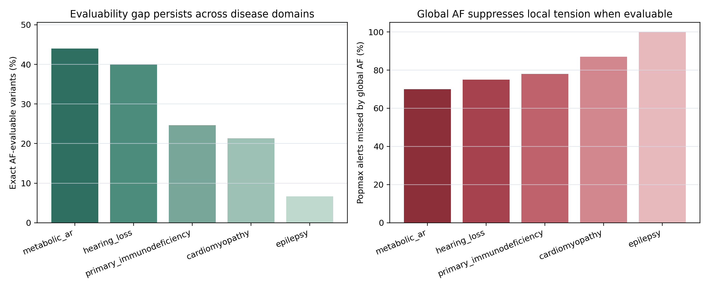
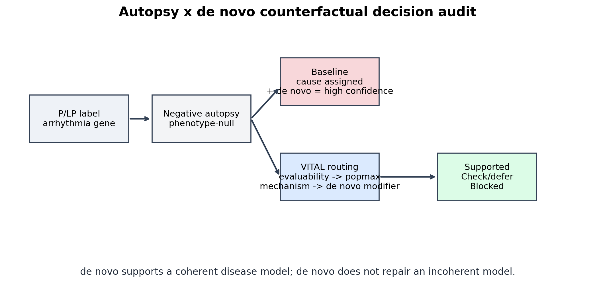
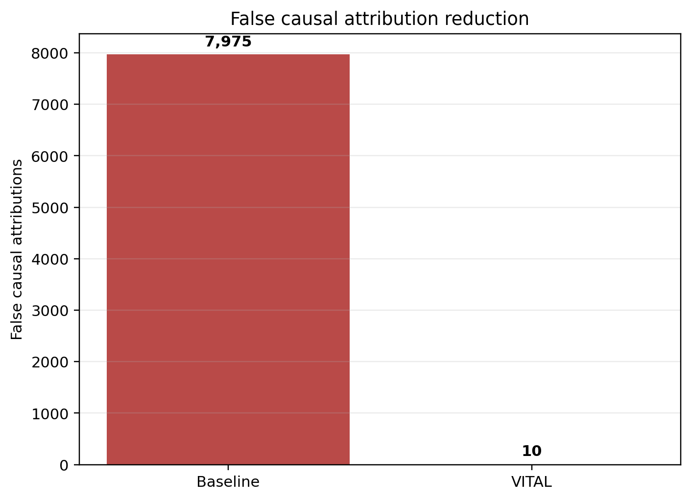
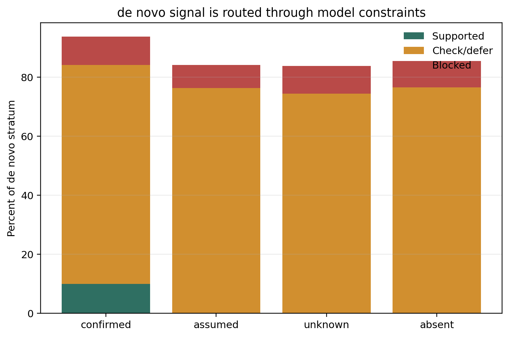
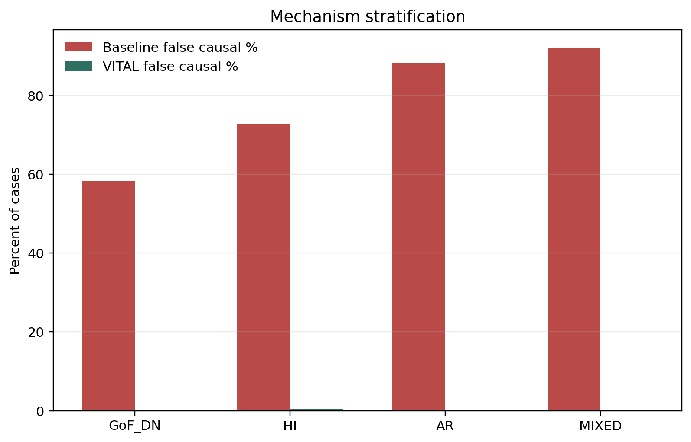
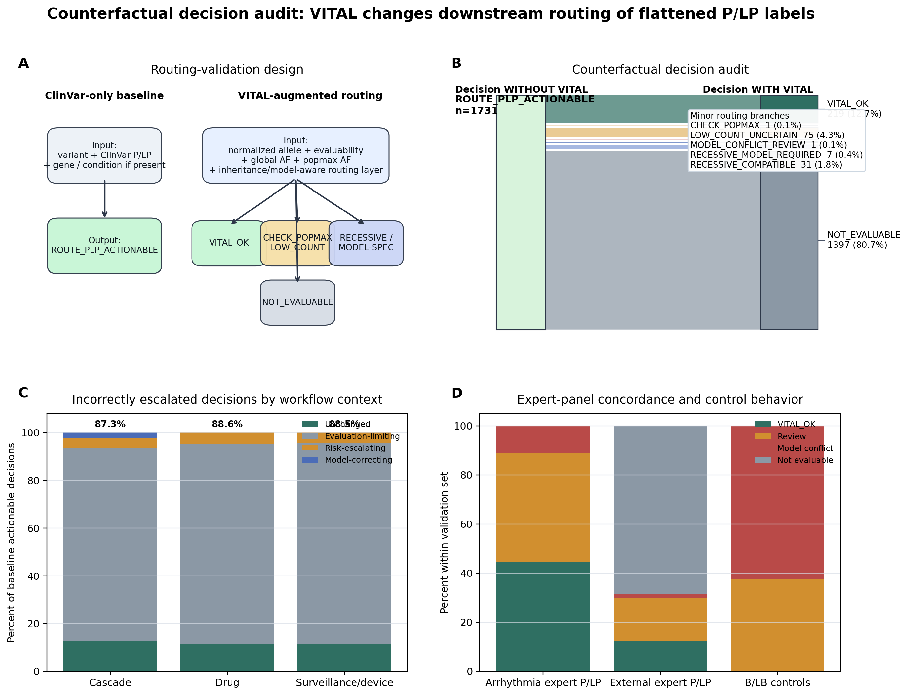

# Population- and mechanism-aware constraints expose unstable actionability of public pathogenic variant labels

## Abstract

Public pathogenic/likely-pathogenic (P/LP) variant labels are widely reused as portable disease-state claims. After downstream flattening of condition- and submission-level context, however, the disease model implied by a P/LP label may no longer be recoverable. This study tests whether flattened labels reliably preserve dominant disease-model compatibility under population-frequency stress and whether such labels can be safely reused as direct-actionability proxies without an explicit constraint layer.

We examined 1,731 ClinVar P/LP variants across 20 inherited arrhythmia genes, of which 17 contributed P/LP records. Only 357 variants (20.6%) achieved allele-resolved frequency recovery in gnomAD v4.1.1 exomes, and primary frequency conclusions were therefore restricted to the 334 variants with usable allele-resolved AF. Within that evaluable subset, ancestry-aware popmax screening identified frequency alerts missed by 102 of 115 global-only queries (88.7%), including 103 alerts in potentially consequential interpretation contexts such as cascade testing, medication guidance, surveillance intensity, or device-related management.

Applying maximum-credible-allele-frequency (MCAF) stress-testing classified the evaluable exome subset into operationally distinct regimes. Here, decomposition denotes only disease-model incompatibility under population-frequency stress, not a claim that the variant is benign or incorrectly classified. At biologically interpretable thresholds, incompatibility with an unqualified dominant high-penetrance model was mechanism-dependent: gain-of-function/dominant-negative genes showed zero observed decomposition (0/34; 95% CI 0-10.2%), haploinsufficient genes showed intermediate decomposition, and recessive genes showed the highest decomposition. Supplementary HGDP and hereditary-cancer analyses were retained only as secondary stress checks rather than as co-equal burden estimates.

We then translated these population and mechanism constraints into VITAL, a post-label actionability routing layer. Under a label-driven baseline, all 1,731 arrhythmia P/LP variants entered a direct-actionable route. After VITAL, 1,512/1,731 decisions (87.3%) were rerouted: 1,397 (80.7%) were evaluation-limiting, 77 (4.4%) were risk-escalating, and 38 (2.2%) were model-correcting. Across six disease domains, the mean nonpass rate was 87.7%. Routing instability persisted among high-review assertions (309/365; 84.7%), while expert-curated evaluable positives were largely preserved (69/73; 94.5% VITAL_OK or review-level; 4/73; 5.5% hard model conflict).

These findings operationalize a measurable downstream reuse failure mode: within the evaluable subset, the portability of a P/LP label as a disease-state claim depends on disease model, molecular mechanism, and population-frequency resolution, none of which are currently encoded in the exported label. Population-structured frequency review should therefore be treated as a minimum evidence layer in downstream interpretation workflows, while preserving explicit uncertainty for non-evaluable variants. VITAL does not reclassify variants; it reroutes actionability when flattened labels no longer carry the constraints required for direct reuse.

## Central Claim

Public P/LP is classification evidence, not portable actionability. Direct actionability should be granted only when the label survives explicit allele-resolved evaluability, ancestry-aware frequency, and disease-model constraints.

## Introduction

Public clinical variant assertions now function as shared infrastructure. A pathogenic or likely pathogenic label exported from ClinVar is routinely reimported into laboratory interpretation pipelines, cascade-testing workflows, decision-support systems, review spreadsheets, VCF annotation tools, screening filters, and research analyses as though it were a portable unit of clinical meaning. This pattern of reuse rests on an implicit assumption: that the public label preserves the disease model it was originally intended to describe.

That assumption is structurally unsafe. A public P/LP assertion records a classification outcome but not necessarily the disease-model parameters required for reliable downstream reuse, including inheritance, penetrance, ancestry context, representation stability, molecular mechanism, and whether population evidence was evaluable at all. This study therefore does not adjudicate original ClinVar submissions. It models a downstream reuse failure mode in which exported P/LP alleles are consumed after condition- and submission-level context has been flattened.

This flattening scenario is routine. Laboratory information systems, VCF annotation pipelines, decision-support tools, review spreadsheets, and screening filters often import ClinVar as a categorical flag. In each case, the consumer may receive a P/LP label without the disease model that justified it.

The concern is practical rather than semantic. In potentially consequential interpretation contexts such as syndrome diagnosis, family cascade testing, medication guidance, surveillance intensity, or device-related management, the key question is whether an exported label remains interpretable once ancestry-aware frequency, allele-resolved representation, and mechanism are restored downstream.

Inherited arrhythmia genes provide a stringent test domain for this problem. They span dominant, recessive, and mixed architectures; variable penetrance; ancestry-specific enrichment; founder effects; and clinically consequential interpretation contexts. They therefore expose both the biological and operational consequences of label reuse. This is not because arrhythmia genes are unique, but because they make the infrastructure problem easier to detect.

We examine three linked questions. First, how much of the public arrhythmia label space is population-evaluable at all under current representation systems? Second, within the exome Tier 1 usable-AF subset that serves as the primary analysis, how often does a label remain compatible with a dominant high-penetrance disease model when one moves from global AF to ancestry-aware popmax and then to frequency stress-testing? Third, when the same outputs are routed as actionability decisions, how often does a label-driven baseline require review, deferral, or model repair?

We show that most public arrhythmia assertions cannot be connected to allele-resolved population frequency even after exhaustive reconciliation and reference-based normalization. Among the minority for which allele-resolved context is available, ancestry-aware frequency exposes distinct interpretation regimes concealed beneath the same public P/LP label. Critically, the rate of disease-model decomposition is not random: it is mechanistically determined by molecular mechanism and variant consequence, and the broader compression problem recurs across biologically distinct disease domains. Safe downstream reuse therefore requires more explicit metadata than current public labels provide.

## Methods

### Cohort Definition

We analyzed ClinVar P/LP assertions across 20 inherited arrhythmia genes: KCNQ1, KCNH2, SCN5A, KCNE1, KCNE2, RYR2, CASQ2, TRDN, CALM1, CALM2, CALM3, ANK2, SCN4B, KCNJ2, HCN4, CACNA1C, CACNB2, CACNA2D1, AKAP9, and SNTA1. Variants were collapsed to unique GRCh38 alleles by chromosome, position, reference allele, and alternate allele, yielding 1,731 unique variant records.

Throughout this manuscript, "P/LP variant record" refers operationally to a unique chr-pos-ref-alt allele carrying at least one public P/LP classification in ClinVar after collapsing across condition-specific submissions and submitters. This unit preserves allele identity but does not retain condition-level or submission-level semantics in the April 24, 2026 ClinVar data freeze used for this manuscript.

Of the 20 genes queried, 17 contributed P/LP variants to the final dataset. KCNE2, SCN4B, and SNTA1 had no P/LP variant records in the ClinVar freeze and are therefore absent from downstream analyses. Where this manuscript refers to "17 genes" in mechanism-stratified analyses or cross-domain comparisons, it reflects this data-driven reduction from the 20-gene query set. This deliberate flattening models the reuse scenario under investigation: downstream consumption of exported P/LP alleles after condition and submission context has been lost.

### Exome Reconciliation and Evaluability Tiering

Variants were cross-referenced against gnomAD v4.1.1 exomes using a multi-step reconciliation pipeline. Matching began with strict allele identity and then added trim-aware and decomposition-aware rescue. All variants were additionally normalized against a local GRCh38 reference using bcftools norm. Each variant was then assigned to one of three exome evaluability tiers:

| Tier | Definition | N | % |
| --- | --- | ---: | ---: |
| 1 | Exact or equivalent allele-resolved match with usable allele-level AF | 357 | 20.6 |
| 2 | Locus or regional context only; no allele-resolved AF | 1,326 | 76.6 |
| 3 | Genuinely unevaluable after all reconciliation steps | 48 | 2.8 |

Tier 1 contains the only variants used for allele-level frequency conclusions in the exome analysis. Tier 2 was never interpreted as population-consistent by implication.

### Exome Frequency Screening and Regime Assignment

For Tier 1 variants with usable AF (n = 334), we extracted global AF, popmax AF, allele count, review-strength metadata, and variant-class annotations. We used 1 x 10^-5 as a review trigger rather than as a pathogenicity boundary because it provides a conservative operational screen for dominant high-penetrance arrhythmia claims while remaining below frequencies that would already imply obvious incompatibility. We then compared global-AF-only review with global-or-popmax review.

Regime assignment within the 115 ancestry-aware alerts followed three categories: hard incompatibility with an unqualified dominant high-penetrance reading, boundary or monitoring status, and recessive or carrier-compatible architecture.

Throughout this manuscript, "disease-model decomposition" (or simply "decomposition"; equivalently, disease-model incompatibility under population-frequency stress) refers operationally to the failure of a flattened P/LP label to remain compatible with an unqualified dominant disease-state model under specified population-frequency constraints. A variant "decomposes" when its popmax allele frequency exceeds the maximum credible allele frequency (MCAF) for the tested disease model, indicating that the implied dominant high-penetrance interpretation is not sustainable at that population-frequency resolution. Decomposition does not imply that the variant is benign or that its original classification was incorrect; it indicates that the disease model implied by an unqualified P/LP label requires additional specification, such as recessive inheritance, reduced penetrance, or population-specific context, to remain coherent.

### MCAF Threshold Rationale

MCAF thresholds were treated as disease-model stress ceilings, not as pathogenicity cutoffs. The governing form was:

`MCAF = prevalence x allelic contribution / (penetrance x 2)`

The analysis therefore asks whether an observed population frequency is compatible with a specified disease model, not whether the variant is pathogenic. Three thresholds were used to bracket biologically interpretable dominant arrhythmia scenarios: 2.5 x 10^-5 as a strict high-penetrance dominant ceiling, 1 x 10^-4 as a reduced-penetrance or founder-compatible boundary, and 1 x 10^-3 as a deliberately permissive sensitivity extreme. The 1 x 10^-5 exome screen was used only to nominate variants for review before MCAF bracketing, not as the final model-incompatibility definition.

This threshold strategy is internally checked in three ways. First, absolute alert counts change under threshold sensitivity, but the ordinal mechanism gradient is preserved. Second, the GoF/dominant-negative class behaves as a positive control: at biologically interpretable MCAF thresholds, it shows 0/34 decomposition. Third, hard conflict is separated from boundary or recessive-compatible routing rather than collapsed into a single "too frequent" label. These safeguards prevent MCAF from becoming an uncalibrated reclassification rule.

### Baseline Decision Model and VITAL Routing

To connect the frequency-stress analysis with downstream reuse, we formalized a simple label-driven baseline. This baseline is not a clinical recommendation; it is the null model used to audit flattened reuse.

| Rule | Definition |
| --- | --- |
| B1_LABEL_DRIVEN_BASELINE | If a variant is exported as public ClinVar P/LP, downstream systems may treat it as eligible for direct actionability unless additional context is explicitly encoded. |
| B2_ACTIONABILITY_CONTEXT_BASELINE | If a P/LP variant appears in a gene linked to intervention, surveillance, cascade testing, device consideration, or therapy selection, the baseline route is ROUTE_PLP_ACTIONABLE. |
| B3_NO_IMPLIED_BENIGNITY | Absence of VITAL_OK does not imply benignity. It implies that direct actionability is not supported by the flattened label alone. |

VITAL was implemented as a post-label routing layer:

| VITAL route | Definition | Operational routing |
| --- | --- | --- |
| VITAL_OK | Label remains compatible with the tested actionability model. | Proceed with standard expert interpretation. |
| CHECK_POPMAX | Label may remain valid, but direct actionability requires ancestry-aware frequency review. | Review. |
| CHECK_MODEL | Label may remain valid, but inheritance, phase, or mechanism is not portable from the flattened label. | Model-specific routing or repair. |
| MODEL_CONFLICT | Flattened P/LP label is incompatible with the tested dominant high-penetrance disease model. | Do not direct-route as dominant actionability. |
| EVAL_LIMITED | No allele-resolved evaluability; direct actionability cannot be justified from population evidence. | Defer direct actionability pending representation, callability, or orthogonal evidence. |

Nonpass does not mean wrong. Nonpass means that direct actionability cannot proceed from the flattened label without review, deferral, or model repair.

### MVP Annotation Layer

To make the framework directly reusable in downstream annotation workflows, we implemented a minimal VITAL annotation layer. The MVP annotator accepts normalized VCF, CSV, or TSV inputs and maps variants against a precomputed lookup table derived from the arrhythmia analysis. Outputs include VITAL_evaluability, VITAL_flag, VITAL_regime, VITAL_popmax_af, VITAL_global_af, VITAL_threshold, and VITAL_reason.

For pipeline compatibility, the tool also generates an ANNOVAR-style export using Chr, Start, End, Ref, and Alt coordinates. All lookup-based interpretation requires prior variant normalization against GRCh38 using bcftools norm. The MVP intentionally restricts actionable flags to three categories: OK, CHECK_POPMAX, and MODEL_CONFLICT. VITAL_OK does not imply benign status, CHECK_POPMAX does not imply reclassification, and MODEL_CONFLICT denotes incompatibility only with the tested unqualified dominant high-penetrance model.

### HGDP Regional Stress-Test

We queried gnomAD r3.1.2 genomes and the HGDP+1KG population layer using cached GraphQL outputs. Variant reconciliation used four levels: exact allele identity, normalization rescue, event-equivalent rescue, and position-overlap rescue, collapsed into four match classes: strict_allele, normalized_allele, position_overlap, and no_match.

For HGDP-matched variants, effective AF was defined as the larger of max_hgdp_af and gnomad_r3_genome_af. This was compared against three pre-specified MCAF thresholds used as a resolution stress-test: 2.5 x 10^-5 as a strict dominant high-penetrance ceiling, 1 x 10^-4 as a reduced-penetrance or founder-compatible dominant boundary, and 1 x 10^-3 as a deliberately permissive sensitivity extreme used only for threshold-sweep robustness testing. These values were chosen to span biologically and clinically interpretable dominant arrhythmia scenarios rather than to create a single adjudication cutoff.

Variants were classified as dominant_compatible, boundary, or hard_incompatible. HGDP results are reported in three evidence layers: strict allele evidence as the primary evidence layer, position-overlap matches as a hypothesis-generating stress map, and the full matched set as exploratory signal rather than an allele-level burden estimate.

### Molecular Mechanism Classification

Genes were classified by molecular mechanism into three categories: gain-of-function/dominant-negative (GoF/DN), haploinsufficient (HI), and recessive (AR). These labels represent the dominant disease-model context being stress-tested for each gene, not a claim that every variant in a given gene acts exclusively through that mechanism. Gene-level assignments, their sources (ClinGen, OMIM, published literature), and caveats for genes with mixed or debated mechanisms, including SCN5A and KCNQ1, are detailed in supplementary tables.

For each category, decomposition rate was defined as the proportion of population-evaluable variants falling outside the dominant-compatible regime. Association between mechanism class and decomposition was assessed by logistic regression with LOEUF score (gnomAD v4.1), variant consequence, and disease domain as covariates. Because the GoF/DN mechanism class exhibits complete separation at biologically interpretable thresholds, Firth-type penalized logistic regression was used to obtain finite, bias-corrected estimates. Leave-one-gene-out sensitivity analysis was used to assess robustness to gene-level clustering.

### Cross-Domain Replication and Structural Sanity Checks

To test whether evaluability compression and regime heterogeneity are domain-specific, we applied the same framework, with the same MCAF thresholds, evaluability tier definitions, and reconciliation logic, to hereditary cancer predisposition genes (BRCA1, BRCA2, MLH1, MSH2, MSH6, PMS2). No domain-specific parameter tuning was applied. This replication is treated as a structural stress-test, not as clinical adjudication or cross-domain calibration; quantitative burdens are interpreted as threshold-dependent and domain-specific.

In parallel, we analyzed five additional sampled public P/LP panels (cardiomyopathy, epilepsy, metabolic autosomal-recessive disease, primary immunodeficiency, and hearing loss) to test whether actionability-routing instability recurs outside arrhythmia.

### Validation and Calibration Layers

The validation architecture was designed as calibration rather than as a single oversized truth set. Four layers were used.

First, high-review ClinVar assertions tested whether routing instability persisted after excluding the weakest public assertions. Second, ClinVar expert-panel and practice-guideline assertions, including ClinGen-curated sources where present in ClinVar, tested whether VITAL preserved expert-curated positives as compatible or review-level rather than indiscriminately generating hard conflicts. Third, expert-curated benign/likely benign controls tested whether VITAL behaved as a disease-model compatibility layer rather than as a pathogenicity detector. Fourth, the counterfactual decision audit and simulated CDS layer tested whether VITAL changed the route taken by a label-driven workflow.

This validation suite is intentionally modest. It is not a blinded clinician adjudication study, and the expert-curated arrhythmia subset is small. Its purpose is to check calibration, specificity of hard-conflict behavior, and workflow-level decision change.

### Autopsy x de novo Counterfactual Decision Audit

To model negative-autopsy interpretation contexts, we implemented an Autopsy x de novo Counterfactual Decision Audit. This phenotype-null framework simulates scenarios in which no structural post-mortem abnormality is available and genetic findings become the primary explanatory anchor.

Each simulated case was assigned a candidate variant, genotype, disease mechanism, inheritance model, population frequency, evaluability tier, autopsy context, and de novo status. The simulation used a hybrid variant universe: empirical ClinVar/gnomAD arrhythmia variants for observed label/frequency structure, plus simulated variants to cover the allele-frequency range from 1 x 10^-6 to 1 x 10^-2. Genotypes were sampled conditional on a candidate alternate allele being present, using AF-derived heterozygous and homozygous probabilities. The primary phenotype-null setting used negative autopsy, absent structural heart disease, no phenotype, and unknown family history.

A label-driven baseline treated any public P/LP variant in an arrhythmia-associated gene as sufficient for probable causal attribution, with confirmed trio de novo status increasing confidence to high. VITAL routing instead required allele-level evaluability, ancestry-aware population-frequency compatibility, and disease-model coherence before causal attribution could proceed. De novo status was treated as supportive evidence only when the underlying disease model remained coherent.

The primary endpoint was false causal attribution, defined as assignment of a variant as the probable cause of death when the simulated ground-truth disease model did not support causality. Secondary endpoints included de novo override error, prevented false attribution, CHECK/DEFER burden, MODEL_CONFLICT routing, and preservation of gold-standard dominant positives.

### Clinical-Action Context and Actionability Discordance Audit

To connect population tension with real downstream use environments, alerted variants were classified into potentially consequential interpretation contexts: cascade testing, drug restriction, intensive surveillance, device-related management, syndrome diagnosis, or carrier/recessive routing. These context labels indicate exposure environments, not measured downstream outcomes.

We also built an Actionability Discordance Audit (ADS) from repository-derived routing calls and representative case vignettes. Inclusion required a public P/LP assertion, action-associated context, normalized variant identity, and a VITAL route of CHECK_POPMAX, CHECK_MODEL, MODEL_CONFLICT, or EVAL_LIMITED. The ADS is not a harm registry; it is a variant-level audit of cases where direct actionability is not fully supported once constraints are restored.

### Analysis Hierarchy

The main text uses one primary denominator chain:

`1,731 public arrhythmia P/LP labels -> 357 allele-resolved exome matches -> 334 usable-AF variants -> 115 ancestry-aware frequency alerts`

All primary disease-model conclusions come from the 334 usable-AF variants. All primary actionability-routing conclusions use the 1,731-label arrhythmia baseline. HGDP, hereditary cancer, and external disease panels are supplementary stress layers: they test structural recurrence and failure modes, not primary burden estimates.

| Layer | Main denominator | Role |
| --- | ---: | --- |
| Public arrhythmia label universe | 1,731 | Primary routing denominator |
| Allele-resolved exome recovery | 357 | Evaluability boundary |
| Usable-AF exome subset | 334 | Primary population/MCAF denominator |
| Popmax alert set | 115 | Primary regime and context analysis |
| HGDP / cancer / external panels | variable | Supplementary stress architecture only |

## Results

### 1. A Structural Evaluability Boundary Limits Allele-Resolved Population Review

Across 1,731 unique arrhythmia P/LP variants, only 357 (20.6%) reached exact or equivalent allele-resolved population context in gnomAD v4.1.1 exomes. Of these, 334 retained usable allele-frequency data for downstream screening. The remaining 1,326 variants occupied Tier 2 locus- or region-context space, and 48 remained genuinely unevaluable after all reconciliation steps.

Strict initial matching recovered 350 variants. Trim-aware and decomposition-aware reconciliation increased recovery by only 7 variants. Full reference-based normalization using bcftools norm changed 0 of 1,731 representations. Together, these negative findings matter more than a cosmetic recovery gain: the dominant barrier is not an avoidable formatting miss, but the structural inability to connect most public arrhythmia assertions to allele-resolved population frequency.

### 2. Tier 2 Reflects Structured Representation Limits, Not Random Absence

Tier 2 is not a homogeneous gray zone. Within its 1,326 variants, 638 (48.1%) showed allele discordance at the queried locus, whereas 688 (51.9%) lacked even a same-locus gnomAD record. Tier 2 was also enriched for representation-sensitive classes: indels, duplications, and insertions accounted for 640 of 1,326 Tier 2 variants (48.3%), compared with 106 of 357 Tier 1 variants (29.7%), corresponding to an odds ratio of 2.21.

This means that non-observation at the allele level is not a uniform proxy for rarity. For precisely the classes most vulnerable to representation instability, absence of an allele-resolved match often reflects discordance between public assertion and aggregation systems rather than genuine population absence. This argument applies most strongly to indels, duplications, and splice-disrupting variants, where representation instability can cause genuine alleles to be absent from frequency databases for technical reasons. For SNVs in well-covered callable regions, allele absence in gnomAD may constitute meaningful rarity evidence with a computable upper bound. This study conservatively treats all non-recovered variants as not allele-level frequency-evaluable rather than absent from the population, and does not apply coverage-based negative-lookup inference.

### 3. Global AF Alone Suppresses Ancestry-Localized Tension in the Evaluable Exome Subset

Within the 334 Tier 1 variants with usable AF, 321 (96.1%) had global AF <= 1 x 10^-5, so a global-AF-only review would have flagged just 13 variants. Replacing global AF with the maximum of global AF and popmax AF increased the alert set to 115. Global-only review therefore missed 102 of 115 ancestry-aware alerts (88.7%).

This was not a trivial methodological refinement. Of the 115 alerted variants, 103 fell in genes linked to clinically consequential interpretation contexts. Sixty occurred in drug-restriction contexts, 59 in intensive-surveillance or device-related contexts, and 103 in cascade-testing contexts. Global AF alone therefore suppresses precisely the ancestry-localized signal most relevant to downstream disease-model constraint in this domain.

### 4. Exome-Resolved Frequency Tension Spans Three Interpretation Regimes Beneath a Shared Public Label

The 115 ancestry-aware exome alerts did not represent one kind of problem. They resolved into three distinct interpretation regimes:

| Regime | N variants | Representative locus | Defining feature |
| --- | ---: | --- | --- |
| Hard dominant incompatibility | 1 | SCN5A VCV000440850 | AF incompatible with an unqualified dominant high-penetrance reading |
| Boundary / monitoring | 76 | KCNH2 VCV004535537 | Exceeds a strict ceiling but remains compatible with a lower-penetrance dominant interpretation |
| Recessive / carrier-compatible | 38 | TRDN VCV001325231 | Dominant reading implausible; recessive or carrier logic remains coherent |

This MCAF-based regime classification is a structural portability stress-test, not a variant reclassification framework. It does not adjudicate whether any individual variant is pathogenic or benign; it tests whether the dominant high-penetrance disease model implied by an unqualified P/LP label remains compatible with observed population frequencies. A hard-incompatible regime does not reclassify the variant as benign; it identifies a label that requires explicit disease-model specification, such as recessive inheritance, reduced penetrance, or population-specific context, to sustain a coherent interpretation.

SCN5A VCV000440850 remains the clearest incompatibility case in the exome-resolved subset. KCNH2 VCV004535537 illustrates a parameter-sensitive monitoring regime rather than a categorical collapse, and TRDN VCV001325231 shows how a generic P/LP label can flatten a carrier-compatible recessive allele into an apparently dominant claim unless the disease model is made explicit.

### 5. VITAL Converts Frequency and Evaluability Stress Into Actionability Routing

Under the formal label-driven baseline, all 1,731 arrhythmia P/LP variants entered ROUTE_PLP_ACTIONABLE. After VITAL routing, only 219/1,731 (12.7%) remained VITAL_OK. The remaining 1,512/1,731 (87.3%) were rerouted away from direct actionability.

Most rerouted decisions were evaluation-limited: 1,397/1,731 (80.7%). A smaller subset required direct frequency or model review: 77/1,731 (4.4%) were risk-escalating and 38/1,731 (2.2%) were model-correcting. Across the six-domain meta-analysis, the mean nonpass rate was 87.7%.

The central result is therefore not that 87% of labels are false. It is that 87% of label-driven actionability decisions require rerouting once minimal constraints are restored.

### 6. Routing Instability Persists Among High-Review Assertions

Routing instability persisted after restricting to high-review ClinVar assertions. In the review-score >= 2 subset, 309/365 variants (84.7%) left the direct-actionable baseline. Within that high-review subset, 256/365 (70.1%) were evaluation-limited, 33/365 (9.0%) required population review, and 20/365 (5.5%) required model-specific rerouting.

This pattern shows that the effect is not driven by low-confidence submissions alone. The problem is not simply that public databases contain noisy labels. The problem is that even strong label objects are not automatically portable actionability objects.

### 7. HGDP Is a Supplementary Regional Stress Map, Not a Primary Burden Layer

HGDP adds regional resolution but weak allele-level coverage for this question. We therefore treat it as supplementary architecture, not as co-equal evidence with the exome-resolved primary analysis.

The strict allele subset contained 64 variants. Within that allele-level subset, 4/64 (6.2%) were non-dominant-compatible under the tested MCAF framework. A much larger position-overlap-expanded universe produced a higher stress signal (67/339; 19.8%), but most of that denominator expansion came from same-position rather than same-allele evidence. It is therefore reported only as a locus-context stress map.

The main-text implication is deliberately narrow: HGDP supports the direction of the exome finding but is not used to estimate primary burden.

### 8. Molecular Mechanism Predicts Disease-Model Stability

Decomposition rates varied systematically and predictably across gene classes defined by molecular mechanism. These mechanism labels define the disease-model context being stress-tested for each gene, not the intrinsic mechanism of every variant in that gene.

| Mechanism class | Decomposition rate | Representative genes | Interpretation |
| --- | --- | --- | --- |
| Gain-of-function / dominant-negative | 0% | RYR2, CALM1-CALM3, KCNJ2 | Positive control: strong purifying selection on heterozygotes keeps variants universally rare |
| Haploinsufficient | approximately 29% | SCN5A HI context, ANK2 | Moderate selection permits some enrichment in specific ancestry groups |
| Recessive | 37-54% | TRDN, CASQ2, KCNE1 | Weak heterozygous selection allows carrier frequencies inconsistent with dominant models |

The GoF/dominant-negative class at 0% decomposition at MCAF >= 2.5 x 10^-5 constitutes a positive control supporting the interpretation that decomposition at biologically interpretable thresholds reflects genuine biology rather than methodological artifact (0/34 evaluable variants; 95% CI 0-10.2%; rule-of-three upper bound 8.8%). At sub-biological thresholds below 2.5 x 10^-5, GoF/DN variants are also flagged, confirming that threshold choice determines whether the pipeline detects genuine disease-model incompatibility or normal population variation.

Variant consequence interacts with inheritance mode in the same direction. Missense variants in autosomal dominant genes decomposed at 6.7%, compared with 26.2% for loss-of-function variants in the same genes, a four-fold difference consistent with mechanism-dependent purifying selection. Loss-of-function in autosomal recessive genes reached 34.0%, and splice-disrupting variants reached 54.5%.

Logistic regression confirmed that LOEUF score and recessive or haploinsufficient mechanism class increased decomposition odds, while missense consequence was associated with lower decomposition odds relative to loss-of-function (OR = 0.83). Disease domain remained a modest predictor (arrhythmia versus cancer OR = 1.69, p < 0.001), likely reflecting broader mechanism heterogeneity in arrhythmia genes compared with the predominantly haploinsufficient/MMR architecture of cancer genes. Because the GoF/DN mechanism class exhibits complete separation, Firth-type penalized logistic regression was used to obtain finite estimates.

Leave-one-gene-out sensitivity analysis preserved the mechanism gradient in every iteration. The overall decomposition rate ranged from 17.2% to 21.3% (overall 19.5%; maximum single-gene shift 2.3 percentage points, driven by TRDN exclusion). The ordering GoF/DN < HI < AR was preserved without exception. Excluding limited-evidence genes (AKAP9, CACNA2D1, CACNB2, SNTA1), mixed-mechanism genes (SCN5A, KCNQ1, CACNA1C, KCNE1), or all eight disputed/mixed genes still preserved the gradient.

ClinVar review status analysis also showed that decomposition is not driven by low-confidence submissions. Among Tier 1 variants at MCAF = 2.5 x 10^-5, no-assertion-criteria variants decomposed at 3/12 (25.0%), single-submitter variants at 28/213 (13.1%), and multiple-submitters-no-conflicts variants at 34/109 (31.2%). The higher rate in the multiple-submitter subset is consistent with enrichment of well-characterized, population-common alleles that attract multiple submissions precisely because they are frequent enough to be independently observed. Restricting to Pathogenic (not Likely pathogenic) classification yielded 21/148 (14.2%), lower than the overall rate but preserving the mechanism gradient. Restricting to multiple-submitter (>=2-star) variants yielded 34/109 (31.2%), higher than overall, with the mechanism gradient steepened.

### 9. Cross-Domain Analyses Are Sanity Checks, Not Standalone Validation

The cross-domain layers are intentionally demoted to structural sanity checks. The hereditary-cancer analysis asks whether evaluability compression and regime heterogeneity recur under a different mechanism mix; it does not estimate clinically calibrated cancer burden because the thresholds were inherited from arrhythmia.

The five external disease panels similarly test recurrence of routing instability, not independent clinical validity. Their nonpass rates ranged from 82.7% to 95.0%, yielding a six-domain mean of 87.7%. This supports the generality of the infrastructure problem, while leaving disease-specific burden estimation to domain-calibrated analyses.

### 10. Validation Is Layered: Expert Positives, Controls, Review Status, and Pipeline Routing

No single validation layer is large enough to carry the manuscript alone, so validation is presented as a calibration suite.

| Validation layer | Question | Result | Interpretation |
| --- | --- | --- | --- |
| High-review ClinVar assertions | Is routing instability driven by weak submissions? | 309/365 high-review assertions (84.7%) left the direct-actionable baseline. | No; high review status does not restore portability. |
| Expert-curated P/LP positives | Does VITAL indiscriminately overturn expert positives? | 69/73 evaluable expert-curated positives (94.5%) remained VITAL_OK or review-level. | Expert truth is mostly preserved. |
| Hard-conflict behavior | Is the severe alert burden low in expert positives? | 4/73 evaluable expert-curated positives (5.5%) entered MODEL_CONFLICT. | Hard model-conflict routing is uncommon. |
| B/LB controls | Does VITAL behave as a pathogenicity classifier? | Common B/LB controls were incompatible with a forced dominant high-penetrance model. | VITAL detects model incompatibility, not pathogenicity status. |
| Simulated pipeline comparison | Does routing change a flattened workflow? | 1,512/1,731 label-driven actionability decisions (87.3%) were interrupted. | VITAL changes workflow routing, not labels. |

The expert-curated arrhythmia subset in the current GRCh38 snapshot was small (17 variants total; 9 P/LP and 8 B/LB, concentrated in KCNQ1), so it is not treated as a standalone burden estimate. Its purpose is calibration: CHECK_POPMAX functions primarily as a refinement layer, while rare MODEL_CONFLICT cases define candidates for targeted review rather than broad disagreement with expert classification.

This validation architecture is sufficient for the manuscript's claim because the claim is routing, not final clinical adjudication. A larger blinded ClinGen/ClinVar expert-panel validation set would be the natural next external benchmark, but the current data already show that VITAL preserves most expert-curated positives while interrupting label-driven direct-actionability workflows.

### 11. Autopsy x de novo Audit Shows How de novo Can Amplify False Causal Attribution

In the phenotype-null negative-autopsy simulation, the label-driven baseline frequently converted P/LP status into causal attribution. It assigned 9,348 causal explanations, of which 7,975 were false under the simulated ground-truth disease model (85.3%). Confirmed de novo status further increased baseline confidence, generating 371 de novo override errors.

VITAL substantially reduced false causal attribution by reallocating unsupported genetic explanations into CHECK_MODEL, CHECK_POPMAX, EVAL_LIMITED, or MODEL_CONFLICT routes. VITAL supported only 48 causal attributions, of which 10 were false (20.8%), and prevented 7,965 baseline false attributions. Among confirmed de novo cases, VITAL supported 48, routed 361 to CHECK/DEFER, and blocked 47 as MODEL_CONFLICT. De novo status therefore acted as supportive evidence only when the disease model remained coherent.

Gold-standard dominant positives were preserved: 42/42 empirical GoF/DN AF-compatible P/LP controls remained VITAL_OK and 0 entered MODEL_CONFLICT. A conflicting-ClinVar layer stayed outside the P/LP baseline rather than being forced into model-conflict routing, supporting the interpretation that VITAL is a routing layer rather than a pathogenicity detector.

These results show that in negative-autopsy contexts, the principal risk is not variant classification alone but causal overextension: a flattened P/LP label, especially when reinforced by de novo status, may be promoted from classification evidence to cause-of-death explanation without sufficient model support.

### 12. Actionability Discordance and Simulated CDS Routing

The Actionability Discordance Audit contained 24 repository-derived examples. Each example had a public P/LP label, an action-associated context, and a VITAL route away from direct actionability. The set included ancestry-aware frequency review, recessive or model-specific rerouting, hard dominant-model conflict, and evaluability-limited deferral.

| Variant | Baseline route | VITAL route | Meaning |
| --- | --- | --- | --- |
| SCN5A VCV000440850 | ROUTE_PLP_ACTIONABLE | MODEL_CONFLICT | Direct dominant actionability is not supported under current constraints. |
| KCNH2 VCV004535537 | ROUTE_PLP_ACTIONABLE | CHECK_POPMAX | Actionability requires ancestry-aware frequency review. |
| TRDN VCV001325231 | ROUTE_PLP_ACTIONABLE | CHECK_MODEL | Recessive/carrier-state logic replaces flattened dominant actionability. |
| KCNH2 VCV000405355 | ROUTE_PLP_ACTIONABLE | EVAL_LIMITED | Direct actionability cannot be justified from allele-resolved population evidence. |

In the simulated CDS layer, VITAL would interrupt 1,512/1,731 (87.3%) arrhythmia baseline direct-actionability decisions. The alert burden was mostly orange evaluability-limited alerts: 1,397/1,731 (80.7%). Yellow review alerts accounted for 114/1,731 (6.6%) and red hard model-conflict alerts for 1/1,731 (0.06%). In the high-review subset, the alert rate remained 309/365 (84.7%). A simulated VITAL alert layer would therefore interrupt most label-driven direct-actionability decisions while producing a low hard-conflict rate among expert-curated evaluable positives.

### 13. Repair Logic Separates Pathogenicity, Evaluability, and Actionability

The repair layer converts a nonpass route into an explicit next step rather than a vague warning.

| VITAL route | Meaning | Recommended next step |
| --- | --- | --- |
| VITAL_OK | Compatible with tested actionability model. | Proceed with standard expert interpretation. |
| CHECK_POPMAX | Ancestry/frequency tension. | Ancestry-aware review and penetrance/model reassessment. |
| CHECK_MODEL | Inheritance or mechanism not portable. | Specify inheritance, phase, and mechanism before action. |
| MODEL_CONFLICT | Tested dominant model incompatible. | Do not use flattened P/LP as a dominant-actionability claim. |
| EVAL_LIMITED | Not allele-resolved. | Defer direct actionability; require representation/callability/orthogonal evidence. |

This repair logic is the operational point of VITAL: it separates pathogenicity, evaluability, and actionability instead of letting a flattened public label stand in for all three.

## Discussion

### A Public P/LP Label Is a Compressed Object, Not a Self-Contained Disease Claim

The main result of this study is a measurable downstream reuse failure mode. Even within the exome Tier 1 usable-AF subset, one exported P/LP label can map to incompatible operational readings once ancestry-aware frequency and mechanism are restored. HGDP contributes only a supplementary regional stress signal, with strict allele matches treated as the primary evidence within that layer and position-overlap results used only for hypothesis generation.

This instability arises for three structural reasons. Public labels omit the disease-model parameters needed for reuse; population constraint is ancestry-resolved rather than scalar; and the response to frequency stress is mechanism-dependent. In this framework, decomposition means only incompatibility with the tested dominant high-penetrance model under observed frequency stress, not that the variant is benign, false, or clinically reclassified.

### The Evaluability Boundary Is Structural, Not a Pipeline Artifact

The exome reconciliation result is especially informative because of what it did not show. Reference-based normalization changed 0 of 1,731 variants. Exhaustive reconciliation rescued only 7 additional exact or equivalent exome matches. This localizes the failure clearly: the main barrier is not missed left-alignment or sloppy trimming, but a structural disconnect between public clinical assertions and population aggregation systems.

This distinction matters for governance. If the evaluability gap were a normalization artifact, it could be solved by better preprocessing. Because it is structural, it requires changes at the level of public assertion metadata: variants must carry explicit evaluability tier information so that downstream users know whether population constraint can be applied at the allele level.

### Population Structure Is Not a Refinement Layer; It Is Part of the Claim

Global-only screening missed 88.7% of ancestry-aware exome alerts. In a domain shaped by ancestry-localized enrichment, founder effects, and mixed inheritance architectures, global AF is not a sufficient stand-in for the population signal needed to constrain a disease model. Popmax does not add decorative granularity; it restores biologically relevant structure that global AF suppresses. Among the 102 missed alerts, the dominant signal came from non-European populations, precisely the populations most underrepresented in historical variant databases and most exposed to systematic under-detection of frequency incompatibility.

### Decomposition Is Mechanistically Determined, Not Database Noise

The molecular mechanism findings sharpen the interpretation of the regime structure. GoF and dominant-negative genes show 0% decomposition at MCAF thresholds >= 2.5 x 10^-5, not as a trivial result but as a positive control that supports the framework at biologically interpretable thresholds. If decomposition were a pipeline artifact or a consequence of curation error, it would affect all gene classes proportionally. Instead, it is absent where selection theory predicts it should be absent and present in proportion to how much constraint is relaxed in haploinsufficient and recessive genes.

### The HGDP Layer Is Supplementary to the Exome-Resolved Primary Analysis

The HGDP analysis is intentionally supplementary to the exome-resolved primary analysis. Its main value is to show that regional stress signals can be mapped more broadly than allele-level proof can be established. Strict allele matches remain the primary HGDP evidence, and the position-overlap-expanded universe is treated only as hypothesis-generating locus-context stress.

### Arrhythmia Genes Act Here as a Stress-Test Domain, Not as a Special Case

This manuscript does not claim that arrhythmia genes are uniquely affected. Rather, they provide a stringent stress-test domain in which ancestry structure, variable penetrance, founder effects, and potentially consequential interpretation contexts coexist. The cancer comparison is used only as a structural sanity check. The core claim remains that public P/LP labels lose disease-model portability unless evaluability, inheritance, mechanism, and ancestry-aware AF are made explicit.

### VITAL Is a Routing Layer, Not a Reclassification Engine

VITAL does not claim that nonpass variants are benign, incorrect, or clinically irrelevant. It claims that direct actionability cannot be inferred from the flattened label alone. A public pathogenicity label can remain true in its expert context while still being insufficient as a direct-actionability object in a flattened downstream workflow.

### De Novo Status Supports a Model; It Does Not Replace One

The Autopsy x de novo audit highlights a particularly sensitive failure mode of downstream label reuse. In negative-autopsy settings, phenotypic and structural anchors are absent, increasing the interpretive weight placed on genetic findings. De novo status can further amplify this effect by raising confidence in causal attribution. However, de novo occurrence is orthogonal to disease-model compatibility: it supports causality only when the asserted model remains coherent under population, mechanism, inheritance, and evaluability constraints.

VITAL therefore treats de novo status as evidence within a model, not as a substitute for the model itself. A confirmed de novo variant routed to CHECK_MODEL, CHECK_POPMAX, EVAL_LIMITED, or MODEL_CONFLICT remains important, but it should not be promoted directly to cause-of-death explanation in a phenotype-null negative-autopsy context.

## Limitations

First, all exome disease-model conclusions are restricted to the 334 Tier 1 variants with usable allele-resolved AF. The unevaluable majority cannot be assumed to follow the same regime structure. Because Tier 1 was enriched for SNVs and depleted of indels and duplications relative to Tier 2, direct extrapolation across variant classes would be inappropriate.

Second, the HGDP regional analysis is limited by sparse evaluability. Its broader matched universe is useful as a supplementary stress map, but the strongest quantitative claims remain concentrated in the strict or representation-rescued allele-level subset.

Third, this is a study of disease-model compatibility and actionability routing, not patient-level outcomes. The clinical-action categories used here identify potentially consequential interpretation contexts, not realized downstream clinical consequences.

Fourth, frequency-based analysis can exclude a particular disease-model reading, but it cannot on its own establish the correct alternative interpretation. Low penetrance, haplotypic context, allelic phase, transcript-specific rescue, segregation evidence, and functional validation remain outside the scope of this analysis unless orthogonal data are introduced.

Fifth, the 1 x 10^-5 trigger used in the exome screening layer is operational rather than ontological. The qualitative result, especially the large popmax gain over global AF, was stable across a broad threshold range, but absolute alert counts depend on the screening threshold selected.

Sixth, the HGDP panel covers approximately 4,000 individuals across 54 populations, so allele frequency estimates for rare variants in individual populations carry substantial sampling uncertainty. The HGDP findings are used here as a falsification test for the dominant high-penetrance model, not as precise frequency estimates.

Seventh, the cancer predisposition sanity check uses MCAF thresholds calibrated for dominant high-penetrance arrhythmia models. Cancer genes have different penetrance profiles, age-dependent expressivity, and clinical ascertainment patterns. The deliberate use of identical thresholds tests structural recurrence only; it does not provide clinically calibrated cancer burden estimates.

Eighth, most arrhythmia HGDP matches were achieved through position-overlap rather than strict allele-resolved matching. We therefore treat full matched-universe results as supplementary stress signals rather than primary burden estimates.

Ninth, the current structural-variant layer is a blocking requirement rather than a fully deployed SV/CNV engine. Loci such as SMN1, STRC, and GJB6 require copy-state, paralog, haplotype, and phase-aware handling before direct portability can be granted.

Tenth, the Autopsy x de novo audit is a simulation of candidate-variant interpretation, not an empirical sudden-death cohort. Its ground truth is generated from explicit mechanism, penetrance, inheritance, AF, and de novo assumptions. The purpose is to stress-test causal overextension under controlled assumptions, not to estimate real-world cause-of-death fractions.

## Governance Implications

Four governance-relevant conclusions follow from the evaluable-subset analysis and from the structural limits observed in the non-evaluable majority.

First, population-structured frequency review, including popmax or an equivalent ancestry-aware maximum, should be treated as a minimum evidence layer in inherited arrhythmia variant review workflows whenever the asserted allele is population-evaluable. In this study, global-only screening missed 88.7% of ancestry-aware frequency alerts within the Tier 1 usable-AF subset, and 103 of those alerts occurred in potentially consequential interpretation contexts. Omitting popmax in such settings is not a small methodological omission; it is a systematic failure to apply available population constraint where such constraint is actually available.

Second, public assertions intended for downstream reuse should carry at least four additional fields alongside pathogenicity category: the disease-state model being asserted, including inheritance class and penetrance logic; the population evaluability tier of the asserted allele; the allele count supporting any cited population signal, together with explicit acknowledgment of low-count uncertainty; and a coverage-aware negative-lookup status distinguishing true absence from representation failure or non-callable context. These additions do not require a new pathogenicity framework. They operationalize information that downstream users already need but that the flattened public label does not currently preserve.

Third, downstream users should not equate locus-context stress with allele-level proof. For indels, duplications, splice-disrupting variants, and other representation-sensitive classes, non-observation and same-position overlap are properties of representation before they are properties of biology. Evaluability metadata, and eventually coverage-aware negative lookup, must therefore remain conceptually distinct from pathogenicity classification.

Fourth, downstream users should adopt a four-step population-constrained interpretation workflow as a minimum standard for any application that imports public P/LP labels: determine evaluability tier for the asserted allele; apply ancestry-aware frequency constraint using popmax alongside global AF and preserve negative-lookup uncertainty where callability is unresolved; classify disease-model regime; and require explicit disease-model specification before downstream action. This workflow does not replace expert clinical judgment; it operationalizes a measurable failure mode in downstream reuse.

The repository implementation adds two practical governance layers: a simulated CDS alert layer and a minimal repair table. The alert layer converts CHECK_POPMAX and CHECK_MODEL into review alerts, EVAL_LIMITED into deferral alerts, and MODEL_CONFLICT into model-conflict alerts. The repair table converts each nonpass route into an explicit next step rather than a vague warning.

## Conclusion

Across 1,731 ClinVar P/LP variants in 20 inherited arrhythmia genes, the central biological result comes from a much smaller evaluable subset. Most public assertions could not be brought into allele-resolved exome frequency space, and primary frequency conclusions therefore rest on the 334 variants with usable AF rather than on the full label universe. HGDP provided only a supplementary regional stress layer and was not used as a co-equal burden estimate.

Within the evaluable subset, exported P/LP labels did not behave as portable disease-state claims. The same label could remain compatible with a dominant high-penetrance model, trigger ancestry-aware review, or become incompatible with that tested model depending on mechanism and population resolution.

The pattern was biologically structured rather than random: no dominant-negative/GoF variants decomposed at MCAF >= 2.5 x 10^-5, whereas haploinsufficient and recessive architectures showed substantially higher incompatibility rates. Here, decomposition denotes only model incompatibility under frequency stress; it is not a statement that the variant is wrong, benign, or clinically reclassified. The hereditary-cancer analysis served only as a structural sanity check that the same compression problem can recur outside arrhythmia under a different mechanism mix.

When translated into actionability routing, the same structural problem becomes operationally measurable. In the arrhythmia cohort, 1,512/1,731 label-driven direct-actionability decisions required rerouting; across six domains, the mean nonpass rate was 87.7%. Expert-curated evaluable positives were mostly preserved as VITAL_OK or review-level, with only 4/73 hard model conflicts.

Public pathogenicity labels therefore lose disease-model portability when downstream systems strip away evaluability, inheritance, mechanism, and ancestry-aware frequency context. VITAL operationalizes that failure mode rather than reclassifying variants, and it suggests a minimal standard for public assertions: preserve the label together with the fields required to interpret it safely downstream.

## Tool Availability

The VITAL pipeline (Variant Interpretation Through Ancestry-aware Labeling) is available as an open-source computational tool in the project repository. In addition to generating the analytical outputs reported here, VITAL includes a minimal annotation layer for downstream reuse. The MVP annotator accepts VCF, CSV, or TSV inputs, supports lookup-based annotation, emits VITAL evaluability and disease-model flags, and can export an ANNOVAR-style table with Chr, Start, End, Ref, Alt, VITAL_evaluability, VITAL_flag, VITAL_regime, VITAL_popmax_af, VITAL_global_af, VITAL_threshold, and VITAL_reason.

The tool is designed as a guardrail layer rather than a variant reclassification system: VITAL_OK does not mean benign, CHECK_POPMAX does not mean reclassification, and MODEL_CONFLICT indicates incompatibility with the tested unqualified dominant high-penetrance model. The repository also exposes the routing audit layer (python src/run_vital_routing_validation.py), the Autopsy x de novo Counterfactual Decision Audit (python src/run_vital_autopsy_denovo_audit.py), the cached cohort-level CLI (python run_vital.py --mode full --genes "MYBPC3,MYH7" --pop gnomAD), and machine-readable repair/reason-code tables.

## Data Availability

Code, cached intermediate files, processed tables, and figure assets required to reproduce the analyses summarized here are available in the repository. The April 24, 2026 data freeze used ClinVar public assertion snapshots together with gnomAD v4.1.1 exome outputs and gnomAD r3.1.2 genome/HGDP regional outputs already cached in the project workspace. Machine-readable supplementary tables include evaluability tier classifications, frequency flags, regime assignments, molecular mechanism analysis outputs, routing validation outputs, and cross-domain stress-test tables. Repository: https://github.com/anerecye/New-project
