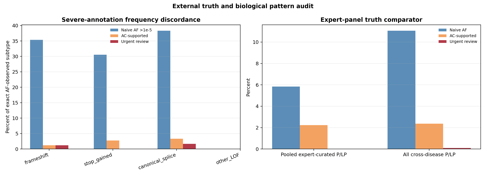
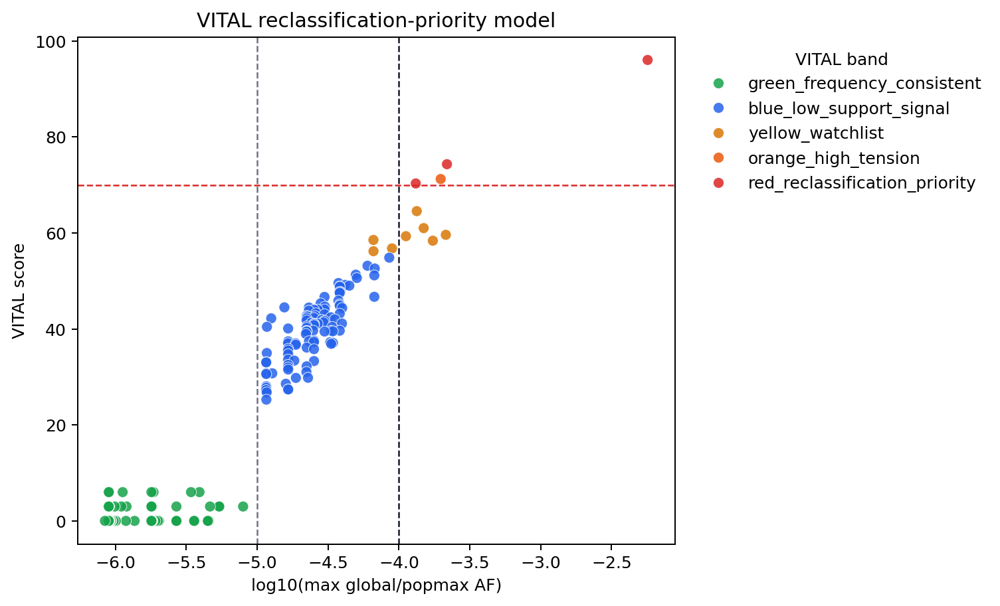

# Severe Annotation Does Not Override Population-Frequency Tension in ClinVar Arrhythmia Variants

## Abstract

**Purpose:** Public P/LP labels can become logically insufficient when read as unqualified high-penetrance Mendelian assertions despite contradictory population evidence. We tested whether ClinVar pathogenic/likely pathogenic (P/LP) arrhythmia assertions remain coherent when evaluated against popmax, allele count (AC), variant representation, and mechanism-aware label states rather than global AF alone.

**Methods:** We collapsed ClinVar P/LP records across 20 inherited arrhythmia genes to 1,731 unique variants and cross-referenced them with gnomAD v4.1.1 exome data. Exact allele matches, allele-discordant sites, no-record states, global AF, popmax AF, AC, variant type, and ClinVar review strength were retained. VITAL (Variant Interpretation Tension and Allele Load) was used as an explainable detection layer for frequency-assertion tension, and a compact pathogenicity-label ontology was used to separate Mendelian disease, susceptibility, carrier-state, low-penetrance, annotation-inflated, and representation-uncertain assertions.

**Results:** The central result is a logical incompatibility class: in 3 red-priority cases, the public P/LP label, observed population frequency, and plausible disease mechanism could not simultaneously support an unqualified high-penetrance Mendelian reading. SCN5A VCV000440850 required susceptibility/haplotype framing rather than generic Mendelian pathogenicity; TRDN VCV001325231 required carrier or biallelic affected-state framing rather than dominant pathogenicity; and KCNH2 VCV004535537 required mechanism-qualified expert review rather than reliance on severe annotation alone. This label-state problem sits within a broader frequency-evidence failure: only 334/1,731 variants (19.3%) had usable exact AF evidence, leaving 1,397 (80.7%) as a non-evaluable representation gap. Within the AF-observed space, global AF alone identified 13 variants above AF >1e-5, whereas popmax/global screening identified 115; global-AF-only review therefore missed 102/115 (88.7%) ancestry-aware frequency alerts. Severe annotation did not protect against this signal: 92/262 AF-observed LOF/splice assertions (35.1%) had popmax/global AF >1e-5, similar to missense assertions (19/66, 28.8%). VITAL compressed 115 frequency-discordant records to 3 urgent state-review cases.

**Conclusion:** The current P/LP label is insufficient when it permits mutually incompatible high-penetrance Mendelian interpretations under standard clinical reading. Susceptibility is not equivalent to Mendelian disease, carrier architecture is not equivalent to dominant pathogenicity, and severe annotation is not equivalent to high penetrance. VITAL makes this label-state collapse visible; the biological contradiction is the central result.

## Introduction

Inherited arrhythmia syndromes, including long QT syndrome, Brugada syndrome, catecholaminergic polymorphic ventricular tachycardia, and related disorders, depend on accurate interpretation of rare variants in ion-channel, calcium-handling, and accessory genes. ClinVar is central to this interpretation because it aggregates public clinical assertions used by laboratories, expert panels, and researchers. A P/LP label in ClinVar can influence diagnosis, cascade testing, surveillance, and treatment decisions, so systematic errors in public assertions matter clinically even when individual case-level evidence is unavailable.

Inherited arrhythmia syndromes represent a particularly sensitive clinical system for detecting pathogenicity-label collapse. Clinical consequences of P/LP labels are immediate and high-impact, including ICD implantation, medication restrictions, and cascade family testing. At the same time, selection against pathogenic alleles is often less absolute than in fully penetrant lethal disorders, penetrance is frequently incomplete and context-dependent, susceptibility and modifier effects are common, population structure critically shapes frequency interpretation, and ClinVar coverage is relatively dense for canonical genes. Under these conditions, a single P/LP label is insufficient to encode biologically distinct states. Arrhythmia genes therefore serve as a natural stress-test for the coherence of public pathogenicity assertions, not an arbitrary scope limitation.

Population frequency is one of the strongest checks on high-penetrance Mendelian pathogenicity. A variant that is too common in a general population database should trigger benign evidence under ACMG/AMP BS1/BA1-style reasoning. The operational problem is that global AF can hide ancestry-specific enrichment. A variant may appear globally rare while exceeding a clinically relevant frequency threshold in one population. In that scenario, a global-AF-only workflow can falsely reassure the reviewer and allow frequency contradiction to remain hidden.

Absence from population databases creates a second failure mode. Non-observation is often treated as evidence of rarity, yet exact representation in gnomAD depends on sequence context, variant type, normalization, coverage, alignment, and calling. This is particularly important for indels, duplications, and splice/complex alleles. Frequency-based interpretation therefore fails both when ancestry-aware signals are missed and when absence is overinterpreted for variants that are difficult to represent.

Here, we ask whether ClinVar P/LP arrhythmia assertions remain coherent when evaluated with exact allele matching, popmax, AC, variant type, detectability, and review support. Our premise is not simply that some variants are "too frequent," but that some public pathogenicity labels collapse mutually incompatible biological states into one P/LP bucket: susceptibility or drug-response haplotypes can be flattened into Mendelian pathogenicity, recessive carrier states can masquerade as dominant disease assertions, and severe annotations can inflate confidence when mechanism-specific evidence is thin. We use VITAL as an explainable detection layer for this collapse and propose a pathogenicity-label ontology that separates Mendelian pathogenicity, susceptibility, carrier architecture, low penetrance, annotation inflation, and representation uncertainty.

## Methods

### Variant selection and collapsing

ClinVar P/LP variants were retrieved for 20 canonical inherited arrhythmia genes: KCNQ1, KCNH2, SCN5A, KCNE1, KCNE2, RYR2, CASQ2, TRDN, CALM1, CALM2, CALM3, ANK2, SCN4B, KCNJ2, HCN4, CACNA1C, CACNB2, CACNA2D1, AKAP9, and SNTA1. VCV XML records were retrieved through the NCBI Entrez API. Records were collapsed to unique GRCh38 variant-level entries using chromosome, position, reference allele, and alternate allele. After quality control, including exclusion of one high-AF single-submitter SCN5A record without expert review, 1,731 unique P/LP variants remained. The primary data freeze was April 21, 2026.

### gnomAD matching and evidence states

Variants were queried against gnomAD v4.1.1 exomes through the gnomAD GraphQL API. Exact matching required chromosome, position, reference allele, and alternate allele concordance. Variants were assigned one of five frequency evidence states: `frequency_observed`, `not_observed_in_gnomAD`, `allele_discordance_no_exact_AF`, `exact_match_without_AF`, or `gnomad_query_error_no_frequency_evidence`. Missing AF was never converted to AF=0. Variants without usable exact frequency evidence were retained as gray no-frequency-evidence records.

### Ancestry-aware frequency analysis

For exact AF-observed variants, global AF, global AC, population AF, population AC, and popmax AF were extracted. A naive global screen used global AF >1e-5. An ancestry-aware screen used global or popmax AF >1e-5. AC-supported frequency evidence required a qualifying global or popmax AC >=20 at the relevant frequency signal. This AC gate was treated as an operational reliability floor rather than a biological threshold; AC reliability was also reported as ordered strata (AC 20-49, 50-199, and >=200) and tested across AC>=10, 20, 50, 100, and 200. These thresholds were used for review prioritization, not automatic classification.

### VITAL score and red-priority gate

VITAL is a 0-100 frequency-assertion tension score used to detect label-state collapse. The score is the clipped sum of seven interpretable components:

`VITAL = min(100, AF_pressure + AC_reliability + popmax_enrichment + variant_type_tension + technical_detectability + gene_context + review_fragility)`.

| Component | Role |
|---|---|
| AF pressure | Scales with max(global AF, popmax AF) above 1e-5 |
| AC reliability | Increases with qualifying AC and saturates at AC >=20 |
| Popmax enrichment | Captures ancestry-specific enrichment over global AF |
| Variant-type tension | Adds context for SNV, indel, duplication, or complex representation |
| Technical detectability | Downweights naive absence assumptions by variant-type detectability |
| Gene context | Captures gene-level frequency-tension background |
| Review fragility | Prioritizes weak/single-submitter assertions over expert-reviewed records |

A red-priority call required VITAL >=70, weak review support, and AC-supported frequency evidence. VITAL is not a benignity classifier and does not model inheritance, penetrance, phenotype match, segregation, functional data, or local laboratory evidence. Final interpretation remains expert-driven.

### Supporting analyses

We compared global AF, popmax/global AF, AC-supported frequency screening, and VITAL red-priority calls. We assessed variant-type enrichment among non-overlap records, severe-annotation frequency discordance, LOF subtype patterns, and mechanism triage of severe-discordant variants. Mechanism triage was used to separate probable label-framing modes, including carrier-compatible architecture, context-dependent susceptibility, annotation inflation, and unresolved high-penetrance tension. We then mapped these modes to review-routing classes with explicit entry rules, transition rules, and clinical consequences. For red-priority cases, we performed a logical incompatibility audit that explicitly compared the public ClinVar assertion, gnomAD population reality, and the biological mechanism frame required for a high-penetrance Mendelian interpretation. Because public ClinVar does not expose patient counts, we quantified clinical decision-risk exposure using record counts and minimum submitter-exposure units, with missing submitter counts treated conservatively as one unit. For red-priority cases, we also audited the public evidence boundary, recording whether the public scoring layer exposed phenotype linkage, penetrance estimates, segregation/phase, or downstream cascade-testing or therapy outcomes. Finally, we performed a frequency-evaluability audit separating AF-observed assertions from the non-evaluable majority, stratified by gene, variant type, and review strength, with SNV-only sensitivity checks. To reduce circularity risk, we pre-specified an independent blinded expert-pilot endpoint of "requires re-review" versus "does not require re-review" using a 23-variant packet (3 red-priority cases, 10 gray no-frequency-evidence cases, and 10 non-red controls); VITAL scores and route labels are hidden from the review form and retained only in the analysis key. We performed supporting audits in a 3,000-variant cross-disease ClinVar P/LP sample, including historical January 2023 to April 2026 reclassification, expert-panel reviewed assertions, and real strict P/LP-to-VUS/B/LB events. Threshold sensitivity, AC-gate sensitivity, weight sensitivity, KCNH2 diagnostics, detectability checklists, pilot-review forms, and time-series details are provided in supplementary outputs.

## Results

### Frequency evidence is sparse and structured

ClinVar parsing identified 1,731 unique arrhythmia P/LP variants. Of these, 350 (20.2%) had exact allele-level matches in gnomAD exomes, and 334 had usable AF evidence. Among the remaining variants, 645 were allele-discordant at the same position, 736 had no gnomAD record, and 16 exact matches lacked usable AF blocks. Thus, most ClinVar arrhythmia P/LP assertions cannot be evaluated by a simple exact-AF lookup.

This low AF-evaluable fraction is not merely a limitation; it is itself an underrecognized failure mode of frequency-based interpretation. Most public P/LP assertions are not even evaluable by exact population-frequency matching. All frequency-based conclusions below are therefore restricted to the AF-observed subset (n=334). The non-evaluable majority (n=1,397) defines a separate interpretability gap rather than weakening the observed frequency signal.

Table 1 summarizes the evidence states used throughout the analysis.

| Evidence state | Count | Interpretation |
|---|---:|---|
| Exact gnomAD match | 350 | Allele represented in gnomAD exomes |
| Usable AF evidence | 334 | Eligible for frequency scoring |
| Allele discordance | 645 | Same position, different alternate allele |
| No gnomAD record | 736 | No record at queried position |
| Exact match without AF | 16 | Exact allele present but no usable AF block |

Among AF-observed variants, most were globally ultra-rare: 321/334 (96.1%) had global AF <=1e-5. This global view was misleading because many globally rare variants were population-enriched by popmax.

The AF-observed subset was not treated as representative of all ClinVar P/LP assertions. A sanity audit showed structured differences between evaluable and non-evaluable spaces: AF-observed variants spanned 14/17 genes but were enriched for SNVs (71.3% vs 52.4% in the non-evaluable majority) and multiple-submitter assertions (32.6% vs 18.3%), whereas non-evaluable variants were enriched for indels/duplications and for KCNH2/SCN5A. This is measured representation bias, not random missingness.

| Analysis space | Variants | Frequency-discordant | Interpretation |
|---|---:|---:|---|
| AF-observed evaluable space | 334 (19.3%) | 115/334 (34.4%) | Only space used for frequency-discordance conclusions |
| Non-evaluable interpretability gap | 1,397 (80.7%) | Not scored | Separate representation gap; not evidence of frequency consistency |
| SNV-only AF-observed sensitivity | 238 | 79/238 (33.2%) | Popmax tension persists in well-represented SNVs |
| Non-recessive SNV-only sensitivity | 186 | 55/186 (29.6%) | Signal persists after excluding CASQ2/TRDN |

The 1,397 non-evaluable variants were routed as a practical gray queue rather than left as an undifferentiated blind spot.

| Non-evaluable category | Recommended next step | Interpretation guardrail |
|---|---|---|
| Indel/duplication with no gnomAD record | Genome-level query plus orthogonal validation when clinically material | Do not interpret absence as rarity |
| Allele-discordant SNV/MNV | Normalize, left-align, verify allele, and requery | Same-site observation is not exact-allele AF |
| Exact match without usable AF block | Retain gray status and recheck in future freeze | Do not convert missing AF to AF=0 |
| No-record SNV in constrained gene | Deferred review with phenotype, segregation, and mechanism context | Absence alone supports neither consistency nor contradiction |
| Complex allele or haplotype | Resolve representation, phase, and haplotype literature | Do not transfer single-site AF assumptions to multi-allelic assertions |

The full routing table is provided as Supplementary Table S33.

### Popmax exposes frequency contradictions missed by global AF

Global AF alone identified only 13 arrhythmia P/LP variants above AF >1e-5. In contrast, popmax/global screening identified 115 variants above the same threshold, including 102 that were globally rare but population-enriched. A global-AF-only ACMG-style screen would therefore miss 102/115 (88.7%) ancestry-aware frequency alerts.

This is an ACMG/AMP implementation failure in a specific scenario: the criteria are not the problem, but global-AF-only implementation hides the population evidence that BS1/BA1-style reasoning is supposed to evaluate.

### Absence is shaped by variant type

Failure to match variants at the allele level was not random missingness. It was a structured artifact of representation, normalization, and detectability. Indels were enriched among variants without exact usable AF evidence: 47.2% of non-overlap variants were indels compared with 28.9% of exact-matched variants (OR=2.20; BH q=1.08e-9). This supports a second operational hazard: absence from gnomAD is not equivalent to rarity for structurally complex or representation-sensitive variants.

Exome-vs-genome sensitivity did not rescue this problem for duplications. Among 22 exact-matched duplications, none had genome AF >1e-5. The practical conclusion is representation-aware, not mechanistic: absence of an indel or duplication from gnomAD should be interpreted more cautiously than absence of a well-represented SNV.

### Severe annotation exposes pathogenicity-label distortion

The main biological result is not simply that severe annotation can coexist with frequency tension. It is that frequency-discordant severe assertions reveal recurring distortion in how pathogenicity is labeled. The argument-bearing statistic is that 92/262 AF-observed LOF/splice assertions (35.1%) were frequency-discordant, similar to missense assertions (19/66, 28.8%; Fisher OR=1.34, p=0.384). In other words, severe consequence annotation did not protect a public P/LP assertion from population-frequency contradiction. The broader AF-observed set contained 115/334 (34.4%) popmax/global alerts; those counts define the review burden, whereas the LOF/splice fraction defines the biological claim.

The subsequent mechanism split is secondary decomposition, not the headline result. Frameshift, stop-gained, and canonical splice variants all showed naive frequency discordance. Mechanism triage showed that 35/92 severe-discordant assertions were in CASQ2 or TRDN, where recessive/biallelic disease architecture can make heterozygous carrier frequency biologically compatible. After excluding CASQ2/TRDN, 57/197 severe annotations (28.9%) remained discordant across 8 genes, but only 1/57 non-recessive severe-discordant assertions was AC-supported. This is not an error-rate estimate; it is a label-state signal: the P/LP label often lacks the biological frame needed to interpret the assertion safely.

| Mechanism triage class | N (% of severe-discordant) | AC-supported | Label-framing implication |
|---|---:|---:|---|
| Carrier-compatible recessive/biallelic architecture | 35 (38.0%) | 6 | Carrier architecture can masquerade as generic P/LP |
| Non-recessive AC-supported high-penetrance tension | 1 (1.1%) | 1 | Possible annotation inflation requiring urgent adjudication |
| Non-recessive constrained-gene low-AC surveillance | 24 (26.1%) | 0 | Severe annotation creates concern, but AC is insufficient |
| Non-recessive other low-AC or unresolved surveillance | 32 (34.8%) | 0 | Biology remains unresolved; not an automatic downgrade |

The claim is therefore narrower and stronger than "LOF variants are often benign": severe annotation is not sufficient to override population-frequency contradiction, and some public P/LP labels conflate different biological objects. Susceptibility is not Mendelian pathogenicity; carrier architecture is not dominant disease; severe annotation is not proof of high penetrance. Each discordant assertion identifies a mechanism hypothesis that must be reconciled with ancestry, AC, inheritance, penetrance, transcript context, and review strength.

### VITAL compresses urgent re-review burden

A naive popmax/global AF >1e-5 screen flagged 115 arrhythmia P/LP variants. Adding AC support reduced the actionable frequency set to 9. VITAL red-priority reduced the urgent review queue to 3 variants by requiring score >=70, weak review, and AC-supported frequency evidence. This is a 97.4% compression relative to naive AF screening.

Table 2 compares the operational layers.

| Review layer | Flagged variants | Practical meaning |
|---|---:|---|
| Global AF >1e-5 | 13 | Misses most ancestry-aware signals |
| Popmax/global AF >1e-5 | 115 | Sensitive but high review burden |
| AC-supported frequency signal | 9 | Reduces one-allele noise |
| VITAL red-priority | 3 | Short urgent expert-review queue |

An internal consistency audit supported the selected red gate but was not treated as diagnostic accuracy. The proxy positives were weak-review, AC-supported frequency signals; VITAL red captured the 3 operational positives at cutoffs 65-70 while avoiding proxy false-positive urgent review triggers.

Because this internal audit remains partly circular, we converted validation into a pre-specified external-review task rather than claiming independent diagnostic performance. The repository now includes a blinded expert pilot packet with 23 variants: the 3 red-priority cases, 10 gray no-frequency-evidence cases requiring detectability/deferred review decisions, and 10 non-red frequency-consistent controls. The review form exposes ClinVar, frequency, review, and variant-context fields but hides VITAL score, VITAL band, and pilot stratum. The pre-specified endpoint is expert consensus on "requires re-review" versus "does not require re-review"; planned metrics are sensitivity, specificity, PPV for red/gray routing, Cohen/Fleiss kappa, and discordance adjudication. Until this external pilot is completed, VITAL performance claims are limited to burden compression, internal consistency, and public-data audits.

AC reliability behaved as a gradient rather than a binary property. Among 115 popmax/global AF flags, 100 had AC <10 or unavailable and generated no red-priority calls; 6 were AC 10-19 and generated none; 6 were AC 20-49 and contained TRDN plus borderline KCNH2; 2 were AC 50-199 and generated none; and 1 was AC >=200, SCN5A. Sensitivity analysis showed the operational consequence: AC>=10 produced 4 red-like calls by adding CACNB2, AC>=20 produced the default 3-case queue, and AC>=50/100/200 retained only SCN5A. Thus KCNH2 (global AC=24) and TRDN (global AC=40) are near-boundary AC-supported signals, whereas SCN5A has substantially stronger support (global AC=214; AFR popmax AC=190).

Weight sensitivity was evaluated without outcome refitting. Across five alternative weight profiles, the red queue ranged from 1-3 variants and no new red variants appeared. SCN5A remained red in all five profiles, TRDN remained red in four of five, and KCNH2 remained red in two of five. One-weight-at-a-time perturbation showed the same pattern: SCN5A is an anchor signal, TRDN is near-stable but inheritance-routed, and KCNH2 is conditional/borderline.

| Weight profile | Red count | Red variants retained |
|---|---:|---|
| Primary expert weights | 3 | SCN5A, TRDN, KCNH2 |
| Balanced equal components | 1 | SCN5A |
| Frequency dominant | 2 | SCN5A, TRDN |
| Review-fragility dominant | 3 | SCN5A, TRDN, KCNH2 |
| Technical-detectability dominant | 3 | SCN5A, TRDN, KCNH2 |
| Reduced AF pressure | 2 | SCN5A, TRDN |

Weight-profile sensitivity revealed heterogeneous confidence within the red-priority queue. SCN5A VCV000440850 was retained in all five alternative profiles, consistent with its extreme population frequency (AFR popmax AF=5.68e-3) dominating the score regardless of component weighting. TRDN VCV001325231 was retained in four of five profiles and lost only under the balanced equal-components profile, while one-weight perturbations showed additional sensitivity when frequency or AC support was downweighted. KCNH2 VCV004535537 was retained in only two of five profiles and was lost under reduced-AF, equal-weight, and frequency-dominant configurations, confirming that its red assignment is threshold-sensitive rather than robust. This gradient of stability reflects a real biological gradient: SCN5A represents a clear susceptibility-versus-Mendelian contradiction, TRDN represents a carrier-architecture framing problem with substantial AC support, and KCNH2 represents a borderline annotation-inflation case where the label-state concern is genuine but the evidence boundary is less definitive. The three cases are therefore not interchangeable urgent review calls. SCN5A and TRDN warrant immediate state-aware re-review; KCNH2 warrants flagging for expert adjudication with explicit acknowledgment that its red assignment is weight-dependent.

### Red-priority cases show distinct pathogenicity-label distortion modes

The 3 red-priority arrhythmia variants were not interchangeable AF outliers. They represented three different ways in which biology can be compressed into an overly broad P/LP label: a high-frequency haplotype/susceptibility assertion, a recessive-carrier-compatible LOF assertion, and a borderline constrained-gene splice assertion.

| Variant | AF/AC signal | Review support | VITAL | Confidence in red assignment | Misframed-biology mode |
|---|---|---|---:|---|---|
| SCN5A VCV000440850, c.[3919C>T;694G>A] | AFR popmax AF=5.68e-3; AC=190 | No assertion criteria | 96.1 | High / anchor | Susceptibility/haplotype inflated into Mendelian P/LP |
| TRDN VCV001325231, c.1050del | Global AC=40; AMR popmax AF=2.18e-4 | Single submitter | 74.3 | High for review; inheritance-routed | Carrier architecture framed without affected-state context |
| KCNH2 VCV004535537, c.2398+2T>G | Global AC=24; ASJ popmax AF=1.32e-4 | Single submitter | 70.3 | Conditional / borderline | Borderline severe-annotation inflation under weak evidence |

KCNH2 VCV004535537 is therefore best read as a conditional or amber-like priority: its inclusion reflects the need for expert inspection at the decision boundary, not the same stability of red assignment seen for SCN5A.

Manual review of live ClinVar records confirmed that these cases remained weakly supported or single-submitter assertions with unresolved mechanism-specific interpretation questions. These records require state review rather than passive acceptance as generic P/LP.

### Logical incompatibility audit proves label-state insufficiency

If the public P/LP label is interpreted as unqualified high-penetrance Mendelian pathogenicity, the label becomes logically incompatible with observed population reality unless the biological state is changed or qualified. This creates a triangle of contradiction: ClinVar asserts P/LP, gnomAD observes AC-supported frequency, and the disease mechanism requires a different state.

| Case | Public assertion | Population reality | If read as high-penetrance Mendelian | Required state for consistency |
|---|---|---|---|---|
| SCN5A VCV000440850 | Pathogenic for Brugada syndrome 1; no assertion criteria | AFR popmax AF=5.68e-3; popmax AC=190; global AC=214 | Logically incompatible: a variant with this population frequency cannot plausibly represent a high-penetrance monogenic arrhythmia allele | Context-dependent susceptibility, haplotype, low-penetrance, or modifier state |
| TRDN VCV001325231 | Likely pathogenic for CPVT5; single submitter | AMR popmax AF=2.18e-4; global AC=40 | Dominant Mendelian reading is incompatible; the observation remains coherent only under carrier, phase-aware, or biallelic affected-state framing | Carrier-compatible recessive or affected-state-specific assertion |
| KCNH2 VCV004535537 | Likely pathogenic for Long QT syndrome; single submitter | ASJ popmax AF=1.32e-4; global AC=24 | Unqualified high-penetrance reading is not supportable from public data alone; frequency tension plus weak review defines a boundary case | Annotation-inflation or mechanism-qualified review state |

Current ClinVar labeling collapses biologically distinct states into a single P/LP category: susceptibility is not Mendelian pathogenicity, carrier architecture is not dominant disease, and severe annotation is not proof of high penetrance. VITAL makes this state-coding failure visible by prioritizing the variants where population reality and unqualified Mendelian interpretation cannot coexist.

### A pathogenicity-label ontology turns tension into review action

We therefore treat frequency discordance as a label-state problem rather than a binary pathogenic/benign problem. The ontology below separates biological mechanism from review action. Its transition rules are not automatic reclassifications; they are routing rules for expert review.

| Label-state class | Entry rule | Transition rule | Clinical consequence |
|---|---|---|---|
| High-penetrance Mendelian assertion | Frequency-consistent P/LP with mechanism-specific support | Remain in standard ACMG/ClinGen interpretation | Can support diagnosis, cascade testing, and surveillance if phenotype matches |
| Susceptibility or context-dependent risk allele | AF incompatible with Mendelian penetrance, conditional phenotype, haplotype, drug trigger, or ancestry enrichment | Move from generic P/LP toward risk-allele or context-qualified assertion | Avoid diagnostic closure and broad cascade testing as a monogenic disease allele |
| Carrier-compatible recessive assertion | Severe allele in recessive/biallelic architecture with heterozygous AF compatible with carrier state | Reframe as carrier or affected-state-specific assertion; require phase/second allele | Prevent inappropriate dominant-disease counseling or surveillance |
| Founder or low-penetrance allele | AC-supported high popmax with plausible founder effect or reduced penetrance | Retain only with penetrance and ancestry qualifiers | Tailor counseling to ancestry- and penetrance-aware risk rather than binary P/LP |
| Annotation-inflated assertion | Severe annotation plus weak review and AC-supported frequency contradiction | Route to urgent expert review; candidate for VUS/LB or mechanism-qualified label | Avoid using the assertion for irreversible clinical decisions until adjudicated |
| Representation-uncertain gray state | No exact usable AF because of allele discordance, no record, or variant-type detectability limits | Route to orthogonal validation or deferred review rather than rarity inference | Do not treat absence from gnomAD as evidence of rarity by default |

Supplementary Table S32 operationalizes this ontology with a trigger, required evidence, and output format for each state class. For example, a susceptibility transition requires AC-supported AF incompatibility plus context supporting modifier or haplotype biology, and the output should be a risk-allele or context-qualified assertion rather than generic monogenic P/LP. Supplementary Table S37 makes detectability assessment a required field set for gray-to-actionable routing, including exome presence, genome presence, coverage sufficiency, mapping-quality concern, representation ambiguity, and a final detectability-complete flag. This preserves a separate no-frequency-evidence state rather than silently converting missingness into rarity.

### Clinical decision-risk exposure is small but concrete

Public ClinVar cannot tell us how many patients were misdiagnosed or how many relatives underwent cascade testing. It can, however, quantify the public assertion burden capable of creating those decisions. We therefore used a conservative exposure proxy: one P/LP record equals one potential decision-risk record, and each submitter contributes one minimum submitter-exposure unit; missing submitter counts were counted as one.

| Cohort and layer | Records | Minimum submitter-exposure units | Clinical meaning |
|---|---:|---:|---|
| Arrhythmia frequency-discordant P/LP upper bound | 115 | 168 | Labels that could mislead if accepted without ancestry-aware frequency review |
| Arrhythmia AC-supported active-review layer | 9 | 15 | Frequency contradiction has allele-count support |
| Arrhythmia VITAL-red urgent layer | 3 | 3 | Short queue with weak review plus AC-supported frequency contradiction |
| Arrhythmia standard-context red | 2 | 2 | Potential monogenic-label risk for diagnostic closure/cascade testing |
| Arrhythmia recessive-context red | 1 | 1 | Carrier-architecture routing risk if phase/inheritance is ignored |
| Cross-disease 3,000-sample frequency-discordant upper bound | 332 | 1,962 | Cross-disease scale of public label exposure |
| Cross-disease 3,000-sample VITAL-red urgent layer | 3 | 3 | Conservative portability check outside arrhythmia |

### Cross-disease and historical audits support scope, not broad prediction

In an independent 3,000-variant cross-disease current ClinVar P/LP sample, naive popmax/global AF screening flagged 332 variants (11.1%; 95% CI 10.0%-12.2%), while VITAL red-priority contained 3 (0.10%; 95% CI 0.034%-0.294%). Among 204 expert-panel reviewed P/LP assertions in that set, 39 had naive AF tension and 13 were AC-supported, but none were VITAL red-priority. Curated high-frequency exceptions therefore remained visible without being converted into urgent downgrade calls. Because the ontology is mechanism-based rather than arrhythmia-specific, this cross-disease audit supports the general principle that public P/LP labels need state-aware review rather than a single pathogenicity bucket.

Historical audit from January 2023 to April 2026 confirmed high specificity and low recall. In the 3,000-variant set, 23 records underwent real strict P/LP-to-VUS/B/LB reclassification; VITAL-red captured 1/23, CFAP91 VCV000812096, a weak/no-assertion record with popmax AF=3.50e-4, AC=152, and VITAL=76.5. One expert-panel strict downgrade, RYR1 VCV001214001, had no frequency tension (max AF=8.99e-7; VITAL=0.0) and was correctly outside scope. This is the boundary of the framework: VITAL captures frequency-assertion hazards, not all reclassification mechanisms.

A temporal robustness audit across January 2023, January 2024, and the canonical April 2026 current arrhythmia score table supported the same operating profile. Red-priority queues remained sparse (2, 2, and 3 variants, respectively), while composition changed: TRDN persisted across all three snapshots, KCNE1 was red in 2023/2024 but not current, and SCN5A plus KCNH2 entered the current queue. AC-threshold sensitivity supported AC>=20 as a compromise gate: AC>=5 added lower-reliability calls, while AC>=50 removed most actionable cases. The inheritance flag explicitly separated TRDN as recessive-context-required in every red queue.

## Discussion

The central finding is that some public P/LP labels permit mutually incompatible interpretations: they can be read as high-penetrance Mendelian assertions even when population frequency and mechanism require susceptibility, carrier-state, low-penetrance, or annotation-inflation framing. Severe annotation does not resolve this contradiction. Up to 35.1% of AF-observed LOF/splice ClinVar P/LP arrhythmia assertions showed ancestry-aware frequency discordance, showing that severe-looking labels remain vulnerable to state collapse.

Global-AF-only workflows fail operationally because they hide ancestry-specific signals. In this arrhythmia audit, global AF detected 13 frequency alerts, while popmax/global analysis detected 115. If a laboratory applies BS1/BA1-style reasoning with global AF alone, most ancestry-aware contradictions remain invisible.

A second failure is evaluability itself. Only 334/1,731 arrhythmia P/LP assertions had usable exact AF evidence, and the 1,397 non-evaluable assertions were not random missingness. They were structured by gene, variant type, and review support, with indels and duplications disproportionately represented outside the exact-AF space. This means the system has two separable gaps: hidden ancestry-aware frequency tension among evaluable variants, and representation-driven non-evaluability among the majority. Absence from gnomAD therefore cannot be treated uniformly as rarity.

VITAL's role is detection, not the central biological claim. It transforms 115 naive AF alerts into 3 urgent state-review cases while preserving gray no-frequency-evidence states and component-level explanations. The important result is that these 3 cases expose a real label-state collapse: the same public P/LP category can encode susceptibility, carrier architecture, annotation inflation, or high-penetrance Mendelian disease without making that distinction visible to downstream users.

The three red-priority arrhythmia cases provide the central logical result. For each case, the public P/LP label, observed population frequency, and plausible disease mechanism cannot all support an unqualified high-penetrance Mendelian reading simultaneously. SCN5A VCV000440850 is most consistent with a context-dependent haplotype or susceptibility assertion rather than a straightforward high-penetrance monogenic label. TRDN VCV001325231 shows that a frameshift can be frequency-tolerable under recessive/biallelic architecture. KCNH2 VCV004535537 is the borderline case: biologically uncomfortable in a constrained dominant gene, but still unresolved and weight-sensitive.

This incompatibility is the system-level point. A single public P/LP label can travel into diagnostic, family-testing, surveillance, and therapy workflows, but it does not preserve whether the claim is a high-penetrance Mendelian assertion, a susceptibility haplotype, a recessive carrier-state allele, or unresolved annotation inflation. The failure is loss of biological state during clinical transmission.

De novo occurrence is conventionally treated as strong support for pathogenicity because it raises the prior probability for a causal event in an individual proband. In arrhythmia genes with incomplete penetrance and context-dependent expressivity, however, de novo status does not resolve frequency-assertion tension at the label level. SCN5A VCV000440850 remains problematic even if observed as de novo in an individual case: an AFR popmax AF of 5.68e-3 is incompatible with a high-penetrance Mendelian Brugada assertion as a class. De novo evidence changes the case-level prior, but it does not erase the population-level contradiction or specify whether the public P/LP label represents Mendelian disease, low-penetrance susceptibility, or a context-dependent modifier. De novo evidence strengthens the case for expert review; it does not substitute for state-aware interpretation.

The clinical consequence is structural. In the arrhythmia panel, 115 public P/LP records carried ancestry-aware frequency contradiction, representing at least 168 submitter-exposure units. Nine records had AC-supported contradiction, and 3 were urgent VITAL-red records. Two of those were standard-context red calls, where a generic Mendelian label could plausibly promote diagnostic closure, cascade testing, or surveillance before adjudication; one was a recessive-context TRDN call, where the immediate risk is inappropriate dominant-risk framing. VITAL converts this hidden label exposure into an auditable state-review queue.

Prior ClinVar-gnomAD studies have described rarity patterns and gene constraint. This analysis adds three operational distinctions: exact allele absence is separated from allele discordance and no-record states; popmax plus AC is placed at the center of frequency review; and review burden is treated as a clinical workflow endpoint rather than an incidental byproduct. The proposed label-state ontology extends those distinctions beyond arrhythmia by making pathogenicity a structured state, not a single undifferentiated P/LP bucket.

## Limitations

First, VITAL weights are expert-specified to preserve interpretability and were not trained as an optimized prediction model. Sensitivity analyses showed stable prioritization around the red gate, but disease-specific deployment should recalibrate thresholds and weights against local disease architecture.

Second, the analysis is intentionally restricted to inherited arrhythmia genes, where clinical consequence, penetrance architecture, and population structure create the conditions most favourable for detecting frequency-assertion tension. Generalizability to other disease domains requires domain-specific calibration and is not assumed.

Third, historical validation is sparse. VITAL-red captured 1/23 strict future P/LP-to-VUS/B/LB events in the 3,000-variant audit, confirming that it is not a sensitive predictor of all future reclassification. Its intended endpoint is high-specificity frequency-assertion prioritization. Independent validation against larger ClinGen, LOVD, or expert-panel downgrade sets remains a first-order limitation.

Fourth, the score and ontology do not directly model penetrance, phase, zygosity, inheritance, phenotype specificity, segregation, MAVE/functional data, transcript rescue, NMD, or private laboratory evidence. These remain expert review tasks.

Fifth, the AF-observed subset is not representative of all ClinVar arrhythmia P/LP assertions. Frequency-based conclusions are restricted to that evaluable space by design. The non-evaluable majority should be read as an additional interpretability failure caused by representation, normalization, and detectability limits, not as evidence against the AF-observed signal.

Sixth, the internal consistency audit uses proxy labels and is partly circular because weak review and AC-supported frequency evidence help define both the operational positives and the red gate. These metrics should be read as burden diagnostics, not diagnostic accuracy. To address this directly, we pre-specified a blinded expert pilot with an external endpoint of "requires re-review" versus "does not require re-review"; however, that consensus review is not yet complete, so no independent sensitivity, specificity, PPV, or kappa claims are made from it in the present manuscript.

Seventh, public ClinVar captures classification-level changes, not patient-level downstream effects. We can quantify public decision-risk exposure as records and minimum submitter-exposure units, but not actual diagnosis reversal, cascade-testing uptake, surveillance changes, reproductive decisions, or therapy changes.

## Clinical and research implications

1. Use popmax, not global AF alone, when auditing ClinVar P/LP assertions for frequency tension.

2. Require AC support before escalating frequency contradictions to urgent review.

3. Do not equate non-evaluability or absence from gnomAD with rarity, especially for indels, duplications, and complex alleles.

4. Do not treat severe annotation as self-validating; frameshift, stop-gained, and splice labels do not cancel population-frequency contradiction.

5. Treat frequency-discordant P/LP assertions as possible label-framing problems: susceptibility, carrier state, low penetrance, founder effect, and annotation inflation require different clinical responses.

6. Use the label-state ontology as a transition map: move from generic P/LP to context-qualified assertion, carrier assertion, penetrance-qualified assertion, urgent re-review, or gray representation-uncertain queue as evidence dictates.

7. Separate re-review prioritization from final classification. VITAL tells laboratories what to inspect first, not what to believe automatically.

VITAL is implemented as a reproducible batch-scoring workflow with cached intermediate files and exportable review queues.

## Data availability

Code, cached intermediate files, figures, and supplementary outputs required to reproduce downstream analyses are available in the project repository. The April 21, 2026 data freeze used ClinVar records retrieved through NCBI Entrez and bulk variant_summary files, gnomAD v4.1.1 exome/genome data queried through the gnomAD GraphQL API, and UCSC annotation resources. Machine-readable supplementary tables include VITAL scores, frequency flags, severe-annotation discordance, mechanism triage, red-priority case summaries, logical incompatibility audit outputs, frequency-evaluability gap outputs, operational label-state transition outputs, non-evaluable routing outputs, temporal robustness outputs, clinical decision-risk proxy outputs, blinded expert-pilot forms and keys, AC reliability strata, detectability-required fields, contextual overlay modules, historical audits, expert-panel comparator outputs, and sensitivity analyses.
