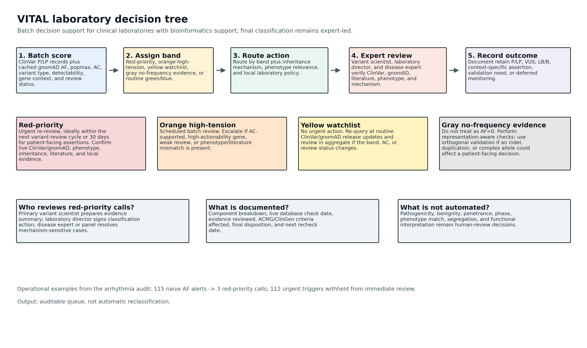
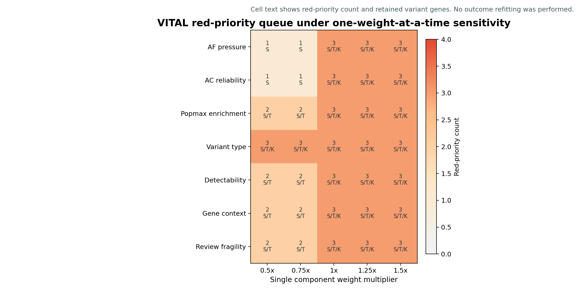
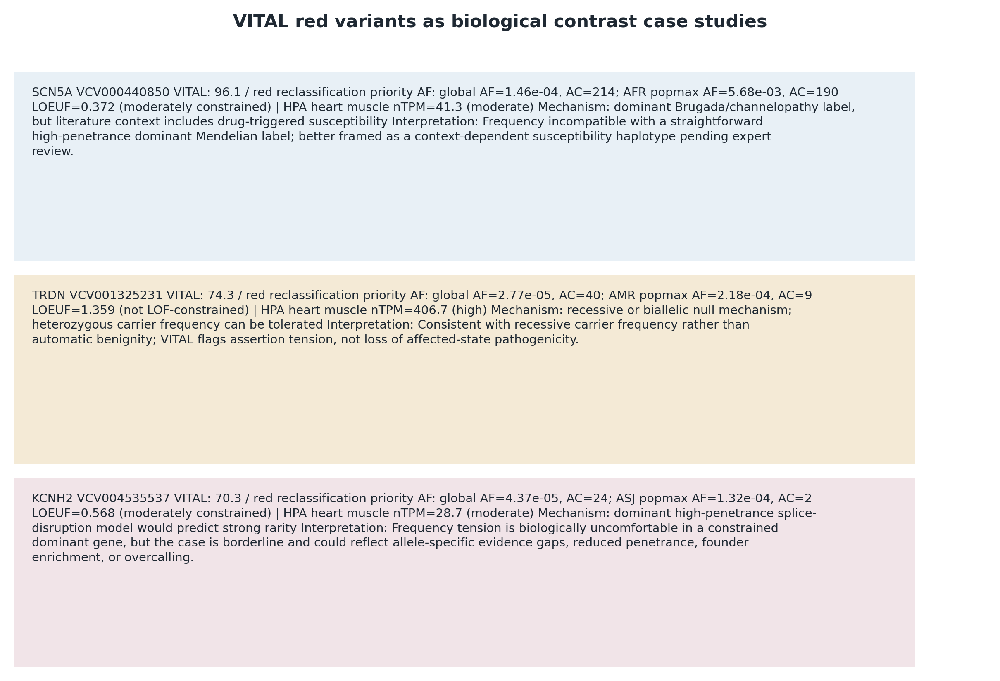
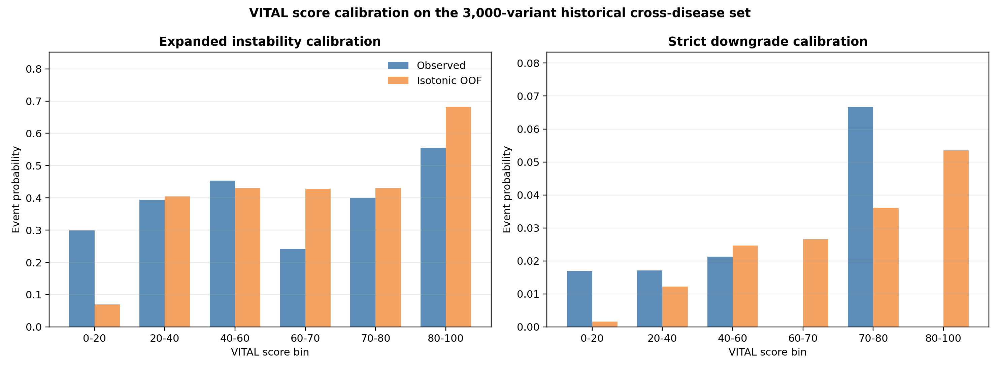
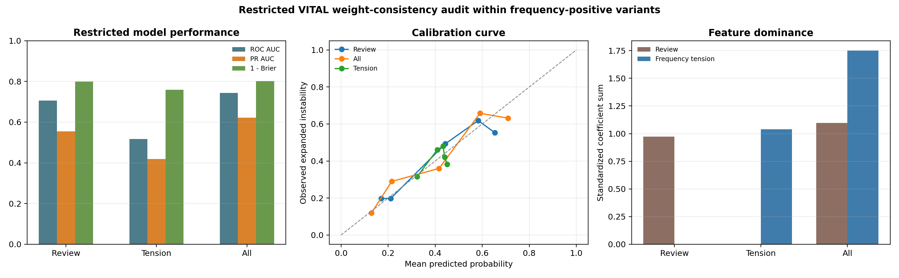

# Frequency Tension Is Common but Hidden in ClinVar Pathogenic Arrhythmia Variants: VITAL Prioritizes Re-Review

## Abstract

**Purpose:** One in three ClinVar P/LP arrhythmia variants with complete population data are rare globally but enriched in at least one ancestry, creating a contradiction that is invisible to global-AF-only workflows. We evaluated this hidden frequency tension and developed VITAL (Variant Interpretation Tension and Allele Load), an explainable review-prioritization framework for clinical laboratories with bioinformatics support.

**Methods:** We collapsed ClinVar P/LP records across 20 arrhythmia genes to 1,731 unique variants and cross-referenced them with gnomAD v4.1.1 exome and ancestry-specific data. VITAL explicitly models exact allele matches, allele discordance, no-record states, global AF, popmax AF, AC, variant type, technical detectability, gene context, and review fragility. It was evaluated as a human-review workflow, not as an automated classifier. Expert-specified weights were compared with semi-empirical calibration in the frequency-positive historical universe using review-only, tension-only, and combined logistic models. Red-priority cases were further examined with real gnomAD v4.1 LOEUF values, Human Protein Atlas v23 heart-muscle expression, and mechanism-specific case interpretation.

**Results:** Only 350/1,731 variants (20.2%) had exact gnomAD allele matches; 334 had usable AF data. Global AF alone detected 13 variants above 1e-5, whereas popmax/global screening detected 115, including 102 globally rare but population-enriched variants. Indels were enriched in the non-overlap set (47.2% vs 28.9%; OR=2.20; BH q=1.08e-9), showing that absence from gnomAD is not equivalent to rarity for structurally complex variants. A naive popmax/global AF >1e-5 screen flagged 115 variants; AC-supported screening flagged 9; the red-priority queue contained 3, a 97.4% reduction in actionable calls. These cases were biologically distinct: SCN5A as a high-frequency haplotype/drug-response susceptibility assertion, TRDN as a high-expression but LOEUF-tolerant recessive-carrier signal, and KCNH2 as a borderline splice assertion in a constrained dominant LQTS gene. In an independent 3,000-variant cross-disease burden audit, naive AF screening flagged 332 variants (11.1%; 95% CI 10.0%-12.2%), whereas the red-priority queue contained 3 (0.10%; 95% CI 0.034%-0.294%). Within frequency-positive historical records, a combined review-plus-tension calibration model outperformed review-only calibration (PR AUC 0.622 vs 0.555), and standardized tension coefficients exceeded review coefficients by 1.60-fold. Historical audits confirmed the operating profile: high specificity, low recall, and usefulness for review-burden compression rather than broad prediction.

**Conclusion:** Frequency tension is common, but actionable review should be rare. VITAL turns hidden population-frequency contradictions into a short, explainable laboratory review queue while preserving gray no-frequency-evidence states and leaving final classification to expert clinical interpretation.

## Introduction

Inherited arrhythmia syndromes, including long QT syndrome, Brugada syndrome, catecholaminergic polymorphic ventricular tachycardia, and related conditions, are caused by rare pathogenic variants in a defined set of ion channel, calcium-handling, and accessory genes. Clinical interpretation of rare variants in these genes relies heavily on structured variant databases, of which ClinVar is the largest publicly accessible resource. ClinVar aggregates variant classifications from clinical laboratories, research submitters, and expert panels, providing pathogenic and likely pathogenic designations that inform diagnostic and therapeutic decisions.

Population allele frequency is a cornerstone criterion in variant interpretation frameworks such as ACMG/AMP. A variant observed at excessive frequency in a general population database such as gnomAD is unlikely to cause a highly penetrant Mendelian disorder and may support benign evidence under BS1 or BA1. Conversely, ultra-rare or absent variants can be consistent with pathogenicity. However, absence and rarity are not interchangeable. Population databases are structured by sequencing technology, variant representation, ancestry composition, allele count, and calling pipelines. These factors are especially important for indels, duplications, and other structurally complex alleles.

Although population frequency can provide benign evidence within the ACMG/AMP framework, frequency observations do not by themselves resolve disease mechanism, penetrance, allelic phase, technical representation, or the evidentiary strength of the underlying clinical assertion. Recent ClinGen recommendations have further clarified that rarity and functional evidence should be applied in a disease-aware and evidence-calibrated manner rather than as isolated rules.

Several practical challenges complicate the use of population frequency in ClinVar auditing. ClinVar records may not have corresponding exact allele-level entries in gnomAD. A variant may be absent from the population cohort, represented differently, affected by normalization, or located at a position where gnomAD reports a different alternate allele. Even when AF is available, global AF can hide population-specific enrichment, and low allele counts can produce unstable frequency estimates. In addition, ClinVar review strength varies substantially: an assertion from an expert panel is not equivalent to a single-submitter record with minimal criteria.

Accordingly, the practical problem is not simply whether a variant appears too frequent for a classical high-penetrance interpretation, but how laboratories should prioritize review when population data, disease mechanism, and archived ClinVar assertions are in visible tension. We therefore developed VITAL as an explainable review-prioritization layer intended to support expert triage rather than to automate reclassification. The intended users are clinical laboratories, expert panels, and research groups with bioinformatics support and responsibility for batch reinterpretation or database auditing; VITAL is not designed as a one-off decision tool for an individual clinician interpreting a single patient.

Here, we report a systematic cross-reference of ClinVar P/LP variants across 20 canonical inherited arrhythmia genes with gnomAD v4.1.1 exome data. We characterize exact matches, allele-discordant sites, no-record variants, ancestry-specific frequency enrichment, variant-type detectability, and gene-level heterogeneity. We then extend the analysis from description to clinical decision support by introducing VITAL (Variant Interpretation Tension and Allele Load), a clinical reclassification risk prioritization framework that integrates AF, popmax, AC, variant type, gene context, technical detectability, and ClinVar review fragility. The goal is not to automate reclassification, but to reduce false-positive variant re-evaluation burden and help laboratories focus limited expert review time on the records most likely to affect clinical decision-making. Finally, we test VITAL against baseline ACMG-style frequency screens, historical ClinVar reclassification from 2023 to 2026, targeted external disease panels, and an independent 3,000-variant cross-disease ClinVar P/LP portability sample.

## Methods

### Variant selection and ClinVar collapsing

ClinVar P/LP variants were retrieved for 20 canonical inherited arrhythmia-associated genes: KCNQ1, KCNH2, SCN5A, KCNE1, KCNE2, RYR2, CASQ2, TRDN, CALM1, CALM2, CALM3, ANK2, SCN4B, KCNJ2, HCN4, CACNA1C, CACNB2, CACNA2D1, AKAP9, and SNTA1. VCV XML records were retrieved programmatically through the NCBI Entrez API. Clinical significance was determined from the ClinVar germline classification field; Pathogenic and Likely pathogenic records were retained.

Records were collapsed to unique variant-level entries using a composite GRCh38 key of chromosome, genomic position, reference allele, and alternate allele. VCV records lacking GRCh38 VCF coordinates were excluded and logged. After collapsing and quality control, including exclusion of SCN5A VCV000440849 because of a high population AF from a single-submitter assertion without expert review, 1,731 unique arrhythmia P/LP variants were retained.

The primary data freeze was April 21, 2026. Throughout the manuscript, "current" refers to this April 2026 ClinVar and gnomAD analysis snapshot. ClinVar assertions can change after data freeze; therefore, all red-priority variants should be rechecked against the live ClinVar record before publication, clinical reporting, or any patient-facing decision.

To reduce dependence on changing external APIs, the April 21, 2026 freeze is preserved as cached intermediate files in the project repository. ClinVar-derived variant tables, gnomAD exact-match tables, population AF tables, exome-genome comparison files, VITAL score tables, historical 2023-to-2026 audit tables, and external-domain stress-test outputs are all written as machine-readable CSV/TSV files under `data/processed/` and `supplementary_tables/`. The API pipeline also writes `.meta.json` cache metadata for core ClinVar, gnomAD, and coverage caches, recording the gene list, dataset, cache type, and pipeline settings used to produce each cache.

### gnomAD matching and frequency evidence states

Each variant was queried against gnomAD v4.1.1 exomes through the gnomAD GraphQL API. Exact matching required concordance of chromosome, position, reference allele, and alternate allele. Exact matches with usable exome AF values were treated as frequency-observed records. Variants without usable exact AF were not imputed as AF=0. Instead, all variants were carried forward under explicit frequency evidence states:

- `frequency_observed`: exact allele match with usable gnomAD AF.
- `not_observed_in_gnomAD`: no gnomAD record at the queried position.
- `allele_discordance_no_exact_AF`: gnomAD reports a different alternate allele at the same position.
- `exact_match_without_AF`: exact allele match but no usable exome AF block.
- `gnomad_query_error_no_frequency_evidence`: transient query failure, kept outside frequency scoring.

This design prevents silent conversion of missing frequency evidence into false rarity. Variants without observed AF retain missing AF fields and are assigned a gray no-frequency-evidence VITAL band.

The analysis can be reproduced in two modes. The full online mode re-queries NCBI Entrez, gnomAD GraphQL, and UCSC APIs using the frozen dataset versions. The offline/cached mode reuses committed intermediate files and therefore does not depend on future API schema stability or live database availability. For example, the ClinVar/gnomAD matching stage can be rerun from cache with `--skip-clinvar --skip-gnomad --skip-coverage`, while downstream VITAL, historical, external-domain, calibration, and manuscript-generation scripts consume the cached CSV/TSV outputs directly. We treat the online API run as data acquisition and the cached rerun as the reproducibility path. A minimal Docker environment is provided for package/runtime reproducibility of cached and demo analyses.

### Ancestry-specific frequency analysis

For exact AF-covered variants, global AF, global AC, population-specific AF, population-specific AC, and popmax AF were extracted where available. Populations included African/African American, Amish, Ashkenazi Jewish, East Asian, Finnish, Latino/Admixed American, Middle Eastern, Non-Finnish European, South Asian, and remaining ancestry groups. A variant was considered population-enriched when global AF <=1e-5 but popmax AF >1e-5.

### Reclassification-risk baseline screens

We evaluated several simple frequency-based baselines: global AF >1e-5, global AF >1e-4, popmax or global AF >1e-5, popmax or global AF >1e-4, and AF >1e-5 with qualifying AC >=20 in either the global or popmax frequency source. These baselines approximate increasingly strict ACMG-style frequency screens but do not incorporate review quality, variant type, gene context, or technical detectability.

### VITAL clinical reclassification risk prioritization framework

VITAL is a 0-100 frequency-assertion tension score for clinical re-review prioritization. It is not intended to declare variants benign, and it is not a replacement for clinical interpretation. It prioritizes ClinVar P/LP assertions that are under enough population-frequency, allele-count, technical, gene-context, and review-quality pressure to warrant expert re-review. VITAL was designed as an explainable review-prioritization layer rather than an automated reclassification engine.

The VITAL score combines seven interpretable components:

- AF pressure from global AF and popmax AF, scaled across the range from 1e-5 to 1e-3.
- AC reliability, saturated at AC >=20.
- Popmax enrichment over global AF.
- Variant-type tension, reflecting whether the observed population signal is surprising for SNV, indel, duplication, or complex variant categories.
- Gene-specific frequency constraint, estimated from the gene's observed frequency-positive burden.
- Technical detectability, derived from empirical exact-match/non-overlap behavior by variant type and a prior for short-read detectability.
- ClinVar review fragility, based on review status and submitter count.

The score is the clipped sum of component scores:

`VITAL = min(100, max(0, AF_pressure + AC_reliability + popmax_enrichment + variant_type_tension + technical_detectability + gene_constraint + review_fragility))`.

The component maxima were expert-specified rather than empirically fitted. They make high-confidence frequency contradiction the dominant signal, AC reliability a required support term, and review fragility/technical detectability visible but not sufficient alone. VITAL should therefore be interpreted as an expert-weighted clinical workflow framework, not as a trained risk model. For exact AF-observed variants, let `F = max(global_AF, popmax_AF)`, `ACq = max(global_AC if global_AF > 1e-5 else 0, popmax_AC if popmax_AF > 1e-5 else 0)`, and `R = (popmax_AF + 1e-12) / (global_AF + 1e-12)`. Components were calculated as follows:

| Component | Maximum | Calculation |
|---|---:|---|
| AF pressure | 45 | `45 * clip(log10((F + 1e-12) / 1e-5) / 2, 0, 1)` |
| AC reliability | 20 | `20 * clip(log1p(ACq) / log1p(20), 0, 1)`; set to 0 when `F <= 1e-5` |
| Popmax enrichment | 10 | `10 * clip(log10(R) / 2, 0, 1)`; set to 0 when `F <= 1e-5` |
| Variant-type tension | 6 | SNV=0, MNV/substitution=1, deletion=3, insertion=3, duplication=6, other/unresolved=2 |
| Technical detectability | 8 | `8 * technical_detectability_index`, derived from empirical exact-match behavior and variant-type priors; set to 0 when `F <= 1e-5` |
| Gene constraint | 10 | `10 * gene_frequency_constraint_proxy`; set to 0 when `F <= 1e-5` |
| Review fragility | 10 | practice guideline/expert panel=0, multiple submitters no conflicts=3, other review=5, single submitter=8, weak/no assertion or missing review=10; set to 0 when `F <= 1e-5` |

The red-priority label was not defined by the score alone. A red-priority call required `VITAL >=70`, weak review support, and AC-supported frequency evidence at the operational AC gate. The default red threshold of 70 is an operational review-capacity gate, not a pathogenicity cutoff: it creates a short, auditable review queue for expert reassessment, not an autonomous clinical decision boundary. An optional threshold of 80 can be interpreted as an ultra-high-priority subqueue. Variants without exact usable frequency evidence were not scored as zero-frequency variants; they were assigned the gray no-frequency-evidence band.

The final score is reported with component-level breakdowns for explainability. We use one nomenclature throughout: red-priority for urgent expert re-review, orange high-tension for scheduled batch review, yellow watchlist for monitoring, gray no-frequency evidence for representation-aware uncertainty, and green/blue for routine low-tension states. Red-priority is a review-priority label, not a clinical benign classification.

Conceptually, VITAL defines a variant pathogenicity tension continuum rather than a binary filter. Each variant is positioned in a discordance space spanning population frequency, AC reliability, ancestry enrichment, review fragility, gene context, variant representation, and predicted functional severity. In the scoring model, functional context is represented by HGVS-derived class and an internal gene-frequency constraint proxy; external LOEUF, heart-expression, and mechanism annotations are added later as the biological contrast layer for red cases, not as hidden scoring features.

Inheritance is not modeled as an automatic score modifier in the current implementation. VITAL operates on ClinVar assertions and population-frequency tension, then requires clinical review to interpret the signal under dominant, recessive, semidominant, low-penetrance, or carrier-state mechanisms. VITAL does not explicitly model inheritance mode, zygosity, penetrance, or disease-specific allelic architecture, and therefore frequency tension must be interpreted in the context of dominant, recessive, hypomorphic, founder-enriched, or pharmacogenomic mechanisms before any classification change is considered. This matters because a frequency that is implausible for a fully penetrant dominant heterozygous disorder may be compatible with a recessive disease allele in carriers.

For practical deployment, VITAL output should therefore be paired with an inheritance-aware routing label rather than interpreted as an inheritance-blind action trigger. A minimal routing scheme would send dominant/high-penetrance red or orange calls to frequency-inconsistent assertion review; recessive or biallelic-gene calls to carrier-frequency, zygosity, and affected-state review; founder, low-penetrance, hypomorphic, or pharmacogenomic calls to context-specific assertion review; and unknown-mechanism calls to a disease-mechanism clarification queue before any classification change is considered. These routing labels are not currently computed automatically and should be supplied from disease-gene curation, ClinGen specifications where available, or laboratory policy. This is a deliberate boundary of the current tool: VITAL marks where population evidence and clinical assertion are in tension, while inheritance-aware interpretation remains an expert review step.

For descriptive subtype analysis, loss-of-function (LOF) variants were further annotated from ClinVar title/HGVS strings as frameshift, stop_gained, canonical_splice, or other_LOF. Frameshift calls required protein-level `fs` or "frameshift" text; stop_gained calls required `Ter`, `*`, "stop gained", or "nonsense"; canonical_splice calls required a +/-1 or +/-2 donor/acceptor pattern or explicit splice donor/acceptor text. This subtype annotation was not used in the VITAL score or red-priority gate. It was added only to test whether LOF subclasses contributed equally to the frequency-function discordance signal.

In the intended clinical workflow, VITAL sits upstream of expert interpretation. It converts population-frequency alerts into a shorter review queue, while final classification remains with laboratory directors, variant scientists, disease experts, and ACMG/AMP evidence review. The framework is therefore a burden-reduction and decision-support tool, not an autonomous diagnostic system.



The AC threshold is applied as an actionability filter, not as part of the scoring function. This separates signal detection from operational decision thresholds. Sensitivity analyses repeated current and historical scoring with AC gates of >=5, >=10, >=20, and >=50; five alternative weight profiles; score cutoffs from 40 to 95; and release-to-release red-set composition checks between the January 2023 and April 2026 freezes. These analyses recorded red-set size, retained/gained/lost variants, proxy false-positive burden, and threshold stability without outcome refitting.

### Workflow-concordance benchmark and threshold sweep

Because prospective truth labels are unavailable for current ClinVar assertions, we defined a workflow-concordance benchmark to test whether VITAL reduces false-positive re-evaluation burden without simply flagging every frequency-positive variant. Positives were weak-review, AC-supported frequency signals. High-confidence current P/LP proxy negatives were variants with stronger review status and no comparable frequency contradiction. This benchmark is not an independent validation of clinical pathogenicity or future reclassification, and it contains an unavoidable degree of circularity because weak review and AC-supported frequency evidence are also part of the red-priority gate. Its purpose is narrower: to compare how much review burden different frequency screens would generate in the same operational universe. Conventional TP/FP/FN/TN and ROC/PR outputs are retained in supplementary files for comparability, but in the main text we refer to them as workflow-concordance metrics rather than diagnostic accuracy estimates. A threshold sweep evaluated score cutoffs from 40 to 95.

### Historical reclassification enrichment and ClinVar time-series analysis

To audit future ClinVar instability without presenting VITAL as a prediction model, we downloaded archived ClinVar variant_summary snapshots for January 2023, January 2024, January 2025, and April 2026. The primary historical analysis used the arrhythmia panel. We then expanded the historical dataset to cardiomyopathy, epilepsy, hearing-loss genes, and a random ClinVar P/LP sample, matching the external-domain stress-test design. Baseline 2023 records were compared with the April 21, 2026 ClinVar snapshot. This analysis was treated as preliminary because the red set was small by design. Given the intentionally small red set, historical auditing is underpowered and serves only as a directional consistency and specificity check rather than a definitive predictive evaluation. Low strict-endpoint recall was expected under this design and would argue against prediction framing, not against the intended use case of creating a compact review queue. Three endpoints were evaluated:

- strict endpoint: P/LP to B/LB or VUS.
- broad endpoint: P/LP to non-P/LP, conflicting, other, or absent from follow-up.
- expanded endpoint: broad endpoint plus aggregate clinical-significance text change or review-status change.

The expanded endpoint was intentionally soft. It can count database-maintenance events, such as review-status or aggregate-text changes, even when the clinical-significance category remains P/LP. We therefore use it only as a ClinVar-instability audit endpoint, not as evidence of clinically meaningful reclassification.

The intermediate snapshots were used to build VariationID-level clinical-significance trajectories rather than treating 2023 and 2026 as the only observable states. We explicitly flagged flippers, defined as P/LP variants that moved to VUS or another non-P/LP state in 2024/2025 and returned to P/LP by April 2026. These variants were retained as a separate trajectory-instability class and not counted as strict downgrades. Because variant_summary does not encode complete SCV version histories, this analysis is VCV/VariationID-level; same-submitter SCV versioning remains a stricter future validation layer.

We also checked whether arrhythmia variants that were P/LP only in intermediate snapshots could create a hidden transient red-priority queue. Arrhythmia P/LP VariationIDs present in 2024/2025 but not present as P/LP in either January 2023 or April 2026 were extracted and scored separately with the same VITAL workflow.

We reported threshold sweeps, workflow-concordance metrics, and event enrichment among red-priority variants, but interpreted historical results qualitatively because the red set is intentionally small. One-event perturbation, exploratory threshold calibration, deduplication logs, and stratified bootstrap were retained as audit checks rather than as formal predictive validation. Multi-domain results were reported within domain and after pooled deduplication to avoid hiding heterogeneity across arrhythmia, cardiomyopathy, epilepsy, hearing loss, and random ClinVar records.

### Score calibration and AC-gate audit

To test whether expert-specified VITAL scores can be given an empirical workflow interpretation, we calibrated VITAL score against the 3,000-variant cross-disease historical set using the score as the only feature. We fit two monotonic post-hoc calibration layers: isotonic regression by pool-adjacent-violators algorithm and Platt-style logistic scaling. Both were evaluated by 5-fold out-of-fold prediction to avoid reporting in-sample calibration. Calibration was performed separately for strict downgrade, broad instability, and expanded instability endpoints. These calibrated probabilities should be read as probabilities of database instability endpoints, not pathogenicity, benignity, or patient-level actionability.

Because unrestricted endpoint calibration conflated general ClinVar churn with frequency-assertion discordance, all weight-comparison analyses were restricted to the frequency-positive universe. Within variants with observed AF >1e-5, we compared three non-negative logistic calibration models for the expanded instability endpoint: review-only features (review fragility, single-submitter status, weak review), frequency-tension features (AF pressure, AC reliability, popmax enrichment, variant-type tension, technical detectability, and gene constraint), and the combined review-plus-tension model. These models were evaluated by 5-fold out-of-fold prediction and bootstrapped confidence intervals. This was a semi-empirical calibration audit of feature dominance, not a replacement for the prespecified VITAL score.

We also audited the AC actionability gate across thresholds of >=1, >=2, >=5, >=10, >=20, >=50, and >=100 in the same historical 3,000-variant set. This audit was not used to refit VITAL. It quantified how many frequency-positive records and weak-review frequency-positive records remain at each AC gate, and how strict, broad, and expanded event rates change as the gate becomes more stringent.

### External-domain stress tests and descriptive comparator

To evaluate portability, we ran small external stress tests on cardiomyopathy, epilepsy, hearing-loss, and random ClinVar P/LP samples, plus a BRCA/MMR/APC descriptive comparator. These were false-positive-burden stress tests, not sensitivity analyses, because independent truth labels were unavailable. We also ran an independent 3,000-variant cross-disease validation outside arrhythmia and previous external-panel genes: 2,000 variants from the top 100 genes by ClinVar P/LP count and 1,000 from the remaining eligible pool. The same sampling design was repeated for the January 2023 snapshot and compared with the April 21, 2026 freeze.

### Exome-vs-genome sensitivity analysis

For all 350 exact allele-level arrhythmia matches, we queried gnomAD v4.1 genomes using the same GraphQL API. We compared exome and genome AF/AC values and flagged genome-only recoverability. Special attention was given to duplications, where genome data might theoretically improve recovery over exome data.

### Variant type, KCNH2 diagnostics, repeats, GC content, and submission dates

Variants were classified as SNV, deletion, insertion, duplication, MNV/substitution, or other complex events using VCF allele lengths and HGVS descriptions. Duplications were subclassified by size: short (1-10 bp), medium (11-50 bp), and long (>50 bp).

KCNH2 was selected for diagnostic dissection because it has a large number of ClinVar P/LP assertions, high non-overlap, and a prominent duplication burden. We evaluated whether KCNH2 non-overlap was explained by variant type, duplication size, repeat overlap, local GC content, comparison with SCN5A, or submission timing. Local GC content was calculated in a 100-bp window around each variant using UCSC hg38 sequence. RepeatMasker and simpleRepeat annotations were queried around variant breakpoints. ClinVar DateCreated, DateLastUpdated, and MostRecentSubmission fields were parsed from VCV XML.

### Biological contrast analysis for red-priority cases

To avoid treating the biological context as decorative metadata, we constructed a focused contrast table for the red-priority queue. The goal was not to add a new black-box score, but to ask what each frequency-positive assertion is biologically claiming. We joined red-priority variants to gnomAD v4.1 constraint metrics, using the MANE/canonical transcript LOEUF (`lof.oe_ci.upper`) as the real external loss-of-function constraint metric rather than the internal VITAL gene-frequency proxy. We also joined Human Protein Atlas v23 tissue consensus RNA expression for heart muscle (nTPM) as a gene-level cardiac expression context. These external annotations were not used to compute VITAL scores or red-priority labels; they were used only to interpret the biological meaning of already-prioritized cases. Domain/transcript context was summarized as a case-level caveat rather than as fully automated protein-domain mapping, because the red-priority variants include a composite haplotype (SCN5A), a frameshift in a recessive/biallelic disease model (TRDN), and a splice-site variant where allele-specific/same-site ambiguity matters (KCNH2).

### Statistical analysis

Frequency classes were defined as ultra-rare (AF <=1e-5), rare (1e-5 < AF <=1e-4), and higher-frequency (AF >1e-4). Fisher's exact tests were used for categorical enrichment analyses, including variant-type non-overlap, gene-level frequency outlier burden, and KCNH2 diagnostic comparisons. Mann-Whitney U tests were used for GC content comparisons. P-values were corrected using the Benjamini-Hochberg false discovery rate procedure where appropriate. Analyses were implemented in Python 3 using requests, pandas, scipy, statsmodels, biopython, seaborn, matplotlib, and tqdm.

Confidence intervals were reported for core binary performance metrics. Wilson 95% confidence intervals were used for proportions, including precision, recall, specificity, false-positive rate, and event rates. For sparse historical enrichment ratios, Haldane-corrected log risk-ratio intervals were used to keep intervals finite in zero-cell settings. These intervals are intentionally shown even when wide, because they make the uncertainty from small red-set counts explicit. One-event perturbation and stratified bootstrap were used as descriptive sensitivity analyses only; neither was treated as formal prospective validation.

## Results

### Variant retrieval and gnomAD match structure

ClinVar parsing identified 1,731 unique P/LP variants across the 20 arrhythmia genes after collapsing and quality control. Of these, 350 (20.2%) had exact allele-level matches in gnomAD v4.1.1 exomes. Among the exact matches, 334 (19.3% of all variants) had usable AF evidence and were eligible for continuous frequency scoring. Another 16 exact matches lacked usable AF blocks and were retained as exact-match-without-AF records.

The remaining 1,381 variants lacked exact usable AF evidence. Among these, 645 (37.3% of total) were allele-discordant, meaning gnomAD reported a different alternate allele at the same position, and 736 (42.5%) had no gnomAD record at the queried position. No current arrhythmia variants were lost to transient query-error status. This split is clinically important: allele discordance is evidence about representation at a locus, not evidence that the ClinVar allele itself is present or absent.

The BRCA/MMR/APC control cache contained 2,000 sampled P/LP variants. It had 187 exact allele-level matches (9.3%), of which 173 had usable exact AF evidence. The VITAL audit table carried all 2,000 control variants forward, including 894 allele-discordant variants and 915 no-record variants.

### Global allele-frequency distribution

Among 334 AF-covered arrhythmia variants, 321 (96.1%) had global AF <=1e-5, 12 (3.6%) had global AF between 1e-5 and 1e-4, and 1 (0.3%) exceeded 1e-4. The median nonzero global AF was 1.37e-6, and 108 AF-covered variants had global AF equal to zero despite exact gnomAD representation. If all exact allele-level matches are used as the denominator, the ultra-rare count is 321/350 (91.7%), consistent with strong concentration of ClinVar P/LP assertions at extremely low population frequency.

The control gene set showed a similar broad pattern among frequency-observed variants: 168/173 control variants (97.1%) had global AF <=1e-5, 5/173 (2.9%) had global AF between 1e-5 and 1e-4, and none exceeded 1e-4. This supports the general expectation that ClinVar P/LP variants in high-penetrance Mendelian disease genes are heavily skewed toward ultra-rare frequencies, while preserving the caveat that cancer-predisposition genes differ in penetrance and founder architecture.

### Popmax reveals frequency contradictions missed by global AF

Global AF alone identified only 13 arrhythmia P/LP variants with AF >1e-5 and 1 with AF >1e-4. In contrast, popmax/global screening identified 115 variants with AF >1e-5 and 9 with AF >1e-4. Among 328 variants with complete popmax data, 102 (31.1%) were globally rare (global AF <=1e-5) but population-enriched (popmax AF >1e-5). This shows that global AF compresses ancestry-specific signals and that popmax is essential for detecting population-specific frequency tension.

The central message is therefore simple: frequency tension is not rare; it is systematically hidden by global-AF-only workflows and by the tendency to treat missing frequency evidence as absence. VITAL does not make this tension disappear. It makes it small enough to inspect.

### Variant type drives absence and detectability bias

Indels were significantly enriched in the non-overlap set. Insertions, deletions, and duplications together accounted for 652/1,381 non-overlap variants (47.2%) but only 101/350 exact allele-level matches (28.9%; OR=2.20; BH q=1.08e-9). This indicates that exact absence from gnomAD is partly a function of variant representation and detectability rather than biological rarity alone.

The VITAL absence/detectability analysis sharpened this result. Exact AF evidence was available for 238/970 SNVs (24.5%), but only 71/529 deletions (13.4%), 21/194 duplications (10.8%), and 4/30 insertions (13.3%). Compared with SNVs, deletions and duplications were significantly more likely to lack exact AF evidence (deletions: OR=2.10, p=2.36e-7; duplications: OR=2.68, p=1.16e-5). Thus, frequency-based criteria implicitly assume detectability, and that assumption does not hold equally across variant classes.

### Baseline frequency screens generate excess re-evaluation burden

A naive ACMG-style popmax/global AF >1e-5 screen flagged 115 arrhythmia P/LP variants (6.6% of the full analytical set). Requiring a high-frequency threshold of AF >1e-4 reduced this to 9 variants. Requiring AC >=20 in the relevant frequency source also produced 9 AC-supported frequency flags. These AC-supported signals are the frequency contradictions most suitable for risk-prioritized review because they are not driven by one or two observations.

However, AC alone was not enough. Among the 9 AC-supported frequency signals, 6 were stronger-review multiple-submitter/no-conflict assertions. VITAL therefore combined frequency pressure with review fragility, variant type, gene context, and technical detectability. The red-priority queue contained 3 variants, representing a 97.4% reduction in action-priority calls relative to the 115 naive AF flags.

### Workflow-concordance benchmark against baseline frequency screens

The workflow-concordance benchmark tested whether VITAL reduces re-evaluation burden relative to baseline frequency screens. It should not be read as independent clinical validation: the positive class was defined using weak review and AC-supported frequency evidence, which also contribute to the red-priority label. This circularity makes conventional diagnostic-performance language appear stronger than it would in a fully independent truth set. We therefore report this section as workflow-concordance, not diagnostic accuracy. The benchmark remains informative because it quantifies the practical workflow question under a shared proxy definition: how many high-confidence retained-P/LP proxy records would each method send into unnecessary urgent review?

Under this proxy benchmark, the red-priority queue captured all 3 operational positives and sent 0 proxy negatives to urgent review; 109 high-confidence retained-P/LP proxy negatives were correctly withheld from the urgent queue. The corresponding proxy positive-concordance and capture-concordance values are both 1.00, with very wide Wilson 95% intervals (0.44-1.00) because only three operational positives exist. The popmax/global AF >1e-5 baseline captured the same three operational positives but produced 53 false-positive urgent-review triggers; the AF >1e-5 plus AC >=20 baseline still produced 6 false positives.

The threshold sweep showed that this result was not dependent on a single brittle cutoff. At VITAL score >=60, all three operational positives were still captured but 2 proxy negatives entered urgent review. At cutoffs of 65 and 70, all three operational positives were captured with 0 proxy false positives. At cutoffs >=75, proxy false positives remained 0 but only 1/3 operational positives was captured.

### Clinical workflow impact and false-positive burden reduction

VITAL's practical value is workload compression for clinical genomics teams. A naive popmax/global AF screen would send 115 current arrhythmia P/LP assertions into manual re-evaluation. The red-priority queue sends 3. This suppresses 112 potential false-positive review triggers while preserving an auditable explanation for why each non-red variant was withheld from urgent review, such as AC below 20, stronger review status, lower score, or no usable frequency evidence.

In the workflow-concordance benchmark, the naive popmax/global AF >1e-5 screen produced 53 false positives among 109 high-confidence retained-P/LP proxy negatives, whereas the red-priority queue produced 0. Interpreted as a laboratory workflow, this is not just a statistical improvement: it prevents nearly half of benchmark-negative records from entering an unnecessary urgent re-evaluation queue. If a first-pass manual review requires approximately 30-60 minutes per variant, suppressing 112 naive alerts corresponds to roughly 56-112 reviewer-hours avoided in this 1,731-variant audit. This time estimate is illustrative, but it makes the clinical impact explicit: VITAL reduces review burden while preserving human decision-making.

### AC threshold sensitivity and red-set stability

The AC sensitivity analysis showed that the current red set is not an artifact of one arbitrary AC threshold, but it is appropriately sensitive at the low and high extremes. At AC>=5, 17 variants had AC-supported frequency signals and 4 entered the red-priority queue. At AC>=10, 15 variants had AC-supported signals and the same 4 entered the red-priority queue. At the prespecified AC>=20 threshold, 9 variants had AC-supported signals and 3 entered the red-priority queue. At AC>=50, only 3 variants had AC-supported signals and 1 remained red-priority.

The composition analysis is the key result. The AC>=20 red-core consisted of SCN5A VCV000440850, TRDN VCV001325231, and KCNH2 VCV004535537. All three remained red at AC>=5 and AC>=10. CACNB2 VCV003774534 appeared only at lower AC gates (AC>=5 and AC>=10) and was excluded at AC>=20 because its qualifying AC was below 20. At AC>=50, only SCN5A VCV000440850 remained red, while TRDN and KCNH2 were lost because their AC support did not reach the more stringent operational gate. Thus, the clinically relevant core is stable across AC>=5 to AC>=20, while the framework transparently shows which variants depend on lower-count evidence.

### Weight-profile sensitivity and red-set stability classes

Expert-weight sensitivity did not introduce any new red variants. Across five alternative weighting profiles, the red queue ranged from 1 to 3 variants, proxy false-positive count remained 0, and compression versus the naive AF screen remained 97.4%-99.1%. Rank correlation with the primary score was high across profiles (Spearman rho 0.990-1.000), showing that the score ordering is broadly stable even though marginal actionability calls can change.

The primary red variants were therefore assigned stability classes. SCN5A VCV000440850 was an anchor variant, retained as red under all five alternative profiles. TRDN VCV001325231 was near-stable, retained under 4/5 profiles and lost only under the balanced-equal profile. KCNH2 VCV004535537 was borderline, retained under 2/5 profiles and lost under balanced-equal, frequency-dominant, and reduced-AF-pressure profiles. This distinction is clinically important: the three variants are not equivalent in weight robustness, and KCNH2 should be presented as a threshold-adjacent priority signal rather than as an anchor call.

We also varied one component weight at a time from 0.5x to 1.5x while holding the other primary weights fixed. This heatmap makes the decision space visible rather than hiding it in five profile names. Red-priority composition was most sensitive when AF pressure or AC reliability was halved, leaving only the SCN5A anchor call. At the primary weights and higher multipliers, the queue returned to SCN5A/TRDN/KCNH2. No one-weight perturbation introduced a new red-priority variant.



### Variant pathogenicity tension continuum

VITAL reorganizes population-frequency signals along a pathogenicity tension continuum rather than simply applying another binary threshold. Across exact AF-observed variants, increasing 20-point VITAL bands concentrated frequency-function discordance signals. The low-tension band (0-20; n=219) had no popmax AF >1e-4 signals and no AC-supported frequency contradictions. The 40-60 band had a median maximum frequency signal of 3.01e-5, 9.8% AC-supported frequency signals, and 39.3% indel/duplication representation. The 60-80 band (n=5) had 100% popmax AF >1e-4, 40.0% AC-supported frequency signals, 40.0% indel/duplication representation, and 100% canonical-or-atypical functional annotations (LOF, splice/intronic, or unresolved/composite). The 80-100 band contained the SCN5A composite assertion, with popmax AF=5.68e-3, qualifying AC=214, and weak review. The trend is not monotonic for every individual component because the upper bands are intentionally small, but the continuum shows that high VITAL scores represent convergence of frequency pressure, functional severity or atypical annotation, and review/AC context.

| VITAL band | N | Popmax AF >1e-4 | AC-supported AF | Weak/single review | Indel/duplication | LOF/splice/unresolved | Median max AF | Median AC |
|---|---:|---:|---:|---:|---:|---:|---:|---:|
| 0-20 | 219 | 0.0% | 0.0% | 74.4% | 27.4% | 78.5% | 8.99e-7 | 0 |
| 20-40 | 48 | 0.0% | 0.0% | 39.6% | 20.8% | 79.2% | 1.85e-5 | 1 |
| 40-60 | 61 | 4.9% | 9.8% | 63.9% | 39.3% | 85.2% | 3.01e-5 | 1 |
| 60-80 | 5 | 100.0% | 40.0% | 60.0% | 40.0% | 100.0% | 1.50e-4 | 19 |
| 80-100 | 1 | 100.0% | 100.0% | 100.0% | 0.0% | 100.0% | 5.68e-3 | 214 |

This framing defines a clinically useful category of frequency-function discordant variants: ClinVar P/LP assertions whose population frequency is difficult to reconcile with a canonical high-penetrance interpretation. These variants may be clinically overcalled, incompletely penetrant, hypomorphic, transcript/domain-specific, ancestry-enriched, or true disease alleles with lower-than-assumed effect size. VITAL does not decide among these explanations. Its contribution is to identify where the tension is strongest and make the basis for that tension auditable.

The same pattern is clearer when comparing signal layers rather than thresholds. A naive AF >1e-5 screen captures 115 variants with median VITAL 41.1 and only 7.8% AC-supported frequency signals. Adding AC support reduces this to 9 variants with median VITAL 52.6. The VITAL 60-80 band contains only 5 variants but has 100% popmax AF >1e-4 and 100% LOF/splice/unresolved annotations; the red-priority layer contains 3 variants, all with AC-supported frequency, weak/single review, and canonical-or-atypical functional annotation. Thus, VITAL does not merely cut down a list. It reorganizes the frequency signal into progressively smaller strata in which frequency, function, and review evidence are increasingly discordant.

| Signal layer | N | Median VITAL | Popmax AF >1e-4 | AC-supported AF | Weak/single review | LOF/splice/unresolved |
|---|---:|---:|---:|---:|---:|---:|
| All AF-observed | 334 | 3.0 | 2.7% | 2.7% | 67.4% | 80.2% |
| Naive AF >1e-5 | 115 | 41.1 | 7.8% | 7.8% | 53.9% | 83.5% |
| AC-supported AF >1e-5 | 9 | 52.6 | 33.3% | 100.0% | 33.3% | 88.9% |
| VITAL 60-80 | 5 | 70.3 | 100.0% | 40.0% | 60.0% | 100.0% |
| VITAL 80-100 | 1 | 96.1 | 100.0% | 100.0% | 100.0% | 100.0% |
| Red-priority | 3 | 74.3 | 100.0% | 100.0% | 100.0% | 100.0% |

### LOF subtype discordance

Subtyping LOF variants showed that frameshift, stop_gained, and canonical_splice assertions do not contribute equally to VITAL signal. Among AF-observed LOF variants, 82 were frameshift, 108 were stop_gained, and 60 were canonical_splice. Naive AF >1e-5 flags were common in all three subclasses (29/82 frameshift, 33/108 stop_gained, and 23/60 canonical_splice), but AC-supported frequency contradictions were much rarer (1/82, 3/108, and 2/60, respectively). High-tension VITAL scores (60-100) were observed in 2 frameshift variants, 1 stop_gained variant, and 1 canonical_splice variant.

| LOF subtype | AF-observed LOF N | Naive AF flags | AC-supported AF | VITAL 60-100 | Red-priority | Max VITAL | Example high-tension variants |
|---|---:|---:|---:|---:|---:|---:|---|
| Frameshift | 82 | 29 (35.4%) | 1 (1.2%) | 2 (2.4%) | 1 | 74.3 | TRDN VCV001325231; TRDN VCV001074440 |
| Stop_gained | 108 | 33 (30.6%) | 3 (2.8%) | 1 (0.9%) | 0 | 61.0 | CASQ2 VCV002565185 |
| Canonical_splice | 60 | 23 (38.3%) | 2 (3.3%) | 1 (1.7%) | 1 | 70.3 | KCNH2 VCV004535537 |

This subtype split directly addresses the concern that all LOF variants might be driving VITAL in the same way. They are not. The 60-80 high-tension band contained two frameshift variants, one stop_gained variant, one canonical_splice variant, and one non-LOF/composite assertion. The TRDN frameshift variant VCV001325231 was red-priority despite a classically severe predicted consequence, with AMR popmax AF=2.18e-4 and global AC=40. A second TRDN frameshift, VCV001074440, reached the high-tension band but did not pass the red-priority gate. These observations do not prove reduced function, penetrance, or mechanism. They show that even supposedly severe variant classes can occupy frequency-function discordant zones and should not be treated as uniformly textbook high-penetrance evidence without AC, ancestry, review, phenotype, and functional context.

### Red-priority variants and explainable case-level prioritization

The three red-priority variants were the highest-priority re-review candidates as of the April 21, 2026 data freeze:

| Gene | ClinVar ID | Variant summary | Key frequency signal | Review support | VITAL | Weight stability |
|---|---|---|---|---|---:|---|
| SCN5A | VCV000440850 | c.[3919C>T;694G>A] | global AF=1.46e-4, global AC=214, AFR popmax AF=5.68e-3, popmax AC=190 | no assertion criteria provided | 96.1 | anchor |
| TRDN | VCV001325231 | c.1050del (p.Glu351fs) | global AF=2.77e-5, global AC=40, AMR popmax AF=2.18e-4 | single submitter | 74.3 | near-stable |
| KCNH2 | VCV004535537 | c.2398+2T>G | global AF=4.37e-5, global AC=24, ASJ popmax AF=1.32e-4 | single submitter | 70.3 | borderline |

In this framework, a red-priority designation should be interpreted as "review now" rather than "algorithm-already-benign." Red-priority variants represent assertions under sufficient combined pressure from population frequency, review fragility, and context mismatch to justify immediate expert reassessment, while the final clinical conclusion remains with human reviewers.

These examples illustrate why VITAL is not simply an AF threshold. The naive AF screen flags 115 variants; VITAL prioritizes only 3 because the strongest actionable signals require AC support and fragile review. For example, CACNB2 VCV003774534 has a high VITAL score (71.3) and popmax AF >1e-4 but is not red because qualifying AC is below 20. Conversely, TRDN VCV001325231 remains red despite being a deletion because global AC=40 supports the frequency signal and the assertion is single-submitter.

## Biological contrast case studies

The red variants should be read as compact biological investigations, not as a supplemental outlier list. We therefore placed each case in a contrast frame: VITAL score, AF signal, real LOEUF, heart expression, expected disease mechanism, and the most plausible interpretation of the conflict. This makes the key distinction visible: VITAL does not say that all high-frequency P/LP assertions are benign. It asks whether the public assertion is biologically coherent under the mechanism it appears to claim.



| Case | VITAL | AF signal | Biological expectation | Reality / interpretation |
|---|---:|---|---|---|
| SCN5A VCV000440850 c.[3919C>T;694G>A] | 96.1 | global AF=1.46e-4, AC=214; AFR popmax AF=5.68e-3, AC=190 | LOEUF=0.372; heart nTPM=41.3; dominant Brugada/channelopathy label but composite haplotype and drug-triggered susceptibility context | Frequency incompatible with a straightforward high-penetrance dominant Mendelian label; more consistent with context-dependent susceptibility or pharmacogenomic/modifier behavior pending expert review. |
| TRDN VCV001325231 c.1050del (p.Glu351fs) | 74.3 | global AF=2.77e-5, AC=40; AMR popmax AF=2.18e-4, AC=9 | LOEUF=1.359; heart nTPM=406.7; recessive/biallelic triadin-null model where heterozygous carrier frequency can be tolerated | Consistent with recessive carrier frequency rather than automatic benignity; VITAL flags assertion tension, not loss of affected-state pathogenicity. |
| KCNH2 VCV004535537 c.2398+2T>G | 70.3 | global AF=4.37e-5, AC=24; ASJ popmax AF=1.32e-4, AC=2 | LOEUF=0.568; heart nTPM=28.7; dominant splice-disruption/LQTS model would predict strong rarity | Biologically uncomfortable but unresolved: borderline weight sensitivity, sparse allele-specific evidence, possible same-site ambiguity, reduced penetrance, founder enrichment, or overcalling. |

This contrast is the biological layer of VITAL. LOEUF is not shown as a decorative number: it changes the logic of interpretation. In SCN5A and KCNH2, moderate LOF constraint makes high-frequency dominant Mendelian claims harder to sustain without strong phenotype or functional evidence. In TRDN, the absence of LOF constraint and the recessive/biallelic disease model make the same kind of AF signal less contradictory. Expression is used similarly: high or moderate heart expression supports clinical relevance of the gene, but it does not rescue a frequency-incompatible assertion without the correct disease mechanism.

### Live manual-review snapshot of red-priority variants

To close the loop between scoring and clinical review, we manually rechecked the three red-priority variants against live ClinVar pages on April 21, 2026 and reviewed whether the records had conflicts, multiple submitters, or variant-specific literature support. This manual review is not a reclassification. It is a case-level audit showing why each variant is suspicious but not resolved by frequency alone.

**SCN5A VCV000440850, c.[3919C>T;694G>A].** Live ClinVar status remained Pathogenic for Brugada syndrome 1, with "no assertion criteria provided" and a single submission. No conflicting or multiple-submitter evidence was present on the live ClinVar page. The submission is literature-only through OMIM and cites PubMed 10532948, 15851227, and 18599870; ClinVar also lists additional text-mined citations. This is the strongest VITAL case because AFR popmax AF is 5.68e-3 with popmax AC=190 and global AC=214. The unresolved point is that this is a haplotype with historical literature and functional/drug-response context, so the appropriate conclusion may be context-dependent susceptibility, low penetrance, pharmacogenomic effect, or modifier behavior rather than simple benignity.

For SCN5A c.[3919C>T;694G>A], the principal tension is not merely elevated frequency, but the coexistence of a fragile literature-based ClinVar assertion, a drug-triggered Brugada phenotype, apparent ancestry enrichment, and unresolved transferability from a haplotype-specific context to a broad Mendelian pathogenic label. This pattern is more consistent with a context-dependent susceptibility haplotype than with a straightforward high-penetrance monogenic Brugada variant.

SCN5A also illustrates the boundary between a red-priority queue and a benign-reclassification list. The frequency and review-quality evidence are strong enough that a downgrade to VUS, likely benign, or a context-specific/non-Mendelian assertion is plausible and should be urgently evaluated. However, VITAL does not itself adjudicate haplotype phase, penetrance, functional/drug-response literature, phenotype specificity, or disease-mechanism context. Therefore, the red-priority label means "classification is under high tension and should be reviewed now," not "the algorithm has assigned benign status."

**TRDN VCV001325231, c.1050del (p.Glu351fs).** Live ClinVar status remained Likely pathogenic for catecholaminergic polymorphic ventricular tachycardia 5, with criteria provided by a single submitter (Revvity Omics) and no conflicting or multiple-submitter evidence on the live page. ClinVar reported no germline citations for this variant. The variant remains suspicious because a frameshift allele has AMR popmax AF=2.18e-4 and global AC=40, but the case is not resolved because TRDN disease architecture includes recessive and heterozygous-carrier considerations, and the public record lacks segregation, detailed phenotype, or functional evidence.

For TRDN c.1050del (p.Glu351fs), the observed frequency tension is biologically less contradictory than it would be for a classically dominant high-penetrance arrhythmia gene, because the strongest established disease model for TRDN is a recessive or biallelic null architecture. In this setting, carrier frequency may generate triage tension without necessarily undermining pathogenicity in the affected-state context.

**KCNH2 VCV004535537, c.2398+2T>G.** Live ClinVar status remained Likely pathogenic for Long QT syndrome, with criteria provided by a single submitter (LabCorp) and no conflicting or multiple-submitter evidence on the live page. ClinVar cites PMID 36861347, and the submitter text states that the variant has been observed in affected individuals but that available reports do not provide unequivocal conclusions and that no experimental protein-function evidence was reported. This is a biologically plausible canonical splice-donor variant in a constrained dominant arrhythmia gene, but it is still suspicious because ASJ popmax AF is 1.32e-4, global AC=24, and the call is weight-borderline. The unresolved point is whether this represents true splice-disrupting pathogenicity with reduced penetrance/founder enrichment, a transcript-specific effect, or an overcalled single-submitter assertion.

For KCNH2 c.2398+2T>G, the review priority arises not only from frequency tension but also from sparse allele-specific evidence, single-submitter dependence, and the practical risk of same-site allele conflation with other donor-site substitutions at the same locus. This makes the case methodologically high-priority even before any reclassification claim is entertained.

The live manual review supports VITAL's intended role. The framework does not declare these variants benign; it produces a short review queue where a human reviewer can immediately see frequency pressure, review fragility, literature support, and the unresolved clinical question.

## Additional validation and stress tests

### Review fragility is an explicit result

Review quality was not hidden inside a black-box score. Of the 9 AC-supported frequency signals, 6 came from multiple-submitter/no-conflict records and were not automatically marked red-priority. All 3 red-priority variants came from review-fragile records: 2/3 single-submitter and 1/3 weak/no-assertion. This makes review fragility auditable and clinically interpretable.

### Handling no-frequency-evidence variants

The gray no-frequency-evidence band is a managed uncertainty state, not a low-priority or green state. Gray no-frequency-evidence variants should not be interpreted as frequency-consistent or low-priority by default; rather, they represent an uncertainty class in which representation-aware checks, inheritance context, orthogonal validation, and deferred expert review are more appropriate than naive absence-based inference. In the current arrhythmia run, 1,397 variants were gray: 736 had no gnomAD record at the queried position, 645 had allele discordance without exact AF, and 16 had an exact match without usable AF. This set was enriched for technically challenging representation states, including 458 deletions, 173 duplications, and 26 insertions, but it also contained 732 SNVs. Therefore, absence must be triaged rather than interpreted uniformly.

We propose a practical gray-queue workflow (Figure: Gray no-frequency-evidence workflow). First, split SNVs/MNVs from indels, duplications, and complex alleles because the technical meaning of absence differs by variant type. Second, move gray variants to expedited review when at least one clinical-priority feature is present: predicted LOF or canonical splice effect in a dominant/high-actionability gene; established haploinsufficiency or LOEUF <0.5 when available; location in a curated critical domain or hotspot with phenotype match; or weak/single-submitter assertion in a record likely to affect patient-facing decisions. Third, require representation checks for indels, duplications, and complex alleles, including left-normalization, transcript/HGVS consistency, repeat context, local mappability/GC review, and breakpoint plausibility. Fourth, use orthogonal validation when the result could affect a patient-facing decision: long-read sequencing, PCR/Sanger across the breakpoint, MLPA/array methods for copy-number-like events, or laboratory-specific evidence review. Fifth, maintain a deferred gray queue for variants without immediate clinical actionability and re-query them after ClinVar, gnomAD, or local coverage updates. This turns "not observed" into an auditable workflow state rather than an implicit assumption of rarity.

### Historical ClinVar analysis: preliminary enrichment in a sparse red set

Historical analysis is retained as a secondary audit layer, not as the main claim. In the January 2023 arrhythmia snapshot, 1,669 baseline P/LP variants were available; by April 2026, 17 met the strict endpoint of P/LP to B/LB or VUS, and 113 met the broader endpoint of P/LP to non-P/LP, conflicting, other, or missing follow-up classification.

The red-priority queue identified only 2 baseline variants. Neither became B/LB or VUS under the strict endpoint (0/2; 95% CI 0.00-0.66). Under the broader endpoint, 1/2 red-priority variants later destabilized, compared with 113/1,669 overall, corresponding to 50.0% versus 6.8% and a 7.44-fold enrichment versus non-red variants (95% CI 2.36-23.31). This is directionally interesting but statistically fragile: adding or removing a single event would materially change the apparent enrichment. The historical result should therefore be read as qualitative consistency for an intentionally tiny review queue, not as evidence that VITAL predicts future reclassification.

Historical AC and threshold sensitivity supported the same operational interpretation. AC>=10 and AC>=20 selected the same two baseline red variants, while AC>=5 added one lower-AC non-event and AC>=50 retained only the strongest case. Threshold 80 showed higher apparent enrichment than 70 in one historical slice, but that estimate was based on a single red event and was not used to refit the model. The clinical logic for the default threshold remains workload-oriented: compress 115 naive arrhythmia AF alerts into a queue of 3, not necessarily into a queue of 1.

| Historical AC gate | Red-priority count | Red-priority variants | Strict events captured | Broad events captured | Expanded instability captured |
|---:|---:|---|---:|---:|---:|
| AC>=5 | 3 | ANK2, KCNE1, TRDN | 0/3 | 1/3 | 2/3 |
| AC>=10 | 2 | KCNE1, TRDN | 0/2 | 1/2 | 2/2 |
| AC>=20 | 2 | KCNE1, TRDN | 0/2 | 1/2 | 2/2 |
| AC>=50 | 1 | KCNE1 | 0/1 | 1/1 | 1/1 |

This table is not a claim that AC>=20 is empirically optimal. It shows that AC>=20 behaves like AC>=10 in the historical arrhythmia slice while avoiding the lower-AC ANK2 addition at AC>=5. The AC gate is therefore an operational robustness filter, not a scoring feature.

The sparse red-set design also limits statistical power. With only 3 red-priority calls, a one-sided binomial enrichment screen against the independent strict-event background of 23/3,000 (0.77%) has only 27.1% probability of observing at least one event if the true red-event rate is 10%, 48.8% if the true rate is 20%, and 65.7% if the true rate is 30%. Against a higher broad-event background such as the arrhythmia 113/1,669 rate (6.8%), demonstrating enrichment at alpha=0.05 would require at least 2/3 red events; power would be only 10.4% if the true red-event rate were 20% and 50.0% if it were 50%. These numbers explain why historical validation should be read as a specificity and queue-stability audit rather than as a powered prediction experiment.

Release-to-release composition was only partly stable. The January 2023 arrhythmia red set contained KCNE1 VCV001202620 and TRDN VCV001325231; the April 2026 set contained SCN5A VCV000440850, TRDN VCV001325231, and KCNH2 VCV004535537. The retained exact-VCV overlap was therefore 1 record. KCNH2 was not a drifted 2023 red call: the current red record is a later allele-specific c.2398+2T>G assertion created/submitted in December 2025 with current AC support. This supports treating KCNH2 as a temporally new and weight-borderline signal.

### Temporal classification stability analysis

The four-snapshot trajectory audit separated monotonic downgrades from transient classification instability. In the 3,000-variant cross-disease historical set, 25 variants met the strict P/LP to B/LB-or-VUS endpoint by April 2026, 125 met the broader non-P/LP/conflicting/other/missing endpoint, and 675 met the expanded endpoint that also counted review-status or aggregate-text changes. No variants followed a P/LP to VUS to P/LP trajectory. However, 9 variants followed a broader P/LP to non-P/LP to P/LP pattern, most commonly through transient conflicting status. None of the 13 cross-disease red-priority variants were flippers.

The arrhythmia panel showed the same pattern. Among 1,669 January 2023 arrhythmia P/LP variants, 18 met the strict endpoint, 121 met the broad endpoint, and 347 met the expanded endpoint. Again, no P/LP to VUS to P/LP flippers were observed. Eight broader P/LP to non-P/LP to P/LP flippers were identified; one was TRDN VCV001325231, which followed P/LP -> P/LP -> other -> P/LP. This makes TRDN a trajectory-instability case, but not a strict downgrade.

The current red-priority arrhythmia cases had distinct trajectories. TRDN VCV001325231 was present throughout the series and returned to P/LP by April 2026 after a transient "no classifications from unflagged records"/other state in January 2025. KCNH2 VCV004535537 was absent from the 2023, 2024, and 2025 bulk variant_summary snapshots and appeared as P/LP by April 2026, consistent with a later red-gate entry rather than a baseline instability event. SCN5A VCV000440850 was present in the current VITAL/VCV-derived cache but was not found in the archived bulk variant_summary snapshots, including April 2026; it is therefore treated as representation/mapping instability in the bulk snapshot audit rather than as an interpretable four-point clinical-significance trajectory.

We identified 33 arrhythmia variants that transiently entered the P/LP classification space in 2024-2025 but were not P/LP in the 2023 baseline and were no longer P/LP in the April 2026 snapshot. These non-persistent assertions represent a distinct instability class separate from strict reclassification trajectories. Retrospective VITAL scoring showed that none of these variants reached the red actionability threshold, and only one variant, KCNQ1 VCV000067060, reached the orange high-tension band. This indicates that transient P/LP assertions are not uniformly driven by population-frequency contradiction signals and therefore are not expected to be systematically prioritized by VITAL.

### Multi-domain historical audit and alignment sanity checks

The expanded historical dataset combined arrhythmia, cardiomyopathy, epilepsy, hearing loss, and random ClinVar P/LP records, yielding 3,063 pooled-deduplicated variants after prespecified duplicate and cross-domain leakage checks. No red-priority rows were removed by deduplication. Cardiomyopathy, epilepsy, and hearing-loss panels contributed no red-priority calls at the AC>=20 gate; arrhythmia and random ClinVar P/LP contributed two each.

Pooled results were consistent with the arrhythmia-only message but remained sparse. The strict endpoint stayed negative: 0/4 red-priority variants became B/LB/VUS despite 24 strict events overall. For the broad endpoint, 2/4 red-priority variants destabilized compared with 174/3,063 overall (50.0%, 95% CI 15.0%-85.0%; 8.80x enrichment). For the expanded endpoint, 3/4 red-priority variants changed compared with 818/3,063 overall (75.0%, 95% CI 30.1%-95.4%; 2.81x enrichment). Recall was very low, so this remains an enrichment and specificity audit, not a prediction result. Stratified bootstrap and missing-ID breakdowns are provided in machine-readable outputs; neither altered the conclusion.

### Independent cross-disease burden audit on 3,000 ClinVar P/LP variants

The larger current cross-disease validation sample contained 3,000 unique ClinVar P/LP variants from 726 genes after excluding arrhythmia genes and earlier external-panel genes. The design used 2,000 variants from the top 100 genes by ClinVar P/LP count plus 1,000 fully random eligible variants; sanity checks found no arrhythmia leaks, previous-panel overlaps, or duplicate variant IDs/keys.

Frequency evidence was observed for 668/3,000 variants (22.3%; 95% CI 20.8%-23.8%). A naive popmax/global AF >1e-5 screen flagged 332/3,000 variants (11.1%; 95% CI 10.0%-12.2%). AC-supported frequency evidence reduced this to 71/3,000 (2.37%; 95% CI 1.88%-2.97%). The red-priority queue contained 3/3,000 variants (0.10%; 95% CI 0.034%-0.294%), equivalent to a 110.7-fold compression relative to naive AF screening. The red-priority calls were PRG4 VCV003574703, MNS1 VCV003024123, and DYNC2H1 VCV002749617; all require disease-mechanism, inheritance, phenotype, and literature review rather than automatic reclassification.

The same design applied to the January 2023 snapshot again showed high specificity and low recall. The baseline red-priority queue contained 13/3,000 variants (0.43%; 95% CI 0.25%-0.74%) compared with 379/3,000 naive AF flags (12.6%; 95% CI 11.5%-13.9%). By April 2026, red-priority captured only 1/23 strict P/LP-to-B/LB-or-VUS events (4.3% recall; 95% CI 0.8%-21.0%) but achieved 99.6% specificity. Under the expanded instability endpoint, 11/13 red-priority calls changed (84.6%; 95% CI 57.8%-95.7%) with 99.9% specificity, while recall remained only 1.4%. This confirms the operating profile: red-priority enriches a tiny audit queue but is not a broad future-downgrade predictor.

### Post-hoc score calibration supports workflow interpretation, not downgrade prediction

Post-hoc calibration gave the most useful interpretation when the endpoint was expanded database instability rather than strict clinical downgrade. Using 5-fold out-of-fold calibration on the 3,000-variant historical cross-disease set, Platt scaling modestly improved the expanded-endpoint Brier score (0.192 vs 0.195 for the uncalibrated base-rate model) and produced low calibration error (ECE=0.008). A VITAL score near the current red threshold mapped to an expanded-instability probability of approximately 50% by Platt scaling: 49.5% at score 70 and 51.1% at score 74. This is clinically interpretable as "substantial chance of database instability or review-status change," not as probability of benign reclassification.

The same calibration was not useful for strict downgrades. For the strict P/LP-to-B/LB-or-VUS endpoint, Platt scaling did not improve over the base-rate model (Brier score 0.00761 vs 0.00761), and a VITAL score of 74 mapped to only 3.0% strict-downgrade probability. This is exactly the desired conclusion for framing: VITAL score can be used as a workflow-instability and burden-compression signal, but it should not be sold as a strict future-downgrade predictor.



### Restricted semi-empirical weight calibration

The expanded endpoint can capture general ClinVar maintenance events, so unrestricted calibration would partly learn review-status churn rather than the biological question VITAL is designed to prioritize. We therefore performed weight-comparison analyses only within the frequency-positive universe: 379 historical cross-disease variants with observed AF >1e-5, of which 156 (41.2%) met the expanded instability endpoint.

Three feature-group models clarified the signal. A review-only model achieved ROC AUC 0.706 (95% bootstrap CI 0.652-0.761), PR AUC 0.555 (95% CI 0.482-0.645), and Brier score 0.201. A tension-only model using AF pressure, AC reliability, popmax enrichment, variant-type tension, technical detectability, and gene constraint was weaker alone (ROC AUC 0.517; PR AUC 0.419), showing that population-frequency evidence without review context is not sufficient for this workflow endpoint. The combined review-plus-tension model performed best: ROC AUC 0.744 (95% CI 0.693-0.795), PR AUC 0.622 (95% CI 0.537-0.712), and Brier score 0.199.

Feature dominance also supported the intended design. In the combined model, standardized frequency-tension coefficients summed to 1.75 compared with 1.10 for review features (tension:review ratio 1.60). The strongest tension contributions were technical detectability, variant-type tension, gene constraint, and AC reliability, rather than raw AF magnitude alone. Thus, after restricting calibration to the correct frequency-positive question, the empirical audit did not reduce VITAL to a review-metadata detector; it supported the framework's central premise that review fragility and frequency-assertion tension are complementary signals.



The AC-gate audit supported AC>=20 as an operational robustness threshold rather than an empirically optimized cutoff. In the 3,000-variant historical set, AC>=10 retained 112 AC-supported frequency flags and 44 weak-review frequency flags; AC>=20 reduced these to 87 and 29, respectively, while expanded event rate remained similar (41.1% vs 40.2%). AC>=50 further reduced the queue to 37 frequency flags and 12 weak-review flags but became more aggressive than needed for the intended review-capacity gate. Thus, AC>=20 is best described as a conservative actionability gate that reduces low-count review burden without being learned into the VITAL score.

### External disease panels and ratio compression

Small external-domain stress tests showed that VITAL does not generate large false-positive red queues outside the arrhythmia context:

| Domain | N | Exact AF rows | Naive AF flags | AC-supported flags | Red-priority | Score >=70 | Max score |
|---|---:|---:|---:|---:|---:|---:|---:|
| Cardiomyopathy | 300 | 64 | 23 | 2 | 1 | 1 | 80.8 |
| Epilepsy | 300 | 20 | 5 | 0 | 0 | 0 | 59.9 |
| Hearing loss | 300 | 120 | 76 | 16 | 0 | 3 | 77.4 |
| Random ClinVar P/LP | 500 | 167 | 94 | 20 | 0 | 7 | 85.1 |
| BRCA/MMR/APC descriptive comparator | 2,000 | 173 | 5 | 2 | 0 | 0 | 57.8 |

This is a false-positive-burden and workload-compression result, not a sensitivity result. The panels are deliberately small, and approximately 300 variants per domain is insufficient to determine whether VITAL would recover true reclassification candidates outside arrhythmia. The result is narrower but clinically useful: random ClinVar and hearing-loss samples had large naive AF queues (94/500 and 76/300), but no red-priority calls; the BRCA/MMR/APC descriptive comparator also had no red-priority or score >=60 calls. VITAL therefore compresses review burden without manufacturing large urgent queues outside the development context, while leaving sensitivity claims to future independently adjudicated datasets.

### Exome-vs-genome sensitivity

All 350 exact allele-level arrhythmia matches were queried in gnomAD v4.1 genome data. Genome data did not materially change the duplication observation. Among 22 exact-matched duplications, only 2 had any genome AC >0, and none had genome AF >1e-5. Across all exact matches, genome-only AC-positive recovery occurred for 14 variants, but the central frequency contradictions were already visible in exome data. These results indicate that switching from exome to genome gnomAD data does not rescue duplication representation at clinically meaningful frequency thresholds in the current release, but they do not by themselves establish the underlying mechanism.

### KCNH2 diagnostic dissection

KCNH2 had high non-overlap: 406/478 variants (84.9%) lacked exact usable gnomAD representation. However, the updated analysis does not support a simple claim that KCNH2 is uniquely elevated by overall non-overlap alone. SCN5A had a nearly identical overall non-overlap rate (331/394, 84.0%; KCNH2 vs SCN5A p=0.708). The informative signal is instead the variant-type composition of KCNH2. We use "driven by duplications" in a statistical sense: duplications account for most of the observed KCNH2 excess signal. This should not be read as a resolved mechanistic explanation for why those duplications are absent or differently represented in gnomAD.

KCNH2 duplications showed 97/102 non-overlap (95.1%) compared with 75/92 duplications in other arrhythmia genes (81.5%; OR=4.40, p=0.00265). SNVs and deletions did not show comparable KCNH2-specific enrichment. Removing all KCNH2 duplications reduced the excess non-overlap count from +24.6 to +9.0, demonstrating that duplications account for most of the KCNH2 diagnostic signal. The mechanism remains unresolved and could include technical representation artifacts, local sequence-context effects not captured by repeat/GC annotations, true biological depletion from population cohorts, ClinVar ascertainment bias, or some combination of these factors. The analysis therefore identifies a reproducible statistical pattern and a clinical caution, not a resolved molecular or sequencing mechanism.

Because the mechanism is unresolved, KCNH2 duplication non-overlap is excluded from clinical action recommendations in this manuscript. It is used only as a methodological warning: absence of a KCNH2 duplication from short-read population data should not be overinterpreted as strong rarity evidence without representation checks and orthogonal validation.

Duplication size analysis showed that short duplications dominated the KCNH2 duplication set: 90/102 duplications were 1-10 bp, and 85/90 (94.4%) were non-overlap. All medium duplications (9/9) and long duplications (3/3) were non-overlap. Repeat annotations did not explain the signal: only 16/97 non-overlap KCNH2 duplications (16.5%) overlapped a RepeatMasker feature within a 10-bp window, and RepeatMasker overlap was not enriched among non-overlap variants overall.

Local GC content also did not provide a sufficient explanation for KCNH2 absence. Exact-matched KCNH2 variants had median local GC100 of 0.706, whereas non-overlap variants had median local GC100 of 0.664, opposite the expectation if high GC alone drove non-overlap. The SCN5A comparison further argued against a simple GC explanation: KCNH2 and SCN5A had similar non-overlap rates despite different local sequence and variant-type structures.

Submission-date analysis showed only a weak, non-significant trend toward lower non-overlap in more recent KCNH2 variants. Variants created in or before 2022 had non-overlap of 253/291 (86.9%), compared with 153/187 (81.8%) for variants created after 2022 (Fisher p=0.082). This suggests possible improvement over time but does not support a strong temporal conclusion.

## Discussion

The central finding is not that ClinVar P/LP variants are usually rare; that is expected. The stronger finding is that frequency tension is common but hidden. Global AF detected only 13 arrhythmia variants above 1e-5, whereas popmax/global screening detected 115, and nearly one-third of variants with complete popmax data were globally rare but population-enriched. At the same time, more than 80% of variants lacked usable exact AF evidence, and indels/duplications were disproportionately affected. Frequency workflows therefore fail in two directions: they miss ancestry-specific frequency contradictions and they can overinterpret absence for poorly represented variant classes.

VITAL's contribution is to make this tension inspectable without turning it into an automatic classification decision. The framework compressed 115 naive AF alerts into 3 red-priority cases, removing 112 urgent review triggers while preserving component-level explanations. In policy terms, this is conservative clinical decision support: explainable, auditable, and designed to preserve clinician oversight. A red-priority label means "review now," not "algorithm already benign."

The biological contrast layer is what makes the red queue memorable rather than merely small. SCN5A is not just an AF outlier; it is a fragile haplotype/drug-response assertion with strong AFR enrichment. TRDN shows why LOF is not automatically incompatible with population frequency when the disease model is recessive/biallelic and gnomAD LOEUF does not indicate LOF constraint. KCNH2 is the honest borderline case: a splice assertion in a constrained dominant LQTS gene, but one with sparse allele-specific evidence and weight sensitivity. These three examples show that VITAL is organizing biological disagreement, not merely filtering rows.

Historical and external audits support the same operating profile. Red-priority is intentionally sparse, high-specificity, and low-recall. That is a feature of a review-prioritization framework for frequency-assertion tension, not a flaw of a prediction model, because the goal is to reduce false-positive review burden rather than identify every future ClinVar label change. Post-hoc calibration sharpened this distinction: a score near 70 maps to approximately 50% expanded-instability probability but only about 3% strict-downgrade probability in the historical 3,000-variant set. Weight and AC sensitivity further show that the red-priority queue is small and largely stable, while KCNH2 remains threshold-adjacent and should be communicated as a review signal rather than a stable automated call.

The time-series audit is consistent with the intended scope of the framework. VITAL is not designed as a general instability detector for ClinVar assertions, but as a targeted prioritization tool for variants under population-frequency, review, and context discordance. The absence of VITAL-red signals among transient P/LP assertions therefore reflects specificity rather than failure, indicating that many transient classifications arise from mechanisms outside the frequency-function tension space. From a clinical workflow perspective, this selectivity is desirable: a prioritization system that flags all transient assertions would recreate the same review burden that it is intended to reduce.

The next validation layer should use orthogonal sources of truth rather than waiting for rare strict downgrades to accumulate. The highest-yield design is to assemble curated sets from ClinGen/expert-panel downgrade rationales, LOVD or ClinGen Variant Curation Interface records with documented evidence changes, and functional assays or MAVE datasets for cardiac genes where available. These sources would test whether high VITAL scores coincide with the mechanism of reclassification or with frequency-function discordance, rather than merely with aggregate ClinVar label drift. Multi-year ClinVar time series from 2019-2026 could also be analyzed as survival data, asking whether high-tension variants lose stable P/LP status earlier than low-tension variants. These analyses are future work; they are not required for the current burden-reduction claim.

Finally, the KCNH2 duplication analysis illustrates why representation-aware interpretation matters. KCNH2's overall non-overlap rate is not unique when compared with SCN5A, but its duplication burden explains much of the statistical excess. GC content, repeats, submission date, and genome data do not resolve mechanism. The practical conclusion is still clear: absence of a KCNH2 duplication from gnomAD should not be treated as strong rarity evidence without orthogonal validation.

## Comparison with previous work

Previous work has examined ClinVar-gnomAD concordance and cardiac channelopathy frequency thresholds, but most studies emphasize frequency distributions or gene-level constraint rather than explicit detectability, review-quality modeling, and workflow burden. This analysis extends that literature in four ways. First, it separates exact allele observation, allele discordance, and no-record states rather than collapsing all nonmatches into absence. Second, it places popmax and AC reliability at the center of frequency-based reclassification risk prioritization. Third, it adds technical detectability as an explicit model component, addressing the otherwise hidden assumption that absent variants are equally detectable across variant classes. Fourth, it probes score behavior using a sparse historical ClinVar snapshot and small external disease-domain stress tests, while treating both as supportive but non-definitive validation layers.

## Limitations

The main limitations are practical rather than cosmetic. VITAL is a review-prioritization framework, not a clinical truth model: red calls should trigger expert review, not automatic reclassification. It does not directly encode penetrance, phase, zygosity, transcript-specific rescue, phenotype match, segregation, functional assays, MAVE scores, medication response, or private laboratory evidence. Disease mechanism still matters; recessive carrier states, founder alleles, incomplete penetrance, mitochondrial mechanisms, and pharmacogenomic susceptibility can all change how frequency tension should be interpreted.

The primary score is expert-specified rather than learned. Weight-profile, one-weight-at-a-time, and restricted semi-empirical calibration analyses showed that the queue is not driven by arbitrary single-weight choices, but they do not make VITAL a trained classifier. KCNH2 remained unstable in 3/5 alternative profiles, and the semi-empirical models were calibrated to an expanded database-instability endpoint rather than independent clinical truth. Future disease-specific deployments should therefore recalibrate weights, AC gates, and thresholds against local disease architecture before prospective use. The workflow-concordance benchmark is also proxy-labeled and partly circular because weak review support and AC-supported frequency evidence help define both the benchmark positives and the red-priority gate; conventional diagnostic-performance summaries should therefore be read only as workflow-burden diagnostics, not clinical accuracy.

Historical audits are underpowered by design. With n=3 red-priority calls, even a true 20% strict-event rate would yield only 48.8% probability of observing at least one event; against a broader 6.8% background rate, detecting enrichment at alpha=0.05 would require at least 2/3 events and has only 10.4% power if the true red-event rate is 20%. Even in the 3,000-variant cross-disease sample, red-priority calls remained sparse and strict downgrade recall was low. The expanded instability endpoint includes soft database changes, including review-status or aggregate-text changes, and should be interpreted as curation activity rather than clinical downgrade. Release-to-release red-queue stability is based on only two freezes and should be tracked prospectively as retained, gained, and lost calls at each database update.

External panels are portability stress tests, not sensitivity analyses. The BRCA/MMR/APC comparator is descriptive rather than a clean negative control because cancer-predisposition genes have founder effects and incomplete penetrance. LOF subtype annotation was derived from ClinVar/HGVS strings and does not replace transcript-aware consequence annotation, NMD prediction, exon/domain context, or curated functional assays. The KCNH2 duplication result is statistical rather than mechanistic and is not used as a clinical recommendation; duplications account for much of the non-overlap signal, but the underlying cause remains unresolved. Finally, the data freeze was April 21, 2026; all red-priority variants should be rechecked against live ClinVar before publication, clinical reporting, or patient-facing decisions.

## Clinical and research implications

These results support several practical recommendations for clinical genomics workflows:

1. Use ancestry-aware frequency thresholds. Popmax identifies frequency tension that global AF misses.

2. Require AC support before acting on frequency contradictions. AC >=20 is not the only possible threshold, but it prevents overreaction to one- or two-allele observations.

3. Do not treat absence as rarity for all variant types. Indels and duplications require special caution because exact gnomAD representation is systematically lower.

4. Separate review prioritization from clinical classification. Red-priority should initiate expert re-review, not automatically assign benignity.

5. Add inheritance-aware routing to the review queue. Dominant/high-penetrance calls, recessive carrier-frequency signals, founder or low-penetrance alleles, pharmacogenomic susceptibility assertions, and unknown-mechanism variants should not be interpreted through the same frequency lens. VITAL identifies tension; the review workflow should route that tension through the appropriate disease-mechanism pathway.

6. Report explainable component scores. AF pressure, AC reliability, detectability, gene context, and review fragility should be visible for each variant.

7. Use external stress tests and historical snapshots. Frameworks that audit clinical databases should show that they behave conservatively outside the development context and, where possible, show preliminary enrichment for future instability with uncertainty reported explicitly.

8. Track review burden as a clinical endpoint. A framework that removes false-positive re-evaluation calls can improve laboratory throughput, shorten review queues, and focus expert decision-making on variants most likely to change patient-facing interpretation.

### Practical implementation

VITAL is implemented as a batch-scoring workflow rather than as a manual spreadsheet. The current implementation is intended for clinical laboratories or expert groups with at least part-time bioinformatics support, not for ad hoc single-variant use by an individual clinician. A laboratory can run the API pipeline to create ClinVar/gnomAD caches, rerun downstream analyses from cache, and export review queues as CSV/TSV files:

```bash
python src/arrhythmia_variant_pipeline.py --email EMAIL --output-prefix arrhythmia
python src/advanced_variant_analyses.py --output-prefix arrhythmia --no-fetch-population-af --no-fetch-exome-genome-af
python src/generate_supplementary_tables.py --output-prefix arrhythmia
python src/build_vital_manuscript_docx.py
```

For archived or laboratory-specific ClinVar-like snapshots, `score_vital_from_variant_summary.py` supports batch scoring from a `variant_summary` file with gene filters, sampling, and cached gnomAD reuse. The core outputs are `*_vital_scores.csv`, `*_vital_component_breakdown.csv`, and `*_vital_predictions.csv`.

| Implementation requirement | Current status |
|---|---|
| User profile | Clinical laboratory, variant curation team, or expert panel with bioinformatics support |
| Runtime | Python command-line workflow using cached CSV/TSV intermediates |
| First run | Hours when ClinVar/gnomAD/API acquisition is required; minutes for cached reruns and demo scoring |
| Offline reproducibility | Supported for downstream scoring, figures, supplementary tables, and manuscript generation from committed caches |
| Docker/container | Minimal Dockerfile provided for cached/demo analyses; full raw-data acquisition still depends on external services and bulky inputs |
| Single-variant usability | Colab demo supports cached VCV examples in approximately two minutes; production use would need a web interface or plugin |

The laboratory action table is intentionally operational:

| VITAL band | Recommended action | Reviewer | Timing | Required documentation |
|---|---|---|---|---|
| Red-priority | Immediate expert re-review; verify live ClinVar/gnomAD, phenotype, inheritance, literature, and local evidence | Variant scientist prepares; laboratory director signs; disease expert/panel as needed | Next review cycle or about 30 days for patient-facing assertions | Component breakdown, live database check date, evidence reviewed, ACMG/ClinGen criteria affected, final disposition |
| Orange high-tension | Scheduled batch review; escalate if AC-supported, high-actionability gene, weak review, or phenotype/literature mismatch is present | Variant scientist or curation team | Monthly or quarterly batch review | Reason for escalation or monitoring, changed AF/AC/review status, next review date |
| Yellow watchlist | Monitor at database refresh; no immediate classification action | Bioinformatics/curation queue | Routine ClinVar/gnomAD release cycle | Band and score trend, reason not escalated |
| Gray no-frequency evidence | Representation-aware checks; orthogonal validation if complex allele could affect patient-facing decision | Bioinformatician plus variant scientist | Case-dependent; expedited for high-actionability genes | Normalization/representation check, validation need, deferred queue status |
| Green/blue | Routine monitoring only | Automated batch audit | Routine release cycle | No urgent action; retain audit trace |

To make the framework immediately inspectable, we also provide a lightweight Google Colab demonstration that scores a single cached VCV record, a small CSV batch, or a demo top-suspicious table without calling ClinVar or gnomAD APIs. This Colab is a reproducibility and usability aid, not a clinical deployment environment. Routine single-variant use would be better served by a lightweight web interface or plugin-style integration into existing interpretation environments such as Franklin or Alamut, showing the one-line human summary, component breakdown, ClinVar/gnomAD/PubMed links, and local laboratory evidence fields.

## Conclusion

Clinically cataloged P/LP arrhythmia variants are strongly concentrated at ultra-rare population frequencies, but the interpretation of frequency evidence is not reducible to a single AF cutoff. Popmax, AC, variant type, technical detectability, gene context, and ClinVar review strength all materially change which variants should be prioritized for re-review. VITAL formalizes these signals into an explainable 0-100 frequency-assertion tension score, identifies 3 red-priority arrhythmia assertions as of the April 21, 2026 data freeze, suppresses more than 100 naive AF alerts, and preserves explicit no-frequency-evidence states for variants that should not be treated as AF=0. Independent current cross-disease burden audit across 3,000 non-arrhythmia ClinVar P/LP variants shows the same workflow profile: 332 naive AF alerts compress to 3 red-priority calls. Historical cross-disease audits remain high-specificity and low-recall, with 13 red-priority calls among 3,000 baseline 2023 variants and only 1/23 strict future downgrade events captured; VITAL is therefore not a sensitive predictor of strict future reclassification. The intended clinical value is reducing false-positive variant re-evaluation burden without replacing clinician or laboratory decision-making. In the intended real-world workflow, VITAL helps laboratories decide what to inspect first, not what to believe automatically. Its value lies in compressing noisy review burden into a shorter and more interpretable queue while preserving human responsibility for final classification. KCNH2 should be interpreted as a borderline, weight-sensitive re-review signal rather than as an anchor case.

## Data availability

Analyses were conducted under an April 21, 2026 data freeze using gnomAD v4.1.1 exome and genome data queried through the gnomAD GraphQL API. ClinVar data were retrieved through the NCBI Entrez API and ClinVar bulk variant_summary snapshots, including archived January 2023, January 2024, January 2025, and April 2026 files for the time-series audit. UCSC genome sequence and annotation APIs were used for GC and repeat-context analyses. Pipeline source code, cached intermediate files, cache metadata, figures, and machine-readable outputs are available in the project repository. The committed intermediate outputs allow downstream analyses and manuscript tables to be regenerated without re-querying external APIs. A Colab notebook is provided for rapid inspection of cached VITAL outputs using one VCV ID or a small CSV input. A minimal Docker/containerized environment is provided for cached/demo analyses so that package installation and the Python runtime can be reproduced in addition to the data freeze.

Key output groups include per-variant VITAL scores and component explanations, method-comparison tables, threshold and AC sensitivity sweeps, weight-sensitivity tables, semi-empirical calibration outputs, historical validation outputs, external-panel stress tests, 3,000-variant cross-disease validation outputs, ClinVar time-series trajectory outputs, and generated figures. The most central files are `arrhythmia_vital_scores.csv`, `arrhythmia_vital_component_breakdown.csv`, `arrhythmia_vital_method_comparison.csv`, `arrhythmia_vital_pathogenicity_tension_continuum.csv`, `arrhythmia_vital_one_weight_sensitivity.csv`, `vital_cross_disease_3000_restricted_calibration_model_metrics.csv`, `vital_cross_disease_3000_restricted_calibration_feature_dominance.csv`, `vital_red_manual_review_live_check.csv`, `vital_cross_disease_3000_cross_disease_validation_summary.csv`, `vital_cross_disease_3000_2023_01_to_current_vital_historical_enrichment.csv`, `vital_cross_disease_3000_clinvar_time_series_wide.csv`, `arrhythmia_current_red_clinvar_time_series_red_queue.csv`, and `arrhythmia_intermediate_only_2024_2025_vital_scores.csv`.

The biological contrast layer is provided as `data/processed/arrhythmia_gene_biological_context.csv`, `data/processed/arrhythmia_vital_biological_contrast_cases.csv`, `data/processed/arrhythmia_vital_biological_contrast_summary.csv`, and `figures/vital_biological_contrast_cases.png`. It is generated by `src/run_vital_biological_contrast.py` from gnomAD v4.1 constraint metrics and Human Protein Atlas v23 tissue-consensus expression downloads; raw external downloads are treated as reproducible inputs and are not committed as bulky repository artifacts.

Usability files include `run_vital.py`, `notebooks/vital_demo_colab.ipynb`, `data/examples/sample_variants.csv`, and `data/processed/vital_top_suspicious.csv`.

Supplementary tables include:

- Supplementary Table S1: ancestry-specific enrichment of globally rare variants by gene and population.
- Supplementary Table S2: complete list of naive frequency-flagged variants with AF/AC fields and reclassification rationale.
- Supplementary Table S3: KCNH2 diagnostic data, including duplication size, repeats, GC content, and submission dates.
- Supplementary Table S4: exome-vs-genome sensitivity analysis.
- Supplementary Table S5: per-gene frequency outlier and non-overlap summaries.
- Supplementary Table S6: VITAL scores.
- Supplementary Table S7: VITAL method comparison.
- Supplementary Table S8: review fragility summary.
- Supplementary Table S9: VITAL threshold sweep.
- Supplementary Table S10: ACMG/VITAL disagreement table.
- Supplementary Table S11: top suspicious variants.
- Supplementary Table S12: absence/detectability bias.
- Supplementary Table S13: VITAL expert-weight sensitivity across five alternative profiles and three current red-priority variants; one-weight-at-a-time sensitivity is provided in `arrhythmia_vital_one_weight_sensitivity.csv`.
- Supplementary Table S14: independent 3,000-variant cross-disease current and historical validation summary.
- Supplementary Table S15: independent 3,000-variant cross-disease current and historical high-score/red outliers.
- Supplementary Table S16: biological contrast case table linking red-priority variants to LOEUF, heart expression, expected mechanism, and case-level interpretation.
- Supplementary Table S17: post-hoc VITAL score calibration mapping for strict, broad, and expanded historical endpoints.
- Supplementary Table S18: ClinVar four-snapshot time-series trajectories.
- Supplementary Table S19: ClinVar four-snapshot red-priority trajectories.
- Supplementary Table S20: ClinVar four-snapshot flipper and transient-instability trajectories.
- Supplementary Table S21: restricted semi-empirical VITAL weight calibration, including review-only, tension-only, and combined logistic models.
