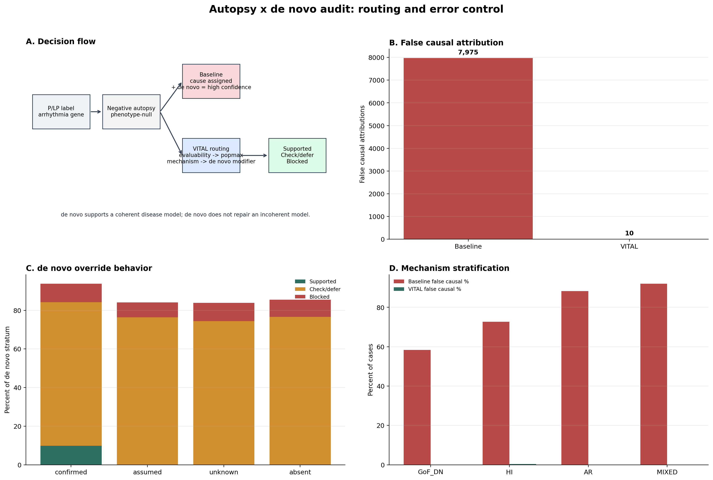

# Secondary Analyses

These analyses are retained as supplementary stress tests. They do not define the main arrhythmia burden estimate or the primary disease-model conclusions.

## HGDP Regional Stress Map

The HGDP layer is treated as a regional stress map rather than a co-equal allele-level burden estimate. Strict allele matches remain the strongest evidence. Position-overlap-expanded results are hypothesis-generating locus-context signals and should not be interpreted as direct allele-frequency compatibility calls.

## Hereditary Cancer and External Disease Panels

Hereditary cancer and external six-domain panel analyses are used only to test structural recurrence of label-portability pressure outside the arrhythmia cohort. They are not disease-calibrated burden estimates, because each domain has distinct prevalence, penetrance, ascertainment, and mechanism architecture.

## Autopsy x de novo Counterfactual Audit

The autopsy/de novo layer models phenotype-null negative-autopsy scenarios where a genetic result can become the main explanatory anchor. It is a counterfactual routing stress test, not clinical outcome validation and not an estimate of real-world cause-of-death fractions.

Figure 5. Autopsy x de novo audit: routing and error control. We simulate phenotype-null autopsy scenarios to test how label-driven attribution behaves under de novo reinforcement and how VITAL reroutes unsupported causal claims. Panel A shows the decision flow, Panel B compares false causal attribution under baseline and VITAL routing, Panel C shows de novo override behavior after model constraints are restored, and Panel D stratifies false attribution by mechanism class.

## Simulated CDS Layer

The simulated clinical decision-support layer translates VITAL routes into alert classes for workflow demonstration. It is retained as a communication and implementation stress test, not as the evidentiary anchor for clinical harm or actionability failure.
